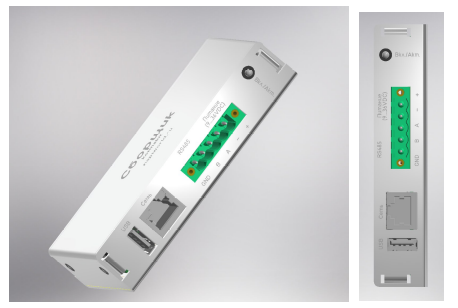

# Сборщик-компакт

Сборщик-компакт (FrontControl Compact ) — суперкомпактный одноплатный компьютер на основе модуля Napi C под управлением NapiLinux c интерфейсом NapiConfig.

## Технические характеристики

- Процессорный модуль Napi C (4-ядерный RK3308 \ 512Мб ОЗУ \ 4Гб ПЗУ)
- RS485 c изоляцией
- RTC
- Ethernet 100Мбит\с
- USB type A
- SD-карта (до 32Гб дополнительного места)
- Не требуется дополнительное охлаждение
- NapiLinux или Armbian, обновление ОС "на лету"
- Крепление на DIN

:boom: **Размер 23х112мм**

## Применение

Мониторинг работы оборудование, коллекционирование статистик и параметров оборудования, передача данных с оборудования в облака, система предупреждений о внештатных ситуациях. Удобно и компактно размещается в телекоммуникационных шкафах для сбора и передачи информации. 
и электро щитках

### Протоколы данных
- Агент сбора данных Telegraf и поддерживаемые им протоколы 

  - Сбор данных по Modbus TCP \ Modbus RTU (Modbus шлюз)
  - Сбор данных по SNMP 
  - Другие протоколы из плагинов Telegraf 
  
### Хранение и отображение данных

- Локальное хранение данных - база временных рядов InfluxDB
- Отображение данных через Dashboard Grafana

## Веб интерфейс NapiConfig

[NapiConfig: Веб интерфейс для NapiLinux](https://napilinux.ru/napiConfig)

- Настройка IP-параметров сети

- Настройка протокола Modbus RTU\TCP для опросов датчиков.

- Просмотр статистики, свободного места.

- Получение статистических данных с датчиков.
  
:boom: Подробно о [NapiConfig](https://napilinux.ru/napiConfig) на сайте [napilinux.ru](https://napilinux.ru/)

## Что внутри
  

### Предзаказ 

Вы можете сделать заявку на тестирование. 
[Напишите нам](/contacts)

