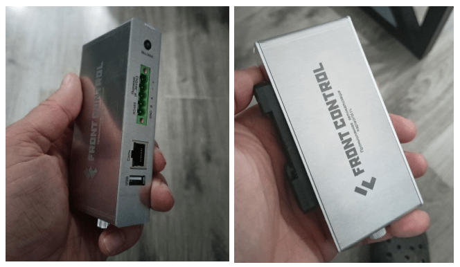

# Сборщик-компакт

Сборщик-компакт (FrontControl Compact ) — суперкомпактный одноплатный компьютер на основе модуля Napi C под управлением NapiLinux c интерфейсом NapiConfig.

## Технические характеристики

- Процессорный модуль Napi C (4-ядерный RK3308 \ 512Мб ОЗУ \ 4Гб ПЗУ)
- RS485 c изоляцией
- Питание 9-36 с защитой от перенапряжения и переплюсовки
- RTC
- Ethernet 100Мбит\с
- USB type A
- SD-карта (до 32ГБ дополнительного места)
- Не требуется дополнительное охлаждение
- NapiLinux (опционально Armbian), 
- Обновление прошивки "на лету"
- Крепление на DIN-рейку

## Обзор внутри и снаружи

:boom: Размер 27х118х55 мм :boom:

:boom: Не требует активного охлаждения и дополнительных радиаторов !

:boom: Крепление на DIN и удобный крепеж (винт) для снятия кожуха и доступа к плате.

## Защитные каскады и изоляция

- Порт RS485 изолированный, линии защищены самовосстанавливающимися предохранителями с ограничением входного напряжения на TVS диодах.

- Входное питание выполнено с защитой от переполюсовки и перенапряжения. Входное питание 9-36В (постоянное напряжение).

## Применение

- Мониторинг оборудования
- Сбор статистики и параметров работы
- Преобразование интерфейсов
- Передача данных в облако
- Уведомления о внештатных ситуациях

Устройство создано для размещения в телекоммуникационных шкафах и электро-щитках

### Протоколы данных
- Агент сбора данных Telegraf и поддерживаемые им протоколы 

  - Сбор данных по Modbus TCP \ Modbus RTU (Modbus шлюз)
  - Сбор данных по SNMP 
  - Другие протоколы из плагинов Telegraf 
  
### Хранение и отображение данных

- Локальное хранение данных - база временных рядов InfluxDB
- Отображение данных через Dashboard Grafana

## Веб интерфейс NapiConfig

[NapiConfig: Веб интерфейс для NapiLinux](https://napilinux.ru/napiConfig)

- Настройка IP-параметров сети

- Настройка протокола Modbus RTU\TCP для опросов датчиков.

- Просмотр статистики, свободного места.

- Получение статистических данных с датчиков.

  
:boom: Подробно о [NapiConfig](https://napilinux.ru/napiConfig) на сайте [napilinux.ru](https://napilinux.ru/)

## Предзаказ

:boom: **Оставьте заявку на тестирование.**

Мы собираем предзаказы на тестирование изделий "Сборщик-компакт" и
процессорных модулей "Napi P". Для участия в программе тестирования напишите пожалуйста запрос на электронную почту dmn@nnz.ru или в Телеграмм @dmn240. 

:boom: Возможна доработка функциональных возможностей согласно требованиям заказчика.

:boom: Возможно создание варианта NapiLinux с пакетами Заказчика.

## Ссылки

[Разборка и сборка корпуса (Видео)](https://youtube.com/shorts/Lm_XV_x1xTE?feature=share)

[Модули Napi](/docs/napi-intro)

[Контакты по всем продуктам Napi](/contacts)

[Продукты Ниеншанц-Автоматика](http://www.nnz-ipc.ru)
