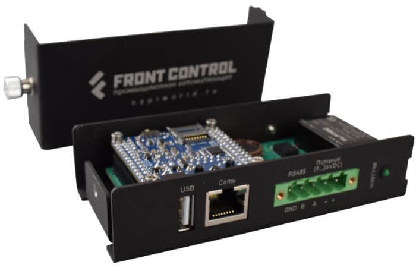
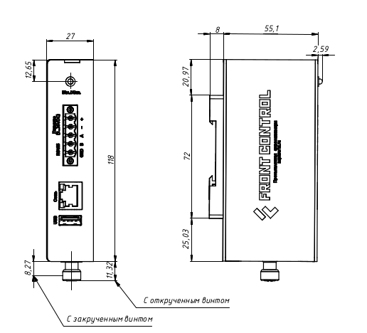
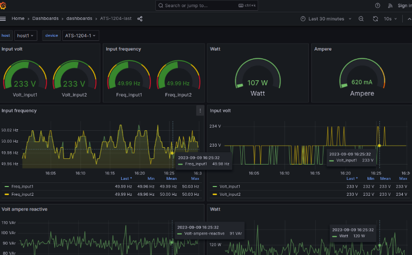

# Сборщик-компакт

Сборщик-компакт (FrontControl Compact ) — суперкомпактный одноплатный компьютер на основе модуля Napi C под управлением NapiLinux c интерфейсом NapiConfig.

<!--  -->

## Аппаратная платформа

### Технические характеристики

- Процессорный модуль Napi C (4-ядерный RK3308 \ 512Мб ОЗУ \ 4Гб ПЗУ)
- RS485 c изоляцией
- Питание 9-36 с защитой от перенапряжения и переплюсовки
- Passive POE
- RTC
- Ethernet 100Мбит\с
- USB type A
- SD-карта (до 32ГБ дополнительного места)
- Не требуется дополнительное охлаждение
- NapiLinux (опционально Armbian), 
- Обновление прошивки "на лету"
- Крепление на DIN-рейку

### Удобная конструкция

Всего один винт и можно, откинув крышку, получить доступ к консоли и к SD

### Компактный размер

:boom: Размер 27х118х55 мм :boom:

:boom: Не требует активного охлаждения и дополнительных радиаторов !

:boom: Крепление на DIN и удобный крепеж (винт) для снятия кожуха и доступа к плате.

### Защитные каскады и изоляция

- Порт RS485 изолированный, линии защищены самовосстанавливающимися предохранителями с ограничением входного напряжения на TVS диодах.

- Входное питание выполнено с защитой от переполюсовки и перенапряжения. Входное питание 9-36В (постоянное напряжение).

## Программное обеспечение

:::tip ВАЖНО ! 

Во всех предустановленных версиях Linux логин пароль по умолчанию root\napilinux

:::

:::tip ВАЖНО !

 Если вставлена SD, то Сборщик грузится с SD-карты, если загрузчика на SD нет, то устройство грузится с NAND

:::

:::tip ПО по умолчанию

Сборщик компакт поставляется с предустановленной во внутреннюю память (NAND) ARMbian (Debian подобная) Linux, на SD в комплекте также поставляется NapiLinux, которая может быть
прошита в NAND.

:::

### Armbian

> Более подробно с ARMbian можно ознакомиться на сайте http://armbian.org

В ArmBian предустановлены пакеты и модули для работы с ModBus 
- Программа опроса modpoll
- Шлюз Modbus TCP - Modbus RTU (mbusd)
- Менеджер пакетов pip3 и модули Python для работы с modbus
- Универсальный шлюз данных telergraf
- Средства разработки gcc\gcc++, cmake, pkg-config

:::tip Ставь и эксперементируй 

Вы можете ставить любое ПО c помощью `apt-get install ...` или из deb-пакетов.

:::

В предустановленном варианте ARMbian уже установлены модули ядра для работы 485-го порта и RTC. Если ставить ARMbian "с нуля", необходимо добавить оверлей-модули по инструкции.

### NapiLinux

>Более подробнее с NapiLinux можно ознакомиться на сайте http://napilinux.ru

NapiLinux - прошивка для Сборщика с Веб-конфигуратором, предустановленным ПО, функциями обновления и резервирования. Мы собираем NapiLinux из исходных кодов на наших серверах с ограниченным набором программного обеспечения, благодаря чему NapiLinux более компактная и быстрая, хотя и менее универсальная. В NapiLinux нет пакетного менеджера, программы и пакеты могут быть добавлены на этапе сборки из исходных кодов. 

> NapiLinux также может быть прошита в NAND как основная ОС.

В составе NapiLinux для Сборщик компакт имеются дополнительно ПО для сбора информации с датчиков, хранения и отображения.

- Универсальный шлюз данных Telegraf
- База временных рядов InfluxDB2
- Сервер отображения Grafana-server
- Программа опроса Modbus RTU\TCP modpoll
- Шлюз Modbus TCP - Modbus RTU (mbusd)

### Веб интерфейс NapiConfig

[NapiConfig: Веб интерфейс для NapiLinux](https://napilinux.ru/napiConfig)

- Настройка IP-параметров сети

- Настройка протокола Modbus RTU\TCP для опросов датчиков.

- Просмотр статистики, свободного места.

- Получение статистических данных с датчиков.

  
:boom: Подробно о [NapiConfig](https://napilinux.ru/napiConfig) на сайте [napilinux.ru](https://napilinux.ru/)

## Применение

- Мониторинг оборудования
- Сбор статистики и параметров работы
- Преобразование интерфейсов
- Передача данных в облако
- Уведомления о внештатных ситуациях

Устройство создано для размещения в телекоммуникационных шкафах и электро-щитках

### Протоколы данных
- Агент сбора данных Telegraf и поддерживаемые им протоколы 

  - Сбор данных по Modbus TCP \ Modbus RTU (Modbus шлюз)
  - Сбор данных по SNMP 
  - Другие протоколы из плагинов Telegraf 
  
### Хранение и отображение данных

- Локальное хранение данных - база временных рядов InfluxDB
- Отображение данных через Dashboard Grafana

## Предзаказ

:boom: **Оставьте заявку на тестирование.**

Мы собираем предзаказы на тестирование изделий "Сборщик-компакт" и
процессорных модулей "Napi P". Для участия в программе тестирования напишите пожалуйста запрос на электронную почту dmn@nnz.ru или в Телеграмм @dmn240.

:::notice Стартовый комплект

Описание стартового комплекта

:::

:boom: Возможна доработка функциональных возможностей согласно требованиям заказчика.

:boom: Возможно создание варианта NapiLinux с пакетами Заказчика.

## Ссылки

[Разборка и сборка корпуса (Видео)](https://youtube.com/shorts/Lm_XV_x1xTE?feature=share)

[Модули Napi](/docs/napi-intro)

[Контакты по всем продуктам Napi](/contacts)

[Продукты Ниеншанц-Автоматика](http://www.nnz-ipc.ru)
