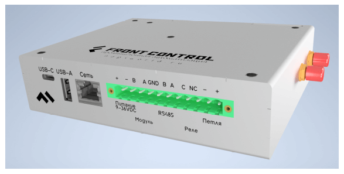

# Сборщик-универсал

> :warning: **Внимание**
>
>Данные материалы являются предварительными и могут незначительно изменяться 
>по ходу приближения к финальному устройству 

Сборщик-универсал (FrontControl Uni ) — Сборщик с встроенными модулями связи и интерфейсом для внешних модулей.

## Технические характеристики (могут незначительно отличаться в финальном устройстве)

- SOM: Napi P - 4-х ядерный ARM процессор, 512MB ОЗУ, 4GB ПЗУ (NAND), SD card
- RS485 изолированный порт для подключения датчиков
- Интерфейс подключения модулей rs485
- Реле - сухой контакт (нормально закрытая группа)
- Шлейф сигнализации охранный, на обрыв (без контроля целостности линии)
- Ethernet 100 Mbit\с
- PCI-E слот для модулей расширений (LTE\LORA\Zigbee)
- Питание 10-60В 
- POE с поддержкой стандарта 802.af
- RTC (часы реального времени)
- USB Type-A
- Консоль (Type-c)
- Два выхода под антенны (SMA)
- Программное обеспечение: [NapiLinux](http://napilinux.ru) *) или Armbian
  
:::tip Веб интерфейс NapiConfig

[NapiConfig: Веб интерфейс для NapiLinux](https://napilinux.ru/napiConfig)

:::

## Размеры и чертеж (предварительно)

## Взгляд изнутри

## Модули NapiConfig

- Настройка сети, Lora, LTE, 
- Настройка протокола Modbus RTU\TCP для опросов датчиков.
- Просмотр статистики, свободного места.
- Получение статистических данных с датчиков.

Все о [NapiConfig](https://napilinux.ru/napiConfig) на сайте [napilinux.ru](https://napilinux.ru/)

