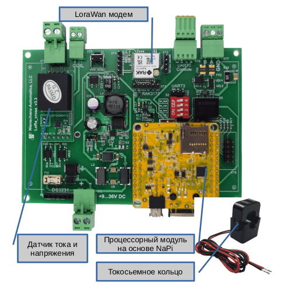
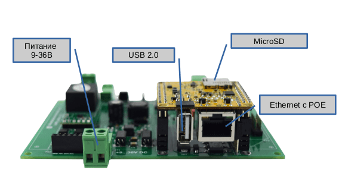
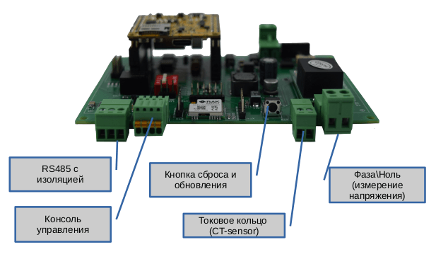
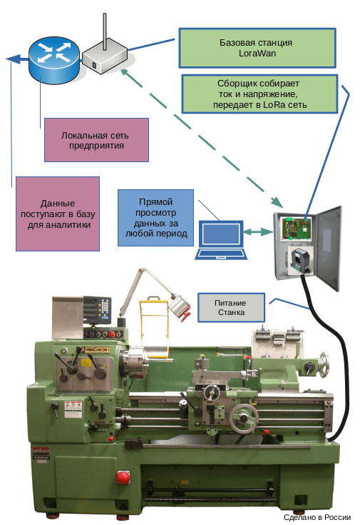

# Токо-сборщик

«Токо-сборщик» (FrontControl Current Collector) - бюджетная и практичная система сбора данных параметров однофазной сети (все в одном устройстве). Предназначена для сбора параметров потребителя (ток, напряжение, мощность, реактивная мощность и другие параметры).Применяется для анализа работы электро-установок (станки, печи, двигатели, вентиляторы), для своевременного
технического обслуживания, минимизации времени простоя. Поддерживает хранение и анализ данных на устройстве и передачу данных через Ethernet\LoraWan сети.
Производится в различных вариантах корпусирования
(пластик, металл). Имеется Веб интерфейс для настройки сетей и система визуализации данных с датчика.

:::tip Важное свойство

Важное свойство нашей реализации - Токо-сборщик работает не только в режиме сбора и передачи информации, но может использоваться как автономное устройство. Токо-сборщик всегда собирает и хранит данные на устройстве. Доступны Веб-интерфейсы для анализа накопленных данных.

**Токо-сборщик устойчив к потерям связи на любые периоды и может работать в режиме черного ящика !**

:::

## Схема и функциональные блоки

 

 

 Питание платы производится через источник постоянного тока 9-36В или через POE Passive(пассивный режим).

 Система может работать как с SD карты (удобно для тестирования и отладки), так и с внутренней памяти NAND (рекомендуется для постоянного применения).

 

Изолированный порт RS485 может использоваться для подключения внешних датчиков (опрос по протоколу MODBUS RTU).

## Быстрый старт

 

:boom: По умолчанию в Сборщик уже установлена прошивка на основе NapiLinux с модулем сбора данных с датчика тока и устройство готово к работе. Подключите токовое кольцо, фазу\ноль в соответствующие разъемы, подключите сетевой кабель (при наличии сети) и можно приступать к работе. Устройство по умолчанию сразу начинает "собирать" параметры тока в встроенную базу, доступ к которой можно получить через встроенный Веб-интерфейс.

:boom: Питание устройства может осуществляться как с источника постоянного тока, так и через Passive POE.

:boom: Скачать прошивку можно в **[Центре загрузок](/software)**

:::tip IP адреса

При подключении к сети по интерфейсу Ethernet устройство пытается получить IP-адрес по протоколу DHCP. Если IP-адрес получен, то он будет в дальнейшем использоваться устройством. Если адрес получить не удалось то присваивается адрес `169.254.100.100`.

:::

:::tip Как получить доступ

- Адрес NapiConfig (Веб-интерфейс): `http://<ip>:8081`
- Адрес интерфейса апгрейда прошивки: `http://<ip>:8080`
- Полный доступ к системе можно получить или через порт консоли
с параметрами: `115200 8n1`; или по ssh (стандартный порт 22)
- Логин \ пароль по умолчанию
`root \ napilinux`

:point_up: Рекомендуем сменить пароль командой `passwd`

:::

:::tip Хранение данных локально
 Для пользовательских данных в NapiLinux доступно примерно 1Гб памяти для хранения локальной базы данных и других данных пользователя.
:::

## NapiConfig (Веб-интерфейс настройки и отображения)

В NapiConfig вы сможете настроить сеть, настроить параметры Lora-сети, обнулить внутреннюю базу сбора данных, контролировать работу служб linux и свободное место в системе. И главное - увидеть графики с датчика тока и просматривать их в различных режимах.

Веб-интерфейс реализует следующий функционал

- Настраивать сеть
- Настраивать параметры LORA модема
- Настраивать новые датчики в формате конфига сервиса Telegraf
- Просматривать служебную информацию о работе системы и сервисов
- Обновлять прошивку (Napi Linux) и сбрасывать устройство к заводским настройкам
- :point_up: Просматривать локально графики с датчика тока и внешних датчиков (требуется дополнительная настройка)

### Настройка сети


### Настройка Lora


### Мониторинг системы и сервисов


### Графики со встроенного датчика (Grafana)


## Порты и периферийные устройства

:point_up: /dev/ttyS0 - консоль ввода\вывода
Порт используется для отладки через TTL-USB устройство

```text title="Параметры порта"
115200,8,n,1
(в старых прошивках возможен вариант 1500000,8,n,1 )
```

:point_up: /dev/ttyS3 - порт 485
Порт используется для подключения дополнительных датчиков с интерфейсом RS485

>Параметры порта задаются подключаемым датчиком

:point_up: /dev/ttyS2 — LORA модем RAK3172.

```text title="Параметры порта"
115200,8,n,1
```

:point_up: /dev/ttyS1 — Датчик тока и напряжения

```text title="Параметры порта"
9600,8,n,1
```

## Работа с датчиком тока

Датчик тока подключен к UART1 (/dev/ttyS1) и работает по
протоколу modbus rtu.

| Адрес | Значение                           |
--------|------------------------------------|
|0x49   |напряжение в Вольт*100 (целое число)|
|0x4B   |мощность в Ваттах                   |
|0x4A   |ток в Амперах*100 (целое число)     |

### Пример опроса датчика утилитой [modpoll](https://www.modbusdriver.com/modpoll.html)

```bash
rock@napi:~$ sudo ./modpoll -m rtu -b 9600 -p none -t 4 -c 1 -a 1 -r 0x4A /dev/ttyS1
modpoll 3.10 - FieldTalk(tm) Modbus(R) Master Simulator Copyright (c) 2002-2021 proconX Pty Ltd Visit https://www.modbusdriver.com for Modbus libraries and
tools. Protocol configuration: Modbus RTU, FC3
Slave configuration...: address = 1, start reference = 74, count=1
Communication.........: /dev/ttyS1, 9600, 8, 1, none, t/o 1.00 s,poll rate 1000 ms
Data type.............: 16-bit register, output (holding) registertable
-- Polling slave... (Ctrl-C to stop)
[74]: 33 - - --- Ток 0.33А
```

## Применение

Модуль может применяться для анализа непрерывной и корректной работы устройств (станков, двигателей, холодильного оборудования), для технического учета электроэнергии, для мониторинга параметров электро сетей.

Типичное применение - анализ работы станков

- контроль загрузки станка, контроль простоев
- контроль непрерывной работы, соблюдение регламентных работ
- контроль за персоналом, работающим за станком


