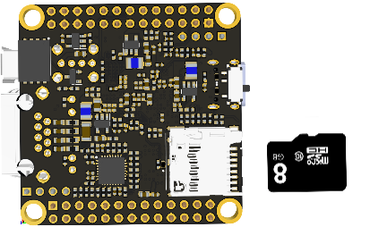
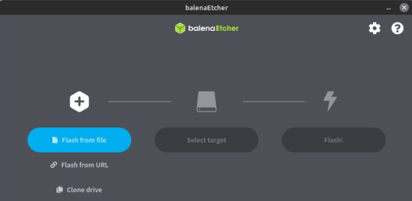
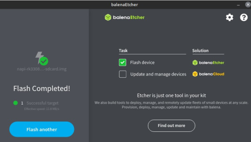
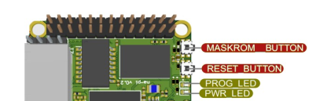

# Прошивка ПО (Linux Host)

## Перед тем как начать

:::tip

ОС Linux можно грузить как в SD карты, так и с встроенной памяти NAND (рекомендуется)  

:::

:warning: Подходит любая microSD карта от 8Gb

 

## Запись образа Linux на SD

:point_up: Адрес прошивок: (<https://packages.nnz-ipc.net/napi/>)

:point_up: Адрес программы Balena для записи SD: (<https://balena-etcher.com>)

:point_up: Адреса совместимых ОС с сайта RADXA: (<https://wiki.radxa.com/RockpiS/downloads>)

В программе Balena надо зашить на SD скачанный образ NAPI Linux

 
 
 
 

:point_up: Вы можете работать с SD карты, без записи образа в NAND. При этом в "боевом" режиме рекомендуется работать с NAND

## Инсталляция Linux в память NAND

:point_up: Рекомендуем именно этот режим в длительной работе !

1. Устанавливаем на Хост-ПК (Linux) утилиту rkdeveloptool.
В терминале вводим команду для установки зависимостей сборки:

```bash
sudo apt-get install libudev-dev libusb-1.0-0-dev dh-autoreconf
```

2. Копируем исходный код и собираем rkdeveloptool

```bash
git clone https://github.com/rockchip-linux/rkdeveloptool
cd rkdeveloptool
autoreconf -i
./configure
make
```

:point_up: Если rkdeveloptool не компилируется необходимо применить патч:
скачать (<https://raw.githubusercontent.com/dmnovikov/napiguide/main/patches/main.patch>)

```bash
patch main.cpp -i main.patch
```

и повторить команду `make`

3. Копируем собранную программу в директорию с программами

```bash
sudo cp rkdeveloptool /usr/local/bin/
```

:warning: Перед записью образа во внутреннюю память, SD Card должна быть
извлечена

4. Загружаем плату в режиме Maskrom;

   - c помощью кабеля USB Type-C подключаем устройство к ПК в слот USB-A;

   - нажимаем и удерживаем клавишу Maskrom, затем коротко нажимаем клавишу Reset не отпускаем Maskrom, через несколько секунд отпускаем Maskrom;



5. Открываем терминал на Хост-ПК, вводим команду lsusb , если в списке USB-устройств появится `«ID 2207 : 330e»` -  означает, что устройство определилось в системе;

6. В терминале вводим команду `rkdeveloptool ld` , если плата
находится в режиме Maskrom, на экране появится сообщение

```bash
dmn@hp:~/rkdeveloptool$ ./rkdeveloptool ld
DevNo=1 Vid=0x2207,Pid=0x330e,LocationID=101 Maskrom
dmn@hp:~/rkdeveloptool$
```

7. Скачиваем bootloader (<https://dl.radxa.com/rockpis/images/loader/>)  файл в зависимости от ревизии процессора 

```
rk3308_loader_uart0_m0_emmc_port_support_sd_20190717.bin -- rk3308
rk3308_loader_ddr589MHz_uart0_m0_v2.06.136sd.bin -- rk3308B-S
```
8. Загружаем во внутреннюю память
  
```bash
sudo rkdeveloptool db  <файл загрузчика>

```

9. Скачиваем образ системы (<https://packages.nnz-ipc.net/napi/>) и загружаем во
внутреннюю память соответствующий вашей конфигурации образ:

```bash
sudo rkdeveloptool db <файл образа>
```

:boom: При успешной загрузке прошивки через некоторое время замигает
красный индикатор.

10. Если необходимо очистить внутреннюю память от загруженного
образа

    - Создаем пустой образ, вводя команду: `dd if=/dev/zero of=./zero.img bs=4M count=10`
    - Запускаем плату в режиме Maskrom
    - Загружаем bootloader
    - Загружаем полученный образ `rkdeveloptool wl 0 zero.img`
    - Перезагружаем устройство
