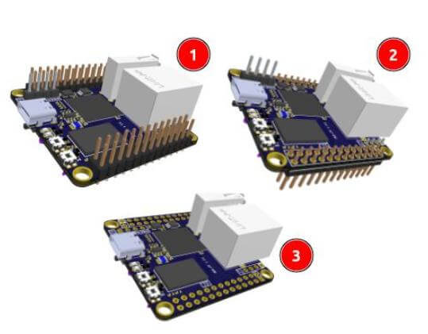

# *Одноплатный компьютер NAPI (C/P)

:::note Что такое NAPI
**NAPI** — одноплатный процессорный модуль на основе мощного ARM процессора Rockchip RK3308 под управлением ОС Linux. Отличная замена микроконтроллерам как более мощный и универсальный вычислительный блок системы с богатыми возможностями инструментария Linux.
:::

  >:boom: **[Взять на бесплатное тестирование](https://nnz-ipc.ru/fc/anketa_napi/)**
  > :boom: **[Купить](https://nnz-ipc.ru/catalogue/front_man/front_control/modul_napi_c/)**
  > :boom: **[База знаний и программное обеспечение](/software/)**

## Преимущества подхода NAPI

:::tip Сразу готов к работе

 Для начала работы с SOM NAPI не нужны дополнительные платы - можно работать с NAPI как с обычным одноплатником.

 

:::

:::tip Делайте свои решения на NAPI

SOM NAPI работает как самостоятельное устройство, но в практическом плане это устройство, которое вставляется в «несущие платы», которые осуществляют питание, дополнительные устройства, датчики, модемы и любые другие устройства по требованию вашего проекта. Вы найдете всю информацию для создания своих устройств на основе NAPI.

:::

## Технические данные

- RK3308 processor (Cortex- A35 quard core)
- Armbian Linux / NAPI Linux
- Современное Linux ядро (kernel 6.1)
- 512 Мб ОЗУ
- 4 Гб ПЗУ (NAND)
- 1 × Ethernet 100 Мбит
- 2 × USB 2.0 (Type-A + Type-C)
- Питание +5 В (через GPIO или USB Type-C)
- PoE Ready
- 2,4 мм GPIO
- 3 × UART
- SPI
- 2 × I2C
- :point_up: Компактный размер: 43 × 43 мм

:::tip варианты

Мы предлагаем два варианта исполнения модуля NAPI.

- **NAPI C** — разъём Ethernet и USB-A расположены на модуле. Этот вариант максимально готов к автономной работе и требует меньших усилий при проектировании несущей платы. но при этом «географически» NAPI необходимо располагать на краю платы (чтобы разъёмы были снаружи);

- **NAPI P** — разъёмы Ethernet и USB-A выполнены в виде разъёма с шагом 2,54 мм (контакты). Это позволяет располагать разъемы Ethernet и USB произвольно на несущей плате, но требует дополнительных усилий при ее проектировании (напайку разъемов, протягивание дорожек).

:::

:::note 2 варианта расположения ножек относительно процессора

Возможна поставка с «гребенкой» как вверх от процессора (1), вниз от процессора (2) или с незапаянной (3) для самостоятельного монтажа.

:point_down: Napi-C

:point_down: Napi-P

:::

## Преимущества NAPI

Имеет малые размеры (43 × 43 мм), малое энергопотребление, не требует активного охлаждения.

Наличие портов (Ethernet, USB, PoE) позволяет быстро создавать самые разные устройства на основе модуля.

Поставляется с предустановленной и настроенной ОС Linux Armbian, имеется также вариант с NapiLinux — прошивка ОС Linux с резервированием.

>:warning: Примеры устройств на основе NAPI: [Сборщик-компакт](/docs/computers-industrial/FCC3308/), [Сборщик-универсал](//docs/computers-industrial/FCC3308P/), [Токо-сборщик](/docs/special/frontcurrent), ПЛК «Наутилус».

## NAPI GPIO (контактные гребенки для соединения с несущей платой)

[Скачать](_gpio/gpio_napi_c.pdf) в формате pdf

<!-- -->

GPIO в виде таблицы

>:warning: **GPIO4_B1 и GPIO4_B0 имеют TTL - 1.8В**

## Размеры и габариты

 Для проектирования Carrier Board и корпусирования приводим точные размеры  **NAPI C** и **NAPI P**. На чертежах приведены размеры платы (с выступающими элементами и без), а также позиционирование элементов.

### Чертеж Napi-C

 >**Скачать в формате [pdf](napi-pdf/Passport-NAPI-P-1.pdf)**

### Чертеж Napi-P

 >**Скачать в формате [pdf](napi-pdf/Passport-NAPI-C-1.pdf)**

 

## Функциональная схема

>**[Скачать](napi-pdf/function_scheme.pdf) в формате PDF**

## Программное обеспечение

Процессорные модули NAPI работают под управлением ОС Linux для архитектуры ARM. Мы поддерживаем систему Armbian и разрабатываем и поддерживаем собственную прошивку NapiLinux с интерфейсом управления NapiConfig.

>:warning: **Все-все про программную поддержку (рецепты, конфигурации, прошивки) - в разделе ["Программная поддержка"](/software)**
