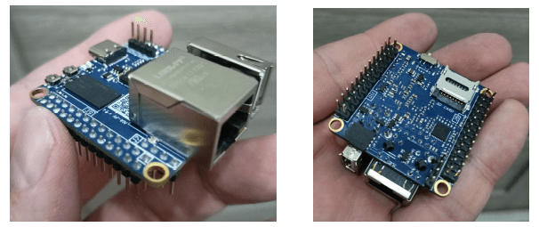
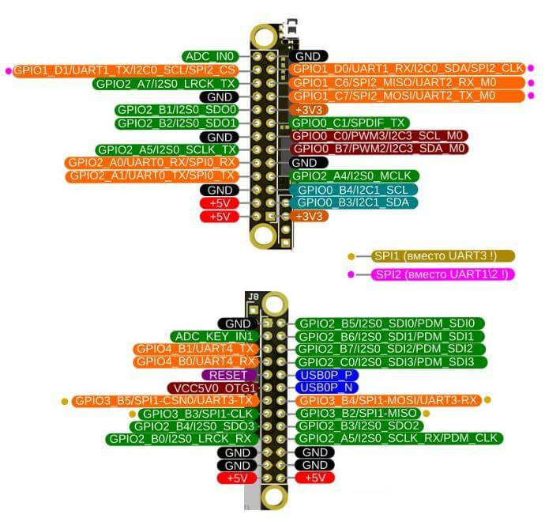

# Модуль NAPI (C\P)

:::note Что такое  NAPI
**NAPI** - одноплатный процессорный модуль на основе мощного ARM процессора Rockchip RK3308 под управлением OC Linux. Отличная замена микроконтроллерам как более мощный и универсальный вычислительный блок системы с богатыми возможностями инструментария Linux.
:::

  >:boom: **[Взять на бесплатное тестирование](https://nnz-ipc.ru/fc/anketa_napi/)**:boom:
  
  > :boom: **[Купить](https://nnz-ipc.ru/catalogue/front_man/front_control/modul_napi_c/)**:boom:
  
   > :boom: **[Паспорт изделия (pdf)](__pdfs/NAPI_%D0%A2%D0%A4%D0%9F%D0%9C_466229_001_%D0%9F%D0%A1_%D0%9F%D0%B0%D1%81%D0%BF%D0%BE%D1%80%D1%82_%D0%B2%D0%B5%D1%80.2.4.3.pdf) **:boom:

## Преимущества подхода NAPI

:::tip Сразу готов к работе

 Для начала работы с SOM NAPI не нужны дополнительные платы - можно работать с NAPI как с обычным одноплатником.

 

:::

:::tip Делайте свои решения на NAPI

SOM NAPI работает как самостоятельное устройство, но в практическом плане это устройство, которое вставляется в "несущие платы", которые осуществляют питание, дополнительные устройства, датчики, модемы и любые другие устройства по требованию вашего проекта. Вы найдете всю информацию для создания своих устройств на основе NAPI. 

:::

## Технические данные

- RK3308 processor (Cortex- A35 quard core)
- Armbian Linux \ NAPI Linux
- Современное Linux ядро (kernel 6.1)
- 512Мб ОЗУ
- 4Гб ПЗУ (NAND)
- 1 х Ethernet 100Мбит
- 2 x USB 2.0 (type-A + type-c)
- Питание +5В (через GPIO или USB Type-C)
- POE Ready
- 2.4мм GPIO
- 3 x UART
- SPI
- 2 x i2c
- :point_up: Компактный размер: 43х43 мм

:::tip варианты

Мы предлагаем два варианта исполнения модуля NAPI.

- **NAPI C** - разъем Ethernet и USB-A расположены на модуле. Этот вариант максимально готов к автономной работе и требует меньших усилий при проектировании несущей платы. но при этом "географически" NAPI необходимо располагать на краю платы (чтобы разъемы были снаружи); 

- **NAPI P** - разъем Ethernet и USB-A выполнены в виде разъёма с шагом 2.54мм (штырьки). Это позволяет располагать разьемы Ethernet и USB произвольно на несущей плате, но требует дополнительных усилий при ее проектировании (напайку разъемов, протягивание дорожек).

:::

:::note 2 варианта расположения ножек относительно процессора

Возможна поставка с "гребенкой" как вверх от процессора (1), вниз от процессора (2) или с незапаянной (3) для самостоятельного монтажа.

:::

## Преимущества NAPI

Имеет малые размеры (43х43мм), малое энергопотребление, не требует активного охлаждения. 

Наличие портов (Ethernet, USB, PоE) позволяет быстро создавать самые разные устройства на основе модуля. 

Поставляется с предустановленной и настроенной  ОС Linux Armbian, имеется также вариант с NapiLinux - прошивка ОС Linux с резервированием.

>:warning: Примеры устройств на основе NAPI: [Сборщик-компакт](/docs/computers/frontcontrol-compact), [Сборщик-универсал](/docs/computers/frontcontrol-uni), [Токо-сборщик](/docs/special/frontcurrent), ПЛК "Наутилус".

## NAPI GPIO (контактные гребенки для соединения с несущей платой)

[Скачать](_gpio/gpio_napi_c.pdf) в формате pdf

GPIO в виде таблицы

>:warning: Внимание, несмотря на "похожесть" с Rockpi S, GPIO отличаются

## Размеры и габариты

 Для проектирования "Carrier board" и корпусирования приводим точные размеры **NAPI C**. На чертеже приведены размеры платы (с выступающими элементами и без), а также позиционирование элементов.

 >**Скачать в формате [pdf](napi-pdf/NA%20PI%20v1_blueprint.pdf)**

  

## Функциональная схема

  

[Скачать](napi-pdf/function_scheme.pdf) в формате PDF

## Программное обеспечение

Процессорные модули NAPI работают под управлением ОС Linux для архитектуры ARM. Мы поддерживаем систему Armbian и разрабатываем и поддерживаем собственную прошивку NapiLinux с интерфейсом управления NapiConfig.

>:warning: **Cмотрите раздел ["Программная поддержка"](/software)**