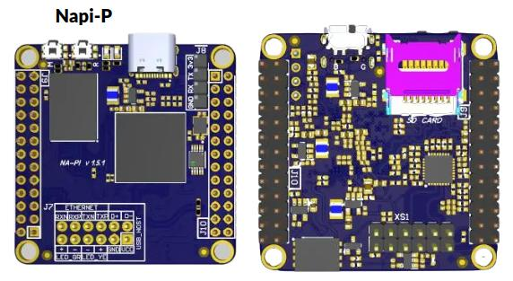
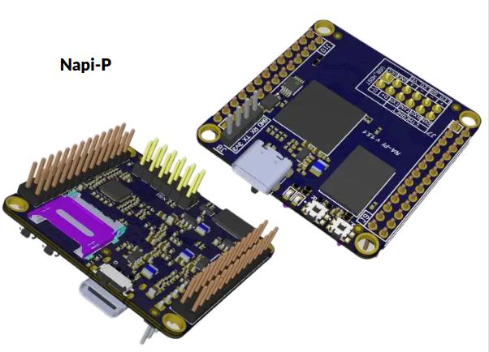
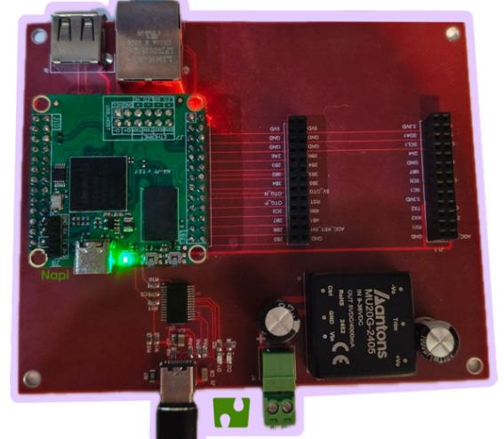
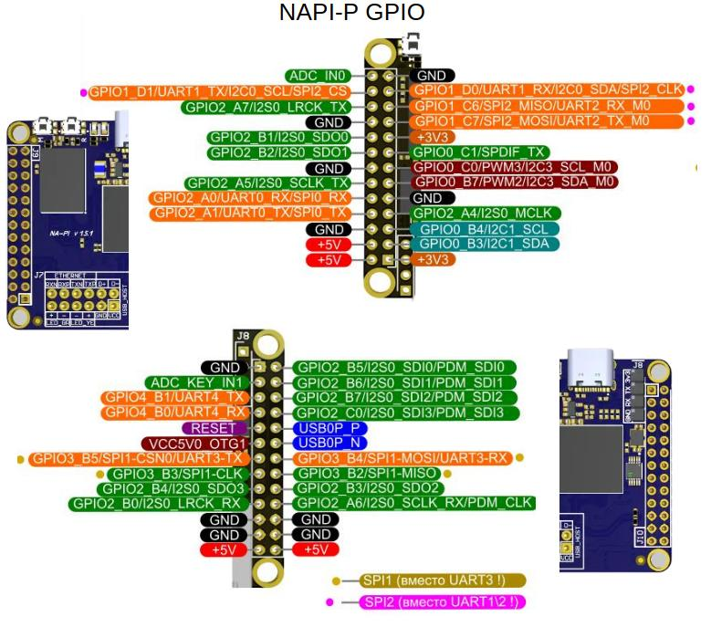

NAPI-P — одноплатный процессорный модуль на основе мощного ARM процессора Rockchip RK3308 под управлением ОС Linux. Модуль является модификацией модуля NAPI-C, где  интерфейсы Ethernet,USB заменены на PINS с шагом 2.4

<!--
:::note Что такое NAPI
**NAPI-С (NAPI-P)** — одноплатный процессорный модуль на основе мощного ARM процессора Rockchip RK3308 под управлением ОС Linux. Отличная замена микроконтроллерам богатыми возможностями инструментария Linux.\
:::
-->

  >:boom: **[Взять на бесплатное тестирование](/forms/napiorder/)** \
  > :boom: **[Купить](https://nnz-ipc.ru/catalogue/front_man/front_control/modul_napi_c/)** \
  > :boom: **[Программная поддержка (Armbian, NapiLnux, OpenWRT)](/downloads/)**

## Преимущества NAPI-P

> **Удобен для применения в проектах**

 Начать работу с NAPI-P можно напрямую, запитав от USB TYPE-C или через плату разработки

> Делайте свои решения на NAPI-C и NAPI-P

NAPI-P это устройство, которое вставляется в «несущие платы», которые реализуют питание, датчики, модемы и любые другие устройства по требованию вашего проекта.

## Технические данные

- RK3308 processor (Cortex- A35 quard core)
- Armbian Linux / NAPI Linux
- Современное Linux ядро (kernel 6.1)
- 512 Мб ОЗУ
- 4 Гб ПЗУ (NAND)
- PINS: Ethernet 100 Мбит + USB Type-A
- 1 × USB 2.0 (Type-C)
- Питание +5 В (через GPIO или USB Type-C)
- PoE Ready
- 2,4 мм GPIO
- 3 × UART
- SPI
- 2 × I2C
- :point_up: Компактный размер: 43 × 43 мм

:::tip варианты

Мы предлагаем два варианта исполнения модуля NAPI-P

- **NAPI P** — разъёмы Ethernet и USB-A выполнены в виде разъёма с шагом 2,54 мм (контакты). Это позволяет располагать разъемы Ethernet и USB произвольно на несущей плате, но требует дополнительных усилий при ее проектировании (напайку разъемов, протягивание дорожек).

:::

:::note 2 варианта расположения ножек относительно процессора

Возможна поставка с «гребенкой» как вверх от процессора (1), вниз от процессора (2) или с незапаянной (3) для самостоятельного монтажа.

:point_down: Napi-P

:::

## Преимущества NAPI

:fire: Имеет малые размеры (43 × 43 мм), малое энергопотребление, не требует активного охлаждения.

:fire: Наличие портов на NAPI-C (Ethernet, USB, PoE) позволяет быстро создавать самые разные устройства на основе модуля.

:fire: Наличие штырьков на NAPI-P (Ethernet, USB на штырьках 2.54) позволяет размещать интерфейсы Ethernet,USB в удобном месте Вашей несущей платы.

:fire: Имеется выбор вариантов Linux: Armbian, Debian, NapiLinux, OpenWRT. Подробнее в разделе [скачать](/downloads).

>:warning: Примеры устройств на основе NAPI: [Сборщик-компакт](/docs/computers-industrial/FCC3308/), [Сборщик-универсал](//docs/computers-industrial/FCC3308P/), [Токо-сборщик](/docs/special/frontcurrent), ПЛК «Наутилус».

## NAPI GPIO (контактные гребенки для соединения с несущей платой)

[Скачать](../_gpio/gpio_napi_c.pdf) в формате pdf

<!-- -->

<!--  -->

GPIO в виде таблицы

>:warning: **GPIO4_B1 и GPIO4_B0 имеют TTL - 1.8В**

## Размеры и габариты

 Для корпусирования приводим точные размеры  **NAPI P**. На чертежах приведены размеры платы (с выступающими элементами и без), а также позиционирование элементов.

### Чертеж Napi-P

 

## Функциональная схема

## Программное обеспечение

Процессорные модули NAPI работают под управлением ОС Linux для архитектуры ARM. Мы поддерживаем систему Armbian и разрабатываем и поддерживаем собственную прошивку NapiLinux с интерфейсом управления NapiConfig.

>:warning: **Прошивки для плат NAPI в разделе ["Программная поддержка"](/downloads)**

## Другие платформы

| Платформа | Описание |
|---|---|
| [NAPI-Slot](/docs/napi-som-intro) | Модуль со слотом под стандартные интерфейсные карты |
| [Платы для NAPI-Slot](/docs/boards/napi-slot/) | Устройства на основе NAPI-Slot |
| [NAPI2](/docs/napi2/) | Новый одноплатный компьютер на RK3568 с HDMI и CAN |
| [Промышленный компьютер FCU3568](/docs/computers-industrial/FCU3568/) | Мощный промышленный ПК на основе NAPI2 |
