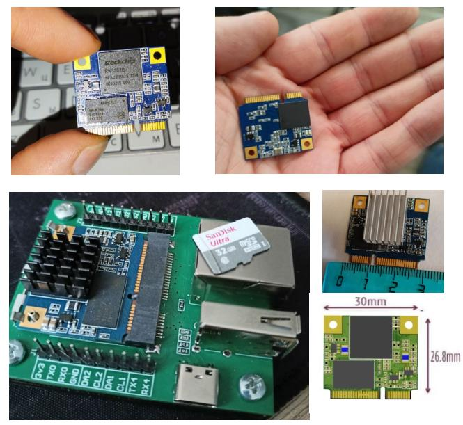
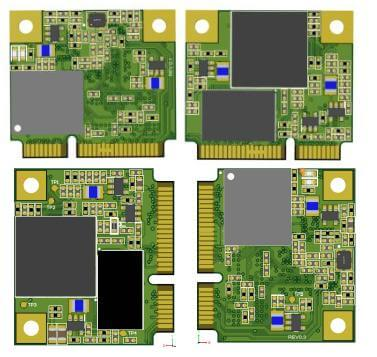
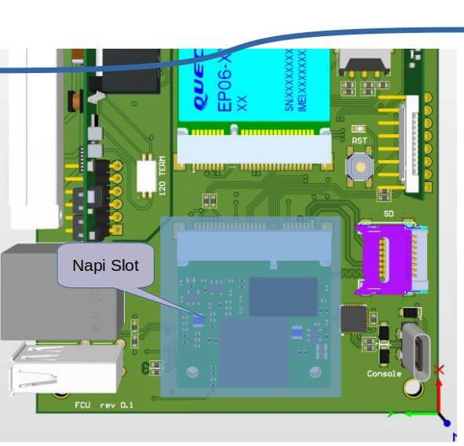
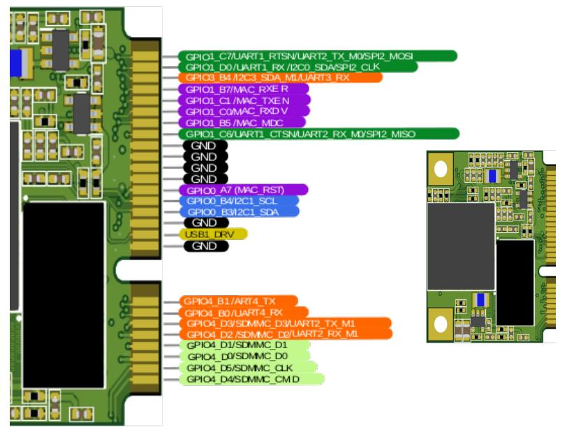
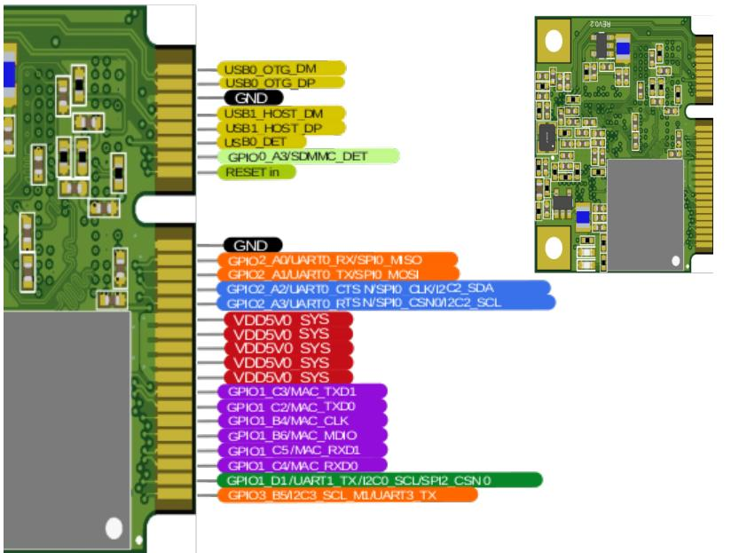

# Процессорный модуль Napi Slot

:::note Napi Slot
Супер-компактный и супер-холодный вычислительный модуль на Linux для Ваших проектов на основе Arm Rockchip RK3308. Модуль оснащен 4-х ядерным процессором RK3308BS, 512Мб DDR2 и 32Гб EMMC.
:::

## Что такое Napi S (Napi Slot)

Napi S - миниатюрный модуль формата 1\2 устройства под разъем PIC-e слот.  На модуле присутствует процессор (RK3308), оперативная память 512Мбайт, постоянная память EMMC 32Гб (более быстрая, чем NAND). На GPIO выведены SPI, UART, I2C

## Технические данные

- RK3308 processor (Cortex- A35 quard core)
- Armbian Linux \ NAPI Linux
- Современное Linux ядро (kernel 6.1)
- 512Мб ОЗУ
- **32Гб ПЗУ (EMMC)**
- 1 х Ethernet 100Мбит
- 2 x USB 2.0
- Питание +5В
- 3 x UART
- SPI
- 2 x i2c

## Плата разработчика

Для прошивки и работы с модулем мы разрабатываем миниатюрную плату разработчика (DevBoard)

Модуль Napi S вставляется через удобный зажим, питание платы осуществляется через разъем USB-C.

## Зачем нужен SOM Napi S

### Устройства на основе Napi S

На основе Napi S можно разрабатывать компактные платы для преобразования данных, сбора данных, шифрации, преобразования интерфейсов. В модуле достаточно мощности и памяти для многих задач, а среда Linux позволит быстро разрабатывать или устанавливать программное обеспечение. В отличие от Napi C, где разработчик привязан к слотам USB, Ethernet, с Napi S Вы можете сделать любую разводку вокруг вычислителя, хотя плата будет более сложной.

>:warning: **Napi C \ Napi P \ Napi S совместимы программно. Вы можете отладить проект на Napi C, а реализовать его на Napi S.**

>Мы сами делаем устройство сбора "Сборщик универсал" на основе Napi Slot, оно получилось более компактным, чем наш же прототип на Napi C.

### Napi S как сервисный модуль

Еще одн применение Napi S - интеграция в другие платы в качестве сервисного чипа. Внедрив NAPI S в Ваш проект, можно с минимальными затратами наделить его новым функционалом:

- Веб-интерфейс или Веб-приложение на полноценных "движках", таких как Flack, Django, NodeJS, React, Nuxt;
- MQTT сервер;
- SNMP V2\V3 сервер;
- REST API \ GraphQL сервер;
- Модуль сбора статистики и логирования параметров основного устройства.

Одним словом, можно значительно усилить или заменить MCU на микроконтроллере полноценным Linux-модулем со всеми инструментами разработки.

### Планы внедрения в продуктах

Участвуя в разработке сложных устройств, мы видим потребность в таком чипе. Вот несколько примеров будущих внедрения NAPI S:

- сервис чип L2 коммутатора для интеллектуального управления POE, сигнализацией и хранения метрологии;
- сервис чип для радио-релейных модулей для хранения метрологии, реализации модуля NetWork Managment System (NMS), реализации функционала SNMP V3;
- сервис чип для интеллектуальных систем управления питанием (ПДУ).

:::tip
Практически в любом сложном устройств на специализированных чипах или контроллерах, есть потребность в реализации интерфейсов и сервисных модулей, для которых идеально подходит NAPI S
:::

## Размер модуля

Мы постарались сделать модуль максимально миниатюрным по размеру

:::tip Делайте свои решения на NAPI

NAPI S совместимо с модулями NAPI C, которое можно отладить как самостоятельное устройство, а затем перенести прошивку на NAPI S.

:::

## Интерфейсы модуля и платы (PINOUT)

### GPIO отладочной платы

Интерфейсы spi2, i2c1,2, uart3, uart4 могут быть задействованы как GPIO.

### GPIO Napi S

>:point_right: Скачать в формате [PDF](napi-som/pdf-pinout/NapiSOM-rev02.pdf) \
>:point_right: Скачать в формате [ODS\Excel](napi-som/pdf-pinout/TableInterface_NapiSOM_rev0.2.ods)

## Программное обеспечение

Процессорные модули NAPI работают под управлением ОС Linux для архитектуры ARM. Мы поддерживаем систему Armbian и разрабатываем и поддерживаем собственную прошивку NapiLinux с интерфейсом управления NapiConfig.

>:warning: **Смотрите раздел ["Программная поддержка"](/software)**

## Для заказчиков и партнеров

Если Вас заинтересовал данный продукт, мы готовы предоставить образцы и оказать консультационные услуги до официальной программы. Также мы готовы к сотрудничеству с продавцами и поставщиками электронных компонентов.

Контакт через Telegram: @dmn240.
