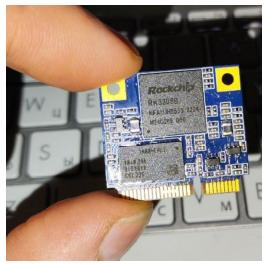
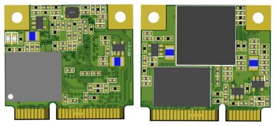
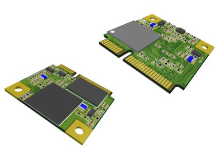
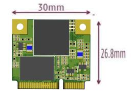
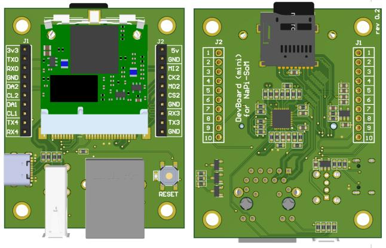
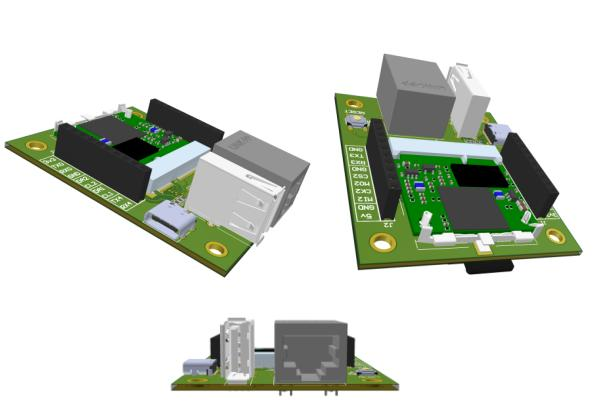
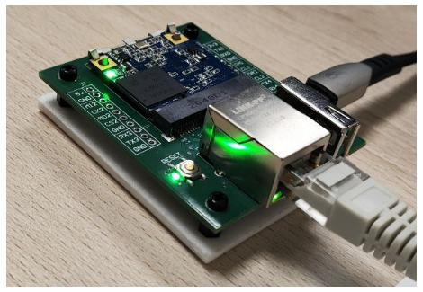
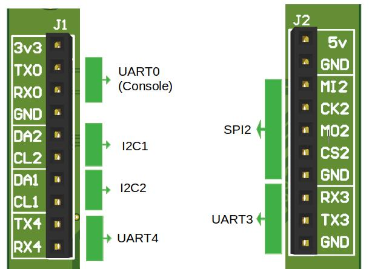
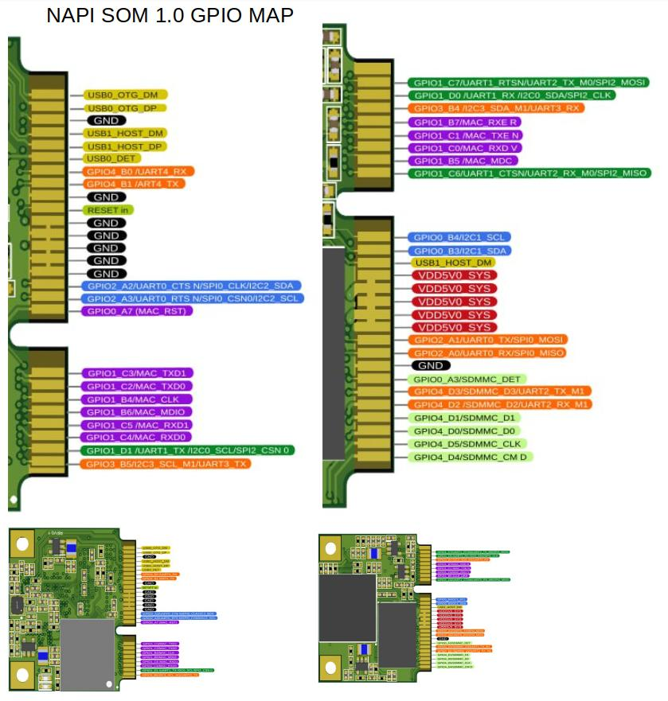

# Процессорный модуль NAPI S

:::note Обратите внимание
В настоящий момент проводится тестирование первой партии. Скоро, совсем скоро мы сможем раздавать на тесты. 
:::

## Что такое NAPI S

NAPI S - миниатюрный модуль формата 1\2 устройства под разъем PIC-e слот.  На модуле присутствует процессор (RK3308), оперативная память 512Мбайт, постоянная память EMMC (более быстрая, чем NAND). На GPIO выведены SPI, UART, I2C

## Зачем нужен SOM NAPI

NAPI S предназначен для интегрирования в другие платы в качестве сервисного чипа. Внедрив NAPI S в Ваш проект, можно с минимальными затратами наделить его новым функционалом:

- Веб-интерфейс или Веб-приложение на полноценных "движках", таких как Flack, Django, NodeJS, React, Nuxt;
- MQTT сервер;
- SNMP V2\V3 сервер;
- REST API \ GraphQL сервер;
- Модуль сбора статистики и логирования параметров основного устройства. 

Одним словом, можно значительно усилить или заменить MCU на микроконтроллере полноценным Linux-модулем со всеми инструментами разработки.

## Планы применение в наших и совместных продуктах

Участвуя в разработке сложных устройств, мы видим потребность в таком чипе. Вот несколько примеров будущих внедрения NAPI S:

- сервис чип L2 коммутатора для интеллектуального управления POE, сигнализацией и хранения метрологии;
- сервис чип для радио-релейных модулей для хранения метрологии, реализации модуля NetWork Managment System (NMS), реализации функционала SNMP V3;
- сервис чип для интеллектуальных систем управления питанием (ПДУ).

:::tip
Практически в любом сложном устройств на специализированных чипах или контроллерах, есть потребность в реализации интерфейсов и сервисных модулей, для которых идеально подходит NAPI S
:::

## Размер модуля

Мы постарались сделать модуль максимально миниатюрным по размеру 

:::tip Делайте свои решения на NAPI

NAPI S совместимо с модулями NAPI C, которое можно отладить как самостоятельное устройство, а затем перенести прошивку на NAPI S.

:::

## Технические данные

- RK3308 processor (Cortex- A35 quard core)
- Armbian Linux \ NAPI Linux
- Современное Linux ядро (kernel 6.1)
- 512Мб ОЗУ
- ** 32Гб ПЗУ (EMMC) **
- 1 х Ethernet 100Мбит
- 2 x USB 2.0 
- Питание +5В 
- 3 x UART
- SPI
- 2 x i2c
- 
## Платы для прошивки и отладки

Для прошивки и работы с модулем мы разрабатываем миниатюрную плату разработчика (DevBoard)

Модуль NAPI-S вставляется через удобный зажим, питание платы осуществляется через разъем USB-C.

## Интерфейсы отладочной платы

Интерфейсы spi2, i2c1,2, uart3, uart4 могут быть задействованы как GPIO.

# Карта GPIO NAPI-S

>:warning: Скачать в формате [PDF](__pdfs/napi-som-chip-gpio.pdf)

## Программное обеспечение

Процессорные модули NAPI работают под управлением ОС Linux для архитектуры ARM. Мы поддерживаем систему Armbian и разрабатываем и поддерживаем собственную прошивку NapiLinux с интерфейсом управления NapiConfig.

>:warning: **Смотрите раздел ["Программная поддержка"](/software)**