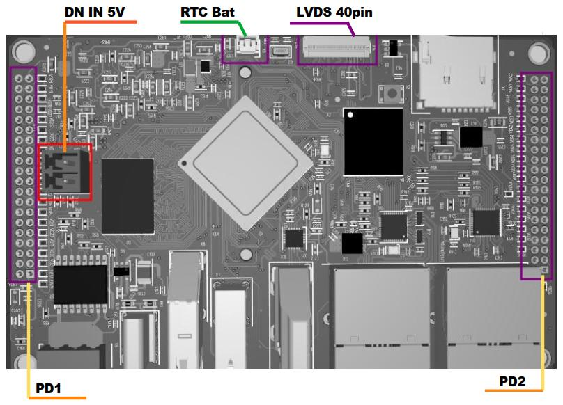

# Одноплатный компьютер NAPI2

Новый одноплатный компьютер NAPI2.

Основные преимущества перед множеством одноплатных компьютеров на рынке

- Все интерфейсы на передней панели
- RS485 встроен в плату
- 2хEthernet 1Гбит
- Компактный размер (109.4х70.2)
- 2 колодки GPIO 2.0 мм для удобного встраивания в мезонин

 \
*Рис. 1: NAPI2 - внешний вид передней панели со всеми интерфейсами*

## Все характеристики

\
*Рис. 2: Схема расположения всех интерфейсов NAPI2*

- Процессор: RK3568J (промышленный температурный диапазон)

Память

- Память ОЗУ: 4Гб
- Память ПЗУ: 32Гб (EMMC)
- Дополнительный слот памяти: SD

Интерфейсы

- 2xEthernet 1Гбит\с
- USB 3.0
- USB 2.0
- USB type-c otg\питание

Видео

- HDMI
- LVDS

## Разъемы на плате

- Питание 5В
- LVDS
- RTC (BAT)

 \
*Рис. 3: Расположение разъемов на плате NAPI2*

## Карта GPIO

- Питание 5В (IN\OUT), 3В (OUT)
- Консоль (UART2)
- 3xUART, CAN, 2xSPI, 2xI2C
- USB 2.0

 \
*Рис. 4: Подробная карта GPIO с распиновкой разъемов*

Скачать в формате [PDF](pdf/napi2-gpio10.pdf)

## Сборочный чертеж

Скачать в формате [PDF](pdf/%D0%A1%D0%B1%D0%BE%D1%80%D0%BE%D1%87%D0%BD%D1%8B%D0%B9_%D1%87%D0%B5%D1%80%D1%82%D0%B5%D0%B6_NAPI_2_%D0%A2%D0%A4%D0%9F%D0%9C_469535_100_%D0%A1%D0%91.PDF)

## Дополнительные платы. Плата для прототипирования.

- Питание 9-36
- Консоль
- Переходные колодки с шага 2.0 мм на шаг 2.54 мм

 \
*Рис. 5: Плата для прототипирования с расширенным питанием и переходными колодками*

## Программное обеспечение

- Armbian
- NapiLinux
