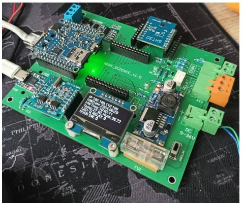

# Учебная плата Napi Sci

>:fire: Репозиторий с прошивкой и учебными скриптами: https://github.com/lab240/napisci

Набор плат на основе одноплатника Napi-C и модулей для прототипирования и изучения Linux.

Открытое GPIO и сменные модули позволяют разрабатывать и тестировать любые датчики и периферийные устройства до разработки печатной платы.

### Модули платы

- Преобразователь UART-USB для подключения консоли
- Преобразователь UART-RS485 для подключения внешних датчиков
- RTC - часы реального времени с памятью
- Блок питания DC 9-36
- Дисплей SPI для отображения данных

### Сменные модули

- Сменный модуль i2c для любых устройств i2c (датчики, ADC, дисплеи)
- Большой сменный модуль с полным дублированием GPIO Napi-C для прототипирования

## Модули формата Wemos D1 mini

>Мы сделали слот, совместимый с платами расширения Wemos D1 mini.

### Датчик температуры и влажности SHT30

>Датчик можно купить в готовом виде на ОЗОН: https://ozon.ru/t/391X1jA

### Свои датчики

Вы можете спроектировать любые датчики и устройства I2C.

Готовая "монтажка" формата Wemos D1 mini

>Готовая плата для проектирования: https://ozon.ru/t/NPBB6X8

Датчики на платках-модулях (датчик освещенности BH1750 и датчик давления и температуры BMP280)

Можно использовать монтажку для Arduino, вырезав необходимый размер и припаяв колодки.

Пример платы на монтажке с датчиком давления BMP280

Чтобы датчик на монтажке заработал, необходимо для датчика взять с разъема "землю", "питание" (есть как 5В так и 3.3В) и соединить SCL (D1),SDA(D2) как показано на рисунке.

:::tip

Хорошая задача для студентов и школьников - проектировать модули с различными датчиками и читать из в Linux с выводом на экран и в сеть.

:::

## Плата расширения на GPIO

Мы дублируем полностью GPIO Napi C для создания различных плат расширения. Это будет полезно для использования свободных GPIO или для проектирования нестандартных устройств.

> :point_up: Назначение GPIO можно посмотреть на **[странице документации к Napi-C](https://napiworld.ru/docs/napi-intro#napi-gpio-%D0%BA%D0%BE%D0%BD%D1%82%D0%B0%D0%BA%D1%82%D0%BD%D1%8B%D0%B5-%D0%B3%D1%80%D0%B5%D0%B1%D0%B5%D0%BD%D0%BA%D0%B8-%D0%B4%D0%BB%D1%8F-%D1%81%D0%BE%D0%B5%D0%B4%D0%B8%D0%BD%D0%B5%D0%BD%D0%B8%D1%8F-%D1%81-%D0%BD%D0%B5%D1%81%D1%83%D1%89%D0%B5%D0%B9-%D0%BF%D0%BB%D0%B0%D1%82%D0%BE%D0%B9)**.

Пример платы расширения свободного проектирования

- Плата расширения с светодиодами и переключателем

- Плата с дополнительным RS485

## Контакты для сотрудничества

Если Вам интересна концепция, есть идея плат расширения или такая плата нужна для обучения, пишите нам: Email: dmn@nnz.ru, Telegram: @dmn240.
