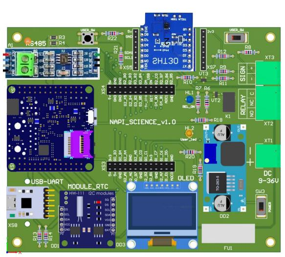

# Учебная плата Napi Sci

>:fire: Заполните **[анкету](https://forms.gle/j7BSwRaSw1z21kQz7)**, чтобы получить плату для учебных целей!

>:fire: Репозиторий с учебными скриптами: https://github.com/lab240/napi-scripts

>**Napi SCI - простая модульная плата на основе одноплатника Napi-C и модулей для прототипирования и изучения Linux. Для работы с i2c датчиками, RTC-часами, SPI-модулями, реле, шлейфами сигнализации, GPIO.**

Открытое GPIO и сменные модули позволяют разрабатывать и тестировать любые датчики и периферийные устройства до разработки печатной платы.

<!--  -->
<!--  -->

### Модули платы

- Преобразователь UART-USB для подключения консоли;
- Преобразователь UART-RS485 для подключения внешних датчиков;
- RTC - часы реального времени с памятью;
- Блок питания DC 9-36;
- Дисплей SPI для отображения данных;
- Слоты для i2c датчиков и набор датчиков;
- Реле 10А;
- Шлейф сигнализации;
- Слот свободного проектирования на GPIO.

<!--  -->

### Сменные модули

- Сменные модули i2c (2 штуки) для любых устройств i2c (датчики, ADC, дисплеи)
- Большой сменный модуль с полным дублированием GPIO Napi-C для прототипирования

## Модули i2c формата Wemos D1 mini

>Мы сделали слот для i2c, совместимый с платами расширения Wemos D1 mini.

Чтобы датчик на заработал, необходимо подать "землю", "питание" (есть как 5В так и 3.3В) и соединить SCL (D1),SDA(D2) как показано на рисунке.

<!--  -->

### Готовые датчики формата Wemos

### Датчик температуры и влажности SHT30

>Датчик можно купить в готовом виде на ОЗОН: https://ozon.ru/t/391X1jA

### Свои датчики

Вы можете спроектировать любые датчики и устройства I2C.

Готовая "монтажка" формата Wemos D1 mini

>Готовая плата для проектирования: https://ozon.ru/t/NPBB6X8

Датчики на платках-модулях (датчик освещенности BH1750 и датчик давления и температуры BMP280)

Можно использовать монтажку для Arduino, вырезав необходимый размер и припаяв колодки.

Пример платы на монтажке с датчиком давления BMP280

:::tip

Хорошая задача для студентов и школьников - проектировать модули с различными датчиками и читать из в Linux с выводом на экран и в сеть.

:::

## Плата расширения на GPIO

Мы дублируем полностью GPIO Napi C для создания различных плат расширения. Это будет полезно для использования свободных GPIO или для проектирования нестандартных устройств.

> :point_up: Назначение GPIO можно посмотреть на **[странице документации к Napi-C](https://napiworld.ru/docs/napi-intro#napi-gpio-%D0%BA%D0%BE%D0%BD%D1%82%D0%B0%D0%BA%D1%82%D0%BD%D1%8B%D0%B5-%D0%B3%D1%80%D0%B5%D0%B1%D0%B5%D0%BD%D0%BA%D0%B8-%D0%B4%D0%BB%D1%8F-%D1%81%D0%BE%D0%B5%D0%B4%D0%B8%D0%BD%D0%B5%D0%BD%D0%B8%D1%8F-%D1%81-%D0%BD%D0%B5%D1%81%D1%83%D1%89%D0%B5%D0%B9-%D0%BF%D0%BB%D0%B0%D1%82%D0%BE%D0%B9)**.

### Платы расширения свободного проектирования

Плата расширения для свободного проектирования с шелкографией
<!--  -->

### Пример плат расширений

- Плата с дополнительным RS485 (как видно, можно использовать простую монтажку с ножками-штырями)

- Плата с светодиодами и переключателем на монтажке

## Контакты для сотрудничества

Если Вам интересна концепция, есть идея плат расширения или такая плата нужна для обучения, пишите нам: Email: dmn@nnz.ru, Telegram: @dmn240.
