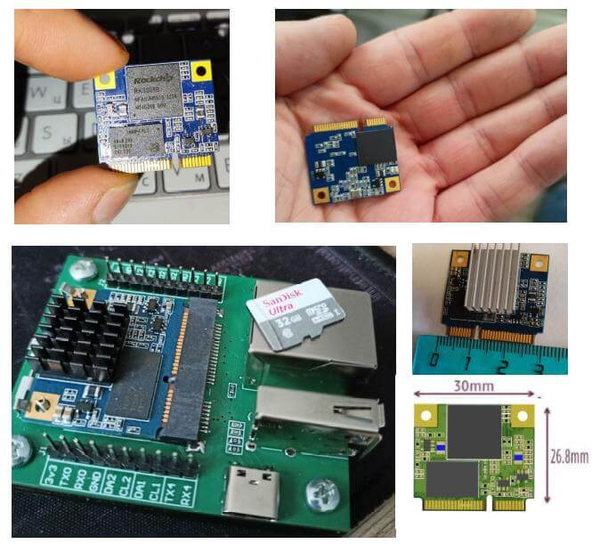
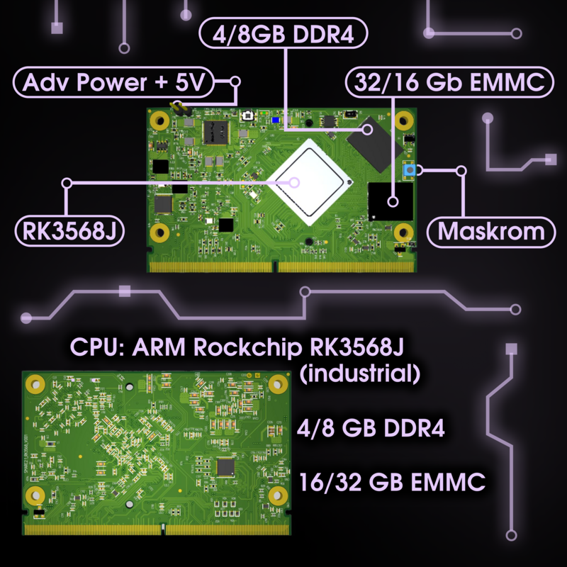

| Модель | Изображение | Описание |
|--------|-------------|----------|
| [**NAPI-Slot**](napi-slot/) |  | Миниатюрный SOM в форм-факторе PCI-e слот на ARM Rockchip RK3308. 512 Мб ОЗУ, 32 Гб eMMC, 1×100 Мбит Ethernet. Размер 30×26.8 мм. |
| [**NAPI2-SMARC**](napi2-smarc/) |  | Индустриальный SOM стандарта SMARC 2.1 на ARM Rockchip RK3568J. Промышленный диапазон температур. Поддержка NapiLinux, Armbian, Debian. |
