# * Процессорный модуль NAPI-Slot

:::note NAPI-Slot
Супер-компактный и супер-холодный вычислительный модуль на Linux для Ваших проектов на основе Arm Rockchip RK3308. Модуль оснащён 4-ядерным процессором RK3308BS, 512 Мб DDR2 и 32 Гб eMMC.
:::

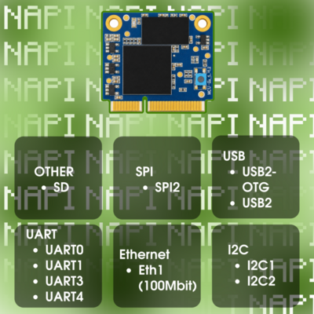

## Что такое NAPI-Slot

NAPI-Slot — миниатюрный модуль формата 1/2 устройства под разъём PCI-e слот.  На модуле присутствует процессор (RK3308), оперативная память 512 Мб, постоянная память eMMC 32 Гб (более быстрая, чем NAND). На GPIO выведены SPI, UART, I2C

## Технические данные

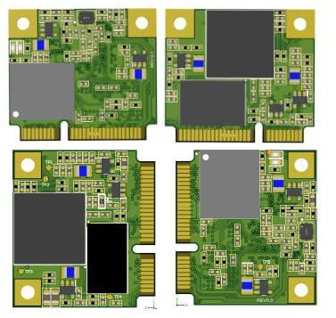

- RK3308 processor (Cortex- A35 quard core)
- Armbian Linux / NAPI Linux
- Современное Linux ядро (kernel 6.1)
- 512 Мб ОЗУ
- **16/32 Гб ПЗУ (eMMC)**
- 1 × Ethernet 100 Мбит
- 2 × USB 2.0
- Питание +5 В
- 3 × UART
- SPI
- 2 × I2C

## Плата разработчика

Для прошивки и разработки решений на основе NAPI-Slot, мы разработали миниатюрную плату разработчика (DevBoard)

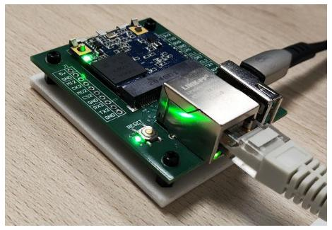

На плате выведены порты UART, I2C, SPI, Ethernet, USB, microSD.

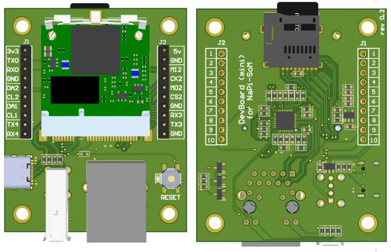

Модуль NAPI-Slot вставляется через удобный зажим, питание платы осуществляется через разъем USB-C.

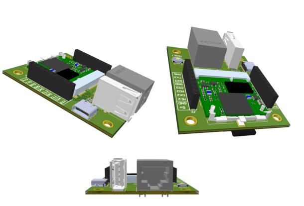

## Зачем нужен SOM NAPI-Slot

### Устройства на основе NAPI-Slot

На основе NAPI-Slot можно разрабатывать компактные платы для преобразования данных, сбора данных, шифрации, преобразования интерфейсов. В модуле достаточно мощности и памяти для многих задач, а среда Linux позволит быстро разрабатывать или устанавливать программное обеспечение. В отличие от Napi C, где разработчик привязан к слотам USB, Ethernet, с NAPI-Slot Вы можете сделать любую разводку вокруг вычислителя, хотя плата будет более сложной.

>:warning: **Napi C / Napi P / NAPI-Slot совместимы программно. Вы можете отладить проект на Napi C, а реализовать его на NAPI-Slot.**

>Мы сами делаем устройство сбора «Сборщик-универсал» на основе NAPI-Slot, оно получилось более компактным, чем наш же прототип на Napi C.

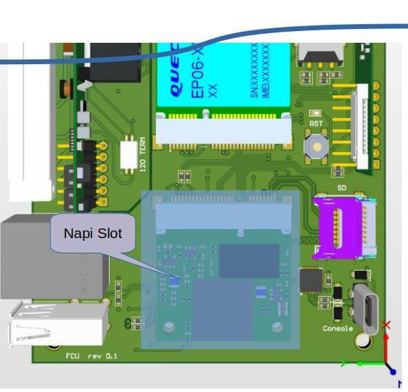

### NAPI-Slot как сервисный модуль

Ещё одно применение NAPI-Slot — интеграция в другие платы в качестве сервисного чипа. Внедрив NAPI-Slot в Ваш проект, можно с минимальными затратами наделить его новым функционалом:

- Веб-интерфейс или веб-приложение на полноценных «движках», таких как Flask, Django, NodeJS, React, Nuxt;
- MQTT сервер;
- SNMP V2/V3 сервер;
- REST API / GraphQL сервер;
- Модуль сбора статистики и логирования параметров основного устройства.

Одним словом, можно значительно усилить или заменить MCU на микроконтроллере полноценным Linux-модулем со всеми инструментами разработки.

### Планы внедрения в продуктах

Участвуя в разработке сложных устройств, мы видим потребность в таком чипе. Вот несколько примеров будущих внедрений NAPI-Slot:

- сервисный чип L2-коммутатора для интеллектуального управления PoE, сигнализацией и хранения метрологии;
- сервисный чип для радио-релейных модулей для хранения метрологии, реализации модуля Network Management System (NMS), реализации функционала SNMP V3;
- сервисный чип для интеллектуальных систем управления питанием (ПДУ).

:::tip
Практически в любом сложном устройстве на специализированных чипах или контроллерах есть потребность в реализации интерфейсов и сервисных модулей, для которых идеально подходит NAPI-Slot
:::

## Размер модуля

Мы постарались сделать модуль максимально миниатюрным по размеру

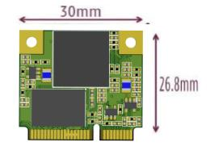

:::tip Делайте свои решения на NAPI

NAPI-Slot совместим с модулями NAPI C, которые можно отладить как самостоятельное устройство, а затем перенести прошивку на NAPI-Slot.

:::

## Интерфейсы модуля и платы (PINOUT)

### GPIO отладочной платы

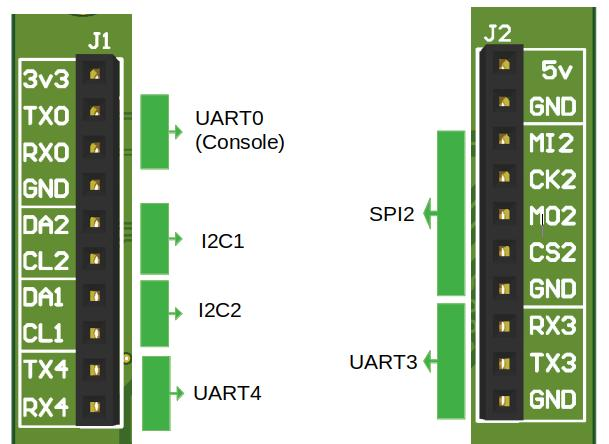

Интерфейсы spi2, i2c1,2, uart3, uart4 могут быть задействованы как GPIO.

### GPIO NAPI-Slot

>:point_right: Скачать в формате [PDF](pdf/TableInterface_NapiSOM_rev0-4-4-d.pdf) \
>:point_right: Скачать в формате [Excel](pdf/TableInterface_NapiSOM_rev0-4-4-d.xlsx)

Top Side

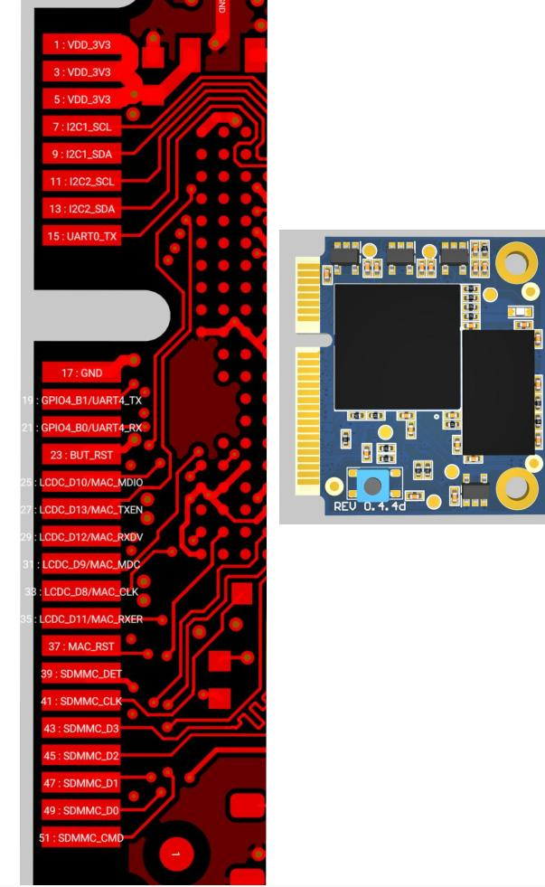

Bottom Side

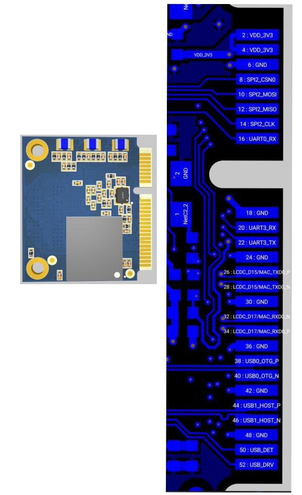

<!--
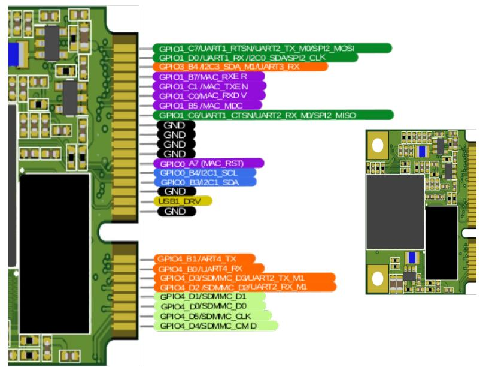

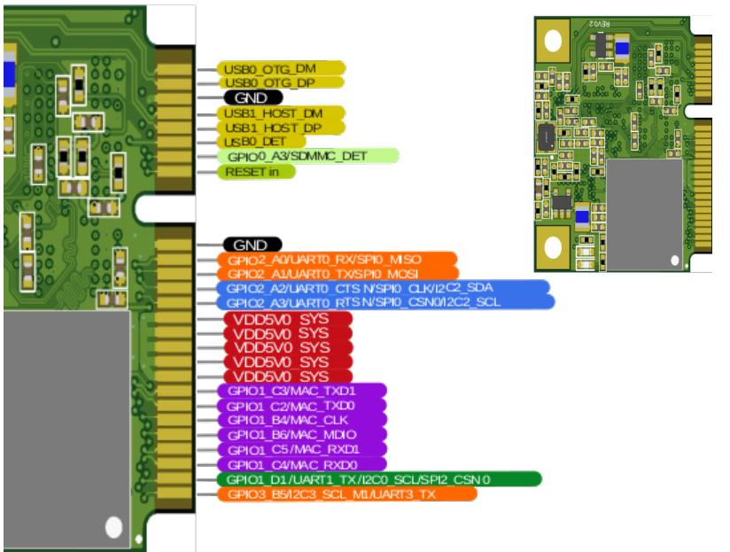

-->

## Программное обеспечение

Процессорные модули NAPI работают под управлением ОС Linux для архитектуры ARM. Мы поддерживаем систему Armbian и разрабатываем и поддерживаем собственную прошивку NapiLinux с интерфейсом управления NapiConfig.

>:warning: **Прошивки для плат NAPI в разделе ["Загрузки"](/downloads)**

## Продукты на NAPI-Slot и другие платы

### Платы на основе NAPI-Slot

- [Платы для NAPI-Slot](/docs/boards/napi-slot) - Сборщик-компакт MFCCS3308, плата разработки DevMini

### Промышленные компьютеры на основе NAPI-Slot

- [Сборщик-компакт FCCM3308](/docs/computers-industrial/FCCM3308) - суперкомпактный промышленный компьютер: RK3308, 2xEth, RS485, RTC, DIN-рейка, NapiLinux/Armbian

### Другие платы

- [Одноплатники NAPI-C и NAPI-P](/docs/computers/napi-c) - компактные одноплатные компьютеры на RK3308
- [Одноплатный компьютер NAPI2](/docs/computers/napi2) - новый одноплатник серии NAPI
- [Платы на основе NAPI-C](/docs/boards/napi-c-boards) - компактные платы, универсальные платы с модулями связи, учебная плата NapiSci, платы с PoE
- [Платы под OrangePi CM4](/docs/boards/napi-cm4) - система сбора данных MFCUCM4, одноплатный компьютер FCU3566
