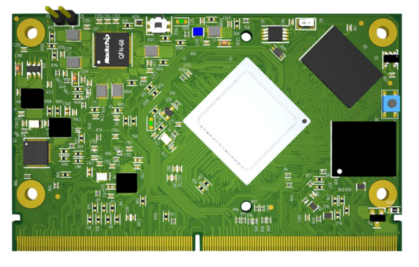
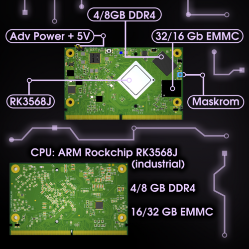
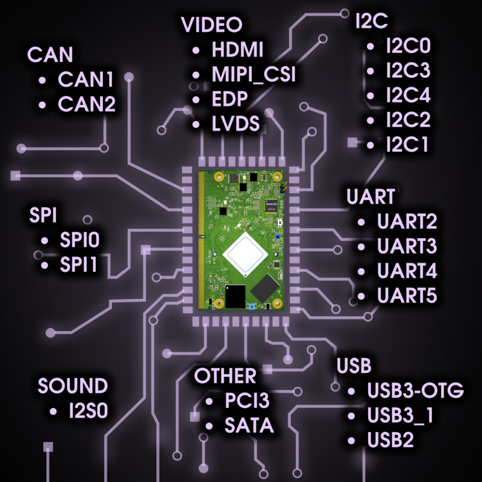
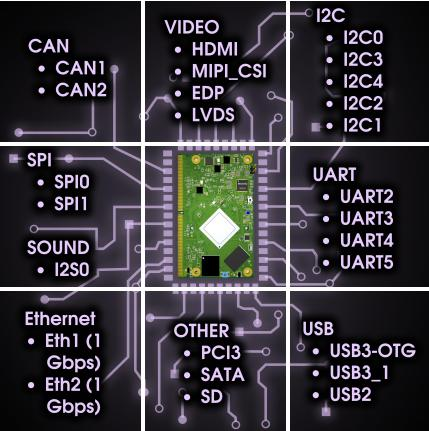
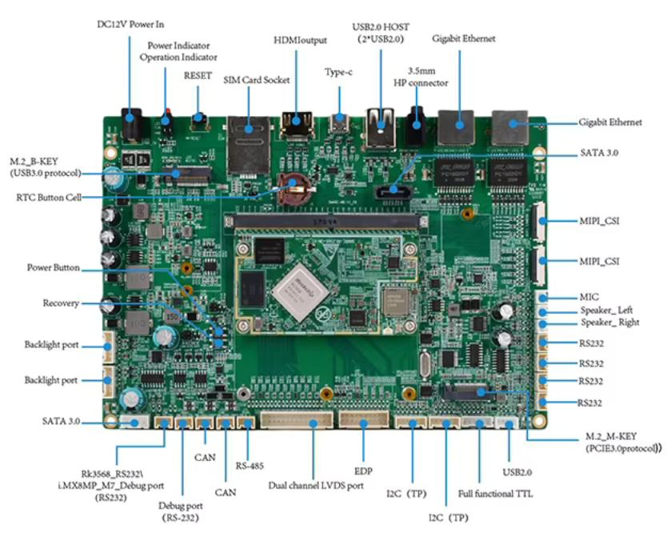

## Самое важное

- Rockchip RK3568J (Industrial)
- 4\8Gb ОЗУ
- 16\32Gb EMMC
- Индустриальный диапазон
- Соответствует стандарту SMARC 2.1
- Поддержка NapiLinux, Armbian, Debian

## Интерфейсы

<!--  -->

## Применение

- В любых платах, поддерживающих SMARC 2.0 / 2.1

Qiyang

> Вы можете применить NAPI2-SMARC в своих разработках, мы готовы оказать всю необходимую помощь.
