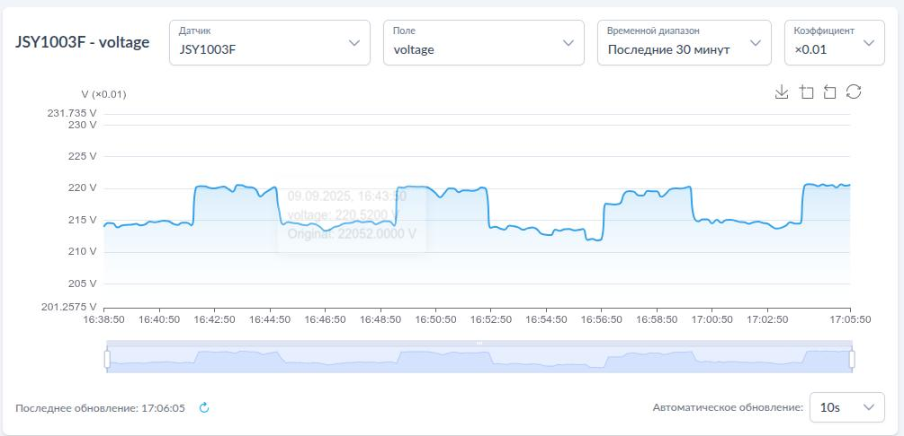

# Система сбора данных "Токосборщик"

Система сбора данных на основе FCU3308P под управлением NapiLinux с интерфейсом NapiConfig2

##

Система представляет собой Сборщик-Универсал с однофазным  датчиком переменного тока и предустановленным ПО для сбора и просмотра параметров

### Напряжение

### Ток

> Выбирайте коэффициент для корректного отображения !

### Мощность

### Счетчик энергии

## Интеграция с Grafana

## Настройка NapiConfig2
