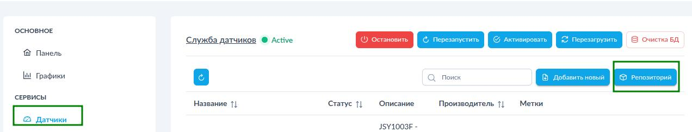
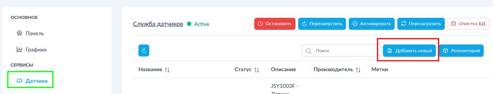
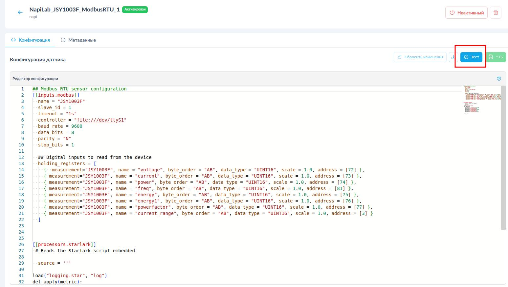
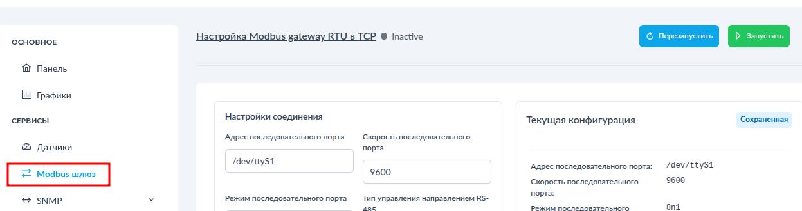
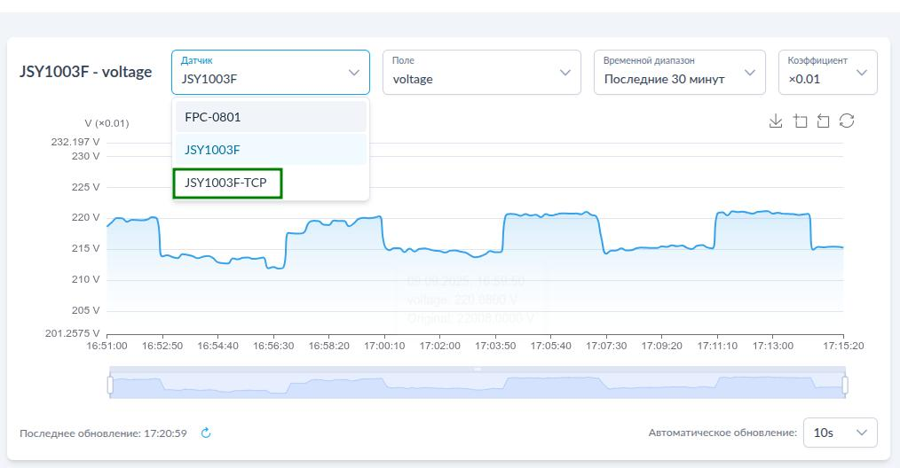

# Система сбора данных "Токосборщик"

Система сбора данных на основе FCU3308P под управлением NapiLinux с интерфейсом NapiConfig2

## Возможности

Система представляет собой Сборщик-Универсал с однофазным  датчиком переменного тока и предустановленным ПО для сбора и просмотра параметров

- Ток
- Мощность
- Напряжение
- Частота
- Энергия (счетчик)

### Напряжение

### Ток

> Выбирайте коэффициент для корректного отображения !

### Мощность

### Счетчик энергии

## Настройка NapiConfig2

Если у вас доступен NapiLinux c NapiConfig2, то конфигурационный файл для
датчика тока доступен через ONLINE репозиторий (каталог).

## Добавление датчика через Online каталог

Нажмите в меню "датчик" кнопку Репозиторий

Выберете датчик JSY Modbus RTU (зеленый)

> Вы можете выбрать и Mbdbus TCP, но тогда необходимо настроить и запустить службу mbusd. Также вы моежет сразу установить оба датчика, но активирован долен быть один. По сути, это один и тот же датчик, только доступ осуществляется по разным протоколам.

Протестируйте датчик и убедитесь, что вывод теста содержит данные (как на рисунке)

Запустите службу

## Добавить датчик вручную

>Вы можете как добавить встроенный датчик тока, так и любой датчик, подключенный по внешнему RS485 или Modbus TCP \ SNMP \ MQTT.

Конфиги датчика: https://github.com/lab240/telegraf-grafana-configs/tree/main/conf-telegraf/JSY

Нажмите кнопку "Добавить новый"

Внесите мета-данные и конфигурационный файл Telegraf, не забудьте нажать кнопку "Сохранить"

Протестируйте датчик в ручном режиме при запуске

Убедитесь что вывод тестового запуска корректен

Запустить службу

## Работа с данными

Проверить что данные поступают в разделе Графики.

Выбирайте измерения и коэффициенты для просмотра корреткных значений, выбирайте период просмотра и другие доступные параметры.

## Доступ к датчику по TCP

Можно также получить данные с датчика по MODBUS TCP, активиовав службу машрутизатора mbusd

> Необходимо деактивировать датчик Modbus RTU !

Перейдите в раздел "Modbus шлюз"

Заполните корректно параметры доступа к датчику

- Порт `/dev/ttyS1`
- Скорость 9600

Остальные параметры по умолчанию.

>Сохраните данные настроек mbusd !

Немного изменить конфигурационный файл датчика (или добавить новый датчик)

Теперь данные должны идти от датчика с именем в конфиге для Modbus TCP

>При работе с датчиком через Modbus TCP вы можете опрашивать датчик не только через Telegraf, этот метод более универсальный, чем Modbus RTU.

## Интеграция с Grafana
