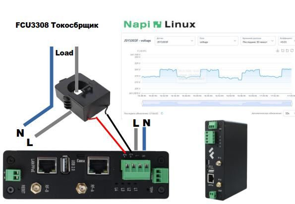
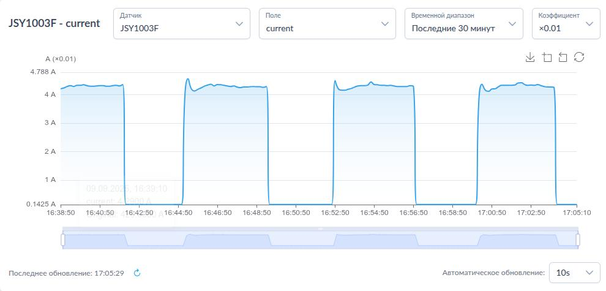
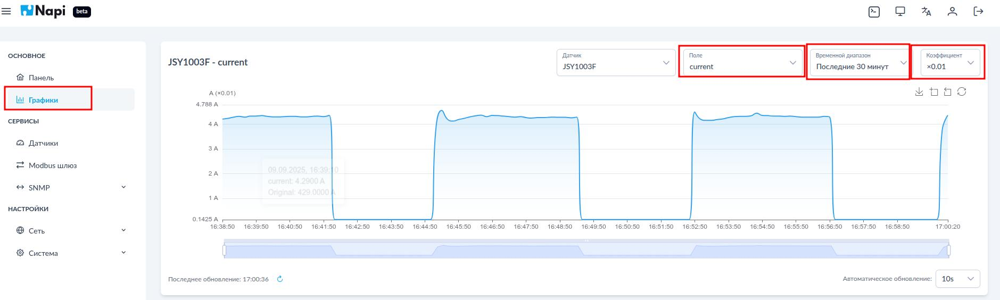
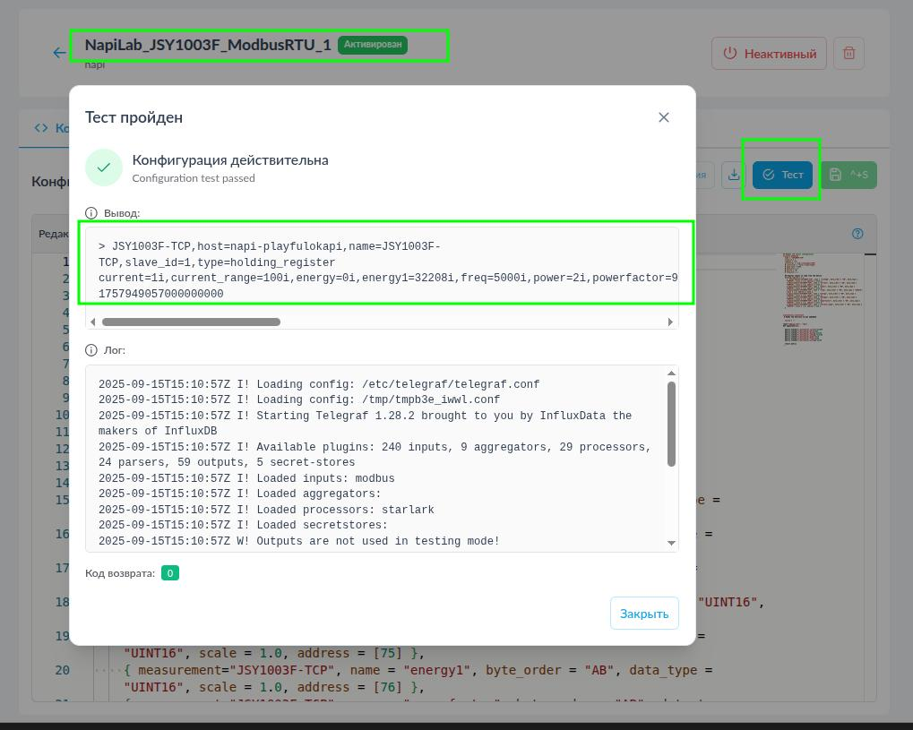
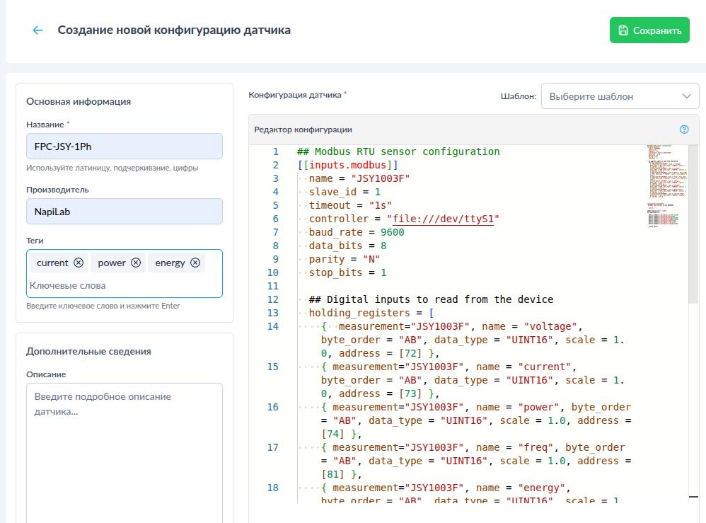
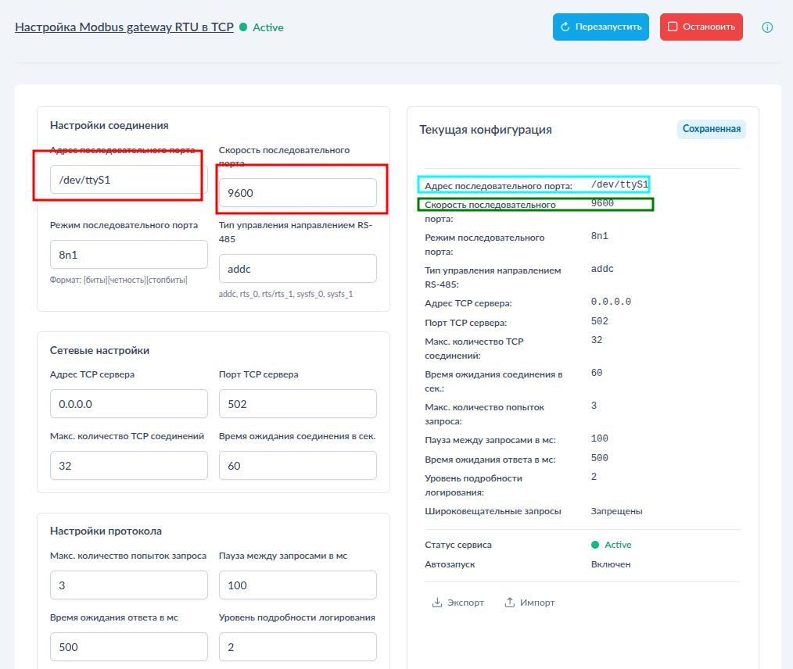
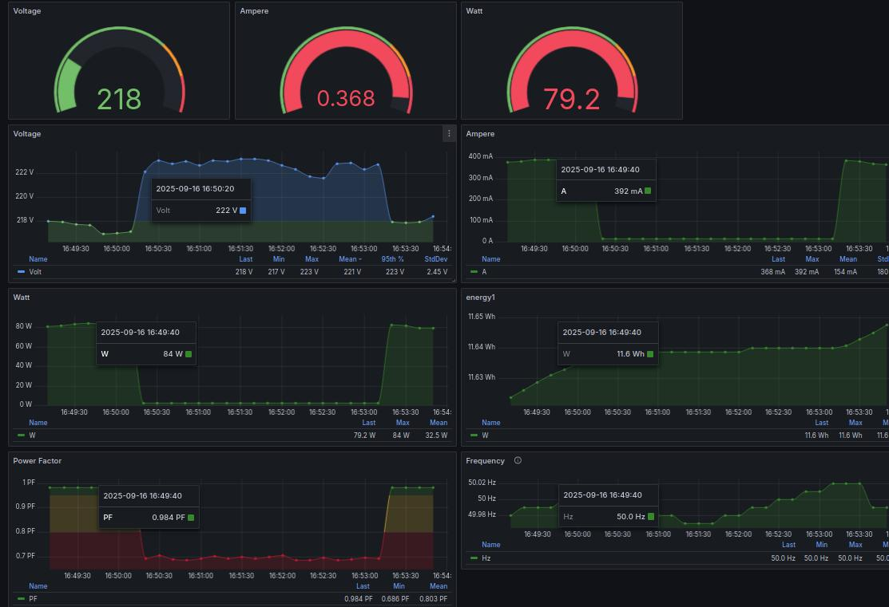
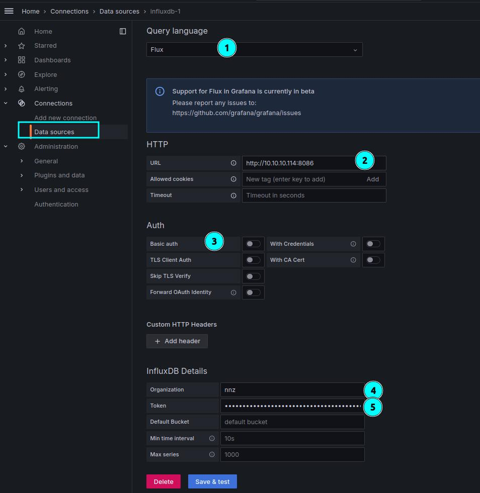
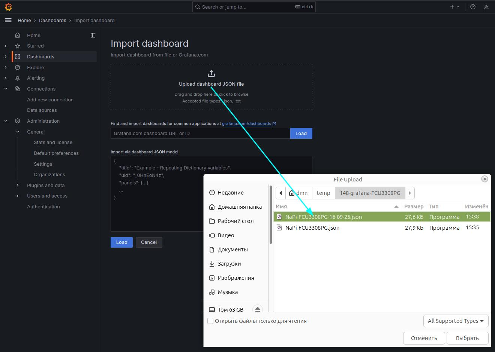
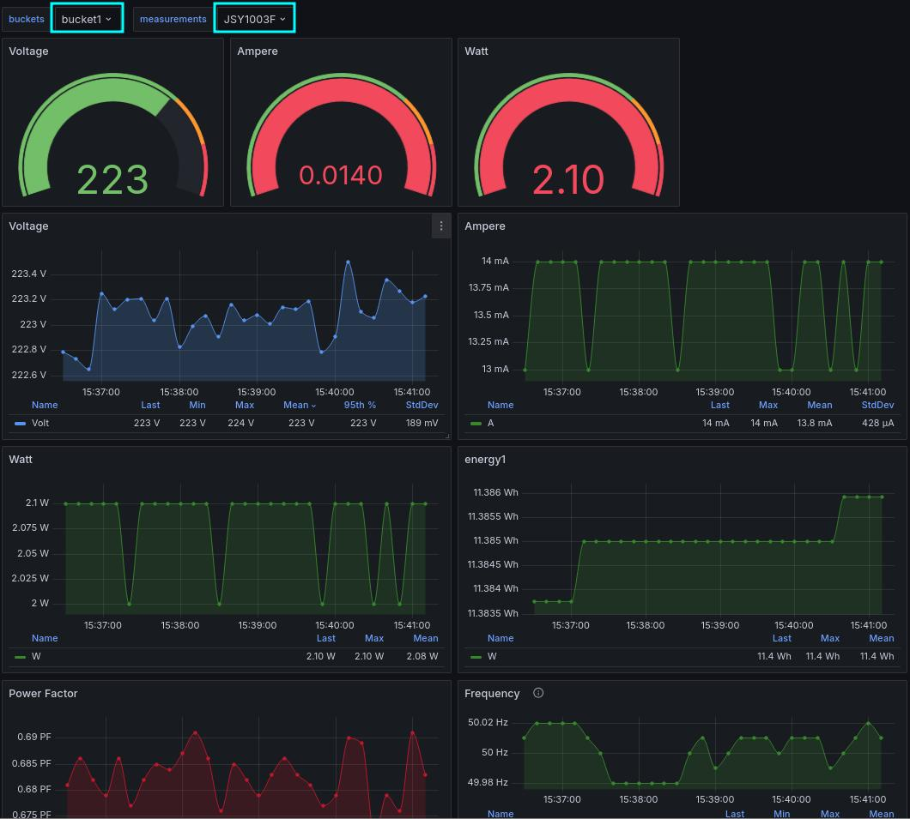

# FCU3308PG. Сбор данных в сетях переменного тока

Система сбора данных на основе [FCU3308P](../../computers-industrial/FCU3308P/) под управлением NapiLinux с интерфейсом NapiConfig2.

>Для простоты мы ее также называем "Токосборщик".



>Применяется для анализа работы электро-установок (станки, печи, двигатели, вентиляторы), для своевременного
технического обслуживания, минимизации времени простоя. Поддерживает хранение и анализ данных на устройстве и передачу данных через Ethernet\LoraWan\Zigbee\WiFi сети.

## Возможности

Система представляет собой Сборщик-Универсал с однофазным датчиком переменного тока и предустановленным ПО для сбора и просмотра параметров

- Ток
- Мощность
- Напряжение
- Частота
- Энергия (счетчик)


:::tip Важное свойство

Важное свойство нашей реализации - Токо-сборщик работает не только в режиме сбора и передачи информации, но может использоваться как автономное устройство. Токо-сборщик всегда собирает и хранит данные на устройстве. Доступны Веб-интерфейсы для анализа накопленных данных.

**Токо-сборщик устойчив к потерям связи на любые периоды и может работать в режиме черного ящика !**

:::


### Напряжение


### Ток



> Выбирайте коэффициент для корректного отображения!



### Мощность


### Счетчик энергии


## Настройка NapiConfig2

Если у вас доступен NapiLinux c NapiConfig2, то конфигурационный файл для
датчика тока доступен через ONLINE репозиторий (каталог).

## Добавление датчика через Online каталог

Нажмите в меню "датчик" кнопку Репозиторий


Выберите датчик JSY Modbus RTU (зеленый)


> Вы можете выбрать и Modbus TCP, но тогда необходимо настроить и запустить службу mbusd. Также вы можете сразу установить оба датчика, но активирован должен быть один. По сути, это один и тот же датчик, только доступ осуществляется по разным протоколам.

Протестируйте датчик и убедитесь, что вывод теста содержит данные (как на рисунке)



Запустите службу


## Добавить датчик вручную

>Вы можете как добавить встроенный датчик тока, так и любой датчик, подключенный по внешнему RS485 или Modbus TCP \ SNMP \ MQTT.

Конфиги датчика: https://github.com/lab240/telegraf-grafana-configs/tree/main/conf-telegraf/JSY

Нажмите кнопку "Добавить новый"


Внесите мета-данные и конфигурационный файл Telegraf, не забудьте нажать кнопку "Сохранить"




Протестируйте датчик в ручном режиме при запуске


Убедитесь, что вывод тестового запуска корректен


Запустите службу


## Работа с данными

Проверьте, что данные поступают в разделе Графики.

Выбирайте измерения и коэффициенты для просмотра корректных значений, выбирайте период просмотра и другие доступные параметры.


## Доступ к датчику по TCP

Можно также получить данные с датчика по MODBUS TCP, активировав службу маршрутизатора mbusd


> Необходимо деактивировать датчик Modbus RTU !

Перейдите в раздел "Modbus шлюз"


Заполните корректно параметры доступа к датчику

- Порт `/dev/ttyS1`
- Скорость 9600

Остальные параметры по умолчанию.

>Сохраните данные настроек mbusd !



Немного изменить конфигурационный файл датчика (или добавить новый датчик)


Теперь данные должны идти от датчика с именем в конфиге для Modbus TCP


>При работе с датчиком через Modbus TCP вы можете опрашивать датчик не только через Telegraf, этот метод более универсальный, чем Modbus RTU.

## Интеграция с Grafana

Удобно наблюдать и анализировать данные, собранные датчиком через популярный инструмент Grfana. Мы подготовили готовую Dash-борду с выводом данных за любой период.



## Импорт и настройка

Чтобы подключить "дашбоард" Grafana, необходимо установить на хост-машину продукт Grafana и подключиться к Сборщику для отображения данных из его базы.

1. Установить Grafana или наш  docker с Grafana (можно установить под Windows)

2. Залогиниться в Графану и создать новый "Data Source"

- Выбираем тип языка запросов "Flux" (1)
- Укажите IP-адрес сборщика (2)
- Уберите базовую авторизацию (3)
- Введите организацию и токен (4,5)

:::tip

Организацию и токен ищем командой в терминале

```
root@napi-playfulokapi:~# cat /etc/telegraf/telegraf.conf | grep -E "token|org"
```

:::



Если все хорошо, то после кнопки "Save & Test" появится зеленая надпись,
что тест прошел удачно и brackets найдены

3. Импортируем готовую DashBoard

- Скачиваем с репозитория файл: https://github.com/lab240/telegraf-grafana-configs/tree/main/conf-grafana-dashboards/NAPI/Napi-FCUJSY

- Добавляем



- Получаем DashBoard



- Проверяем корректность переменных

  - buckets (корзина). Если данные не идут, попробуйте выбрать другой bucket
  - measurement (измерение). Измерение это фактически название датчика, поэтому если их несколько можно меняя переменную просматривать разные датчики.
