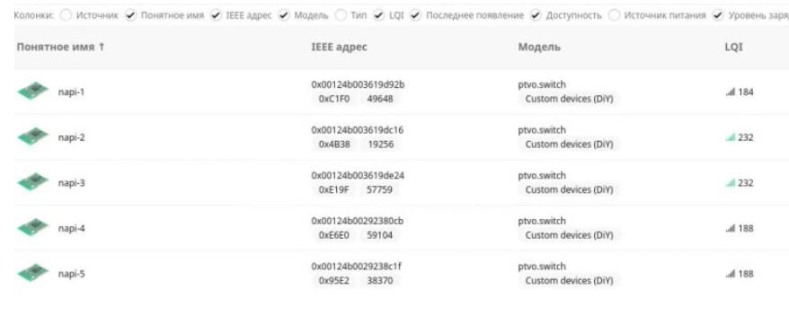
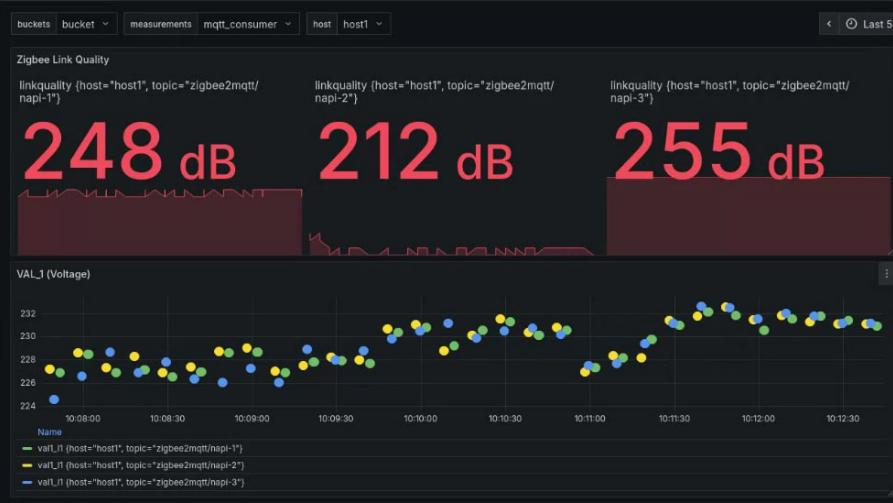

# FCU3308PZ. Система передачи данных Modbus - Zigbee

Система сбора данных на основе [FCU3308P](../../computers-industrial/FCU3308P/) под управлением NapiLinux с модулем передачи данных Zigbee и программным обеспечением для передачи данных.

>Применяется для передачи данных через ZigBee сеть на координатор. Все программное обеспечение открыто и может быть дополнено.

## Возможности

Система представляет собой Сборщик-Универсал с встроенным модулем Zigbee и программным обеспечением трансляции ModBus датчиков через Zigbee сеть на координатор.

Данные встроенного датчика

- Ток (0-100А) через токовое кольцо
- Мощность
- Напряжение
- Частота
- Энергия (счетчик)

Любые данные с внешних датчиков (ModBus RTU, Modbus TCP)

:::tip Важное свойство

Важное свойство нашей реализации - мы можем передавать любые данные с датчиков через встроенные модули Zigbee.

:::

## Схема работы системы

- Источником данных служит FCU3308PZ - индустриальный компьютер на платформе [FCU3308P](../../computers-industrial/FCU3308P/) (может также [FCUCM4](../../computers-industrial/FCUCM4/)) с встроенным датчиком Zigbee с [NapiLinux](http://napilinux.ru) и прошивкой [PTVO](http://ptvo.info);

- Специализированное открытое ПО на FCU3308PZ (пакет [modlink](https://gitlab.nnz-ipc.net/pub/modlink)) собирает данные с датчиков и транслирует в встроенный Zigbee передатчик;

- Все передатчики подключаются к единой Zigbee сети и "доносят" данные до координатора;

- Координатор FCU3308ZC на платформе [FCU3308P](../../computers-industrial/FCU3308P/) (может быть также реализован на [FCUCM4](../../computers-industrial/FCUCM4/)) преобразует Zigbee данные в MQTT каналы на встроенном MQTT-брокере;

- Сервер по локальной сети считывает MQTT каналы и "складывает" в базу данных.

> В качестве мини-сервера может быть использован [FCUCM4](../../computers-industrial/FCUCM4/)

- Оператор работает с программами визуализации и анализа данных

## Иллюстрации

### Датчики в интерфейсе Zigbee2Mqtt

### Данные сигналов с датчиков

### Фактические данные с датчика тока

## Программная поддержка

У нас готовы все конфигурации для датчика тока однофазной сети. Мы построили ZigBee сеть из таких датчиков для мониторинга работы станков. Датчик может быть как встроенный в [FCU3308P](../../computers-industrial/FCU3308P/), так и внешний.

- Для датчика: NapiLinux + NapiConfig c mbusd + modlink
- Для координатора: Armbian + Zigbee2mqtt + mosquitto
- Для сервера: докер в составе которого: telegraf + grafana + influxdb.

Для внешних (пользовательских) датчиков мы готовы построить конфигурационные файлы для корректной трансляции Modbus - Zigbee и настроить трансляцию данных в любую базу данных, а также даш-борды в системе Grafana.

## Заказать

Для предварительного расчета и консультаций пишите на email: napi@nnz.ru или любым способом в разделе "[Контакты](/contacts)"
