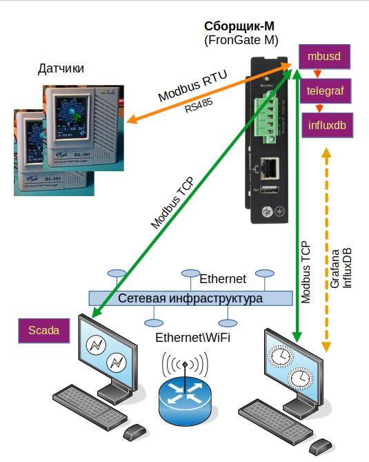
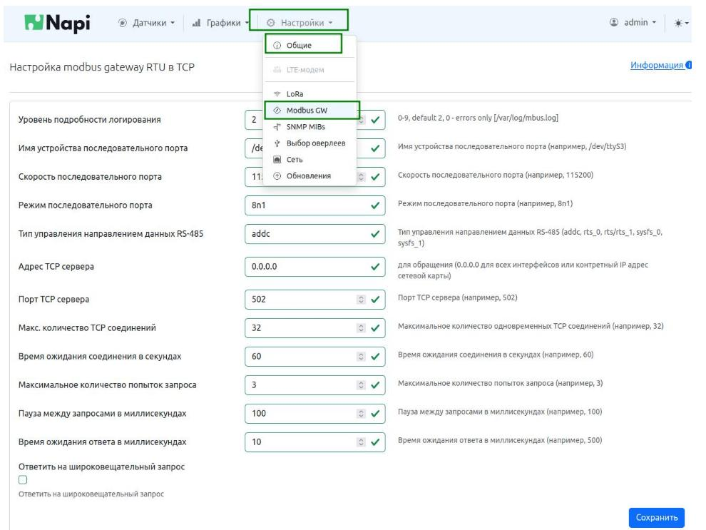
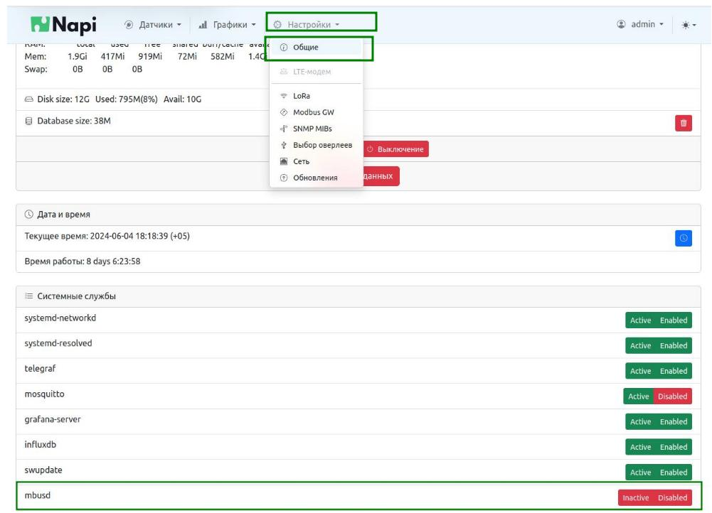

# Шлюз ModBus с памятью FrontGate-M

## О чем речь

Сборщик-М (FrontGate-M) шлюз Modbus TCP - Modbus RTU выполняет прозрачное шлюзование протокола Modbus RTU (физический порт RS485) в Modbus TCP (физический порт Ethernet). Разработан на основе Сборщик-Компакт и оснащен процессором RK3308, 512Мб ОЗУ, 4Гб ПЗУ. Устройство поставляется с NapiLinux и Веб-интерфейсом управления шлюзом NapiConfig.

> В отличие от большинства аналогов, Сборщик-М (Frontgate-M) может собирать данные, являясь клиентом своего шлюза, а также выполнять другие операции. Для продвинутых пользователей доступны тулкиты для работы с GPIO, язык программирования Python, возможность запускать любые программы и скрипты для ARM64. 

## Схема включения

1. Сборщик-М подключается к датчикам по RS485
2. Сборщик-М подключается к сети по Ethernet
3. На Cборщик-М настраивается и запускается сервис mbusd.

Оператор или программа опроса по Modbus TCP обращается к Сборщик-М, который транслирует запросы а Modbus RTU и транслирует ответы в Modbus TCP. 

Опционально Сборщик также может.

- Опрашивать по Modbus TCP самого себя и сохранять данные.
- Показывать графики сохраненных данных
- Предоставляет интерфейс к базе данных Influx для дальнейшего анализа в таких инструментах как Grafana. 

> Это позволяет более четко понимать есть ли связь с датчиком, видеть когда она прерывалась, оперативно анализировать данные. 

## Состав изделия 

С точки зрения "железа" это [Сборщик-Компакт](../../computers/frontcontrol-compact.md).

В состав ПО Сборщик-М  входит: 

- ОС NapiLinux с возможностью обновления 
- Свободное ПО mbusd (доступно в исходных кодах)
- Веб-интерфейс NapiConfig

Также могут быть активированы следующие сервисы:

- Telegraf - комбайн по сбору данных (в применении к Сборщику-М нас интересует съем данных по протоколу Modbus TCP)
- InfluxDB - база данных для складирования однотипных данных и доступа к ним. 
- Mosquito - сервис трансляции данных по протоколу MQTT

> Все сервисы уже инсталлированы и преднастроены - достаточно включить их через Веб.

## Быстрый старт

### Настройка TCP\IP сети 

- Если в Вашей сети есть DHCP, то Сборщик-М получит IP самостоятельно. 
 
>Как понять, какой IP получен, можно прочитать в **[статье](../../../software/notes/findip/)**. 

- Если в сети DHCP нет, то нужен компьютер с Ethernet и возможностью установить на этот компьютер IP адрес вручную. 
  
> Как это делать, написано в отдельной **[статье](../../../software/notes/staticip/)**. 

### Настройка mbusd

1. Подсоедините датчик по RS485 порту к Сборщик-М

>Как подсоединить датчик и как проверить что он опрашивается написано в отдельной **[статье](../../../software/sensors/modbus-rtu/)**.

2. Убедитесь, что опрос датчика работает 
   
>:warning: ** Проводите опрос по RS485 порту ДО активации службы mbusd ! **

3. Зайдите в Меню "Настройки - ModbusGW".

** Часть1. Настроим обязательные параметры ** 

 - Скорость порта (1)
 - Параметры порта (2)

> Эти параметры "диктуются" настройками датчика. Если Вы его уже "прочли" вручную, то Вы их точно знаете. В этих параметрах важна не только скорость, но и параметры работы порта (8n1, 8e1 и тп) - необходимо отнестись к этому внимательно !

** Остальные параметры нужно менять или при проблемах или при необходимости нестандартной работы \ поведения ** !

** Часть2. Посмотрите параметры, которые рекомендуется оставить по умолчанию **

- Адрес сервера (3). Поясним, что 0.0.0.0 позволяет принимать запросы на любой IP сборщика, это можно сменить ограничив только определенный адрес. Как правило, этот параметр остается по умолчанию.

- Порт TCP (4). Стандартный порт для Modbus TCP - 161. Если Вам нужно, чтобы Сборщик отвечал  по другому порту, можно сменить этот параметр.

- Количество одновременных соединений. Если у вас нет проблем с опросом огромного количества датчиков, оставьте этот параметр по умолчанию.

** Часть3. Параметры, которые нужны только продвинутым пользователям **

- Пауза в запросах. Этот параметр нужен при "шторме" из одновременных запросов. Рекомендуется при спокойных запросах оставить по умолчанию, при запросах без паузы этот параметр надо подбирать от 3 до 10 мс.

> ** Несмотря на обилие параметров, по сути Вам нужно ввести два параметра - скорость и характеристики порта. ** 

## Запустите службу mbusd

Заходим в "Настройки - Общие", среди сервисов ищем mbusd.

- Нажимаем на Inactive (переводим в состояние Active)
- Нажимаем на Disabled (переводим в состояние Enabled)

Обе кнопки должны стать зеленые - это значит что служба запустилась и будет автоматически запущена при дальнейшем рестарте системы.  

## Как проверить работу mbusd

Убедиться, что шлюз работает можно посылая ему запросы в Modbus TCP по его IP-адресу. Можно делать это с самого шлюза, опрашивая адрес 127.0.0.0.1 командой `modpoll`

> Как проверять работу шлюза описано в отдельной [статье](../../../software/sensors/mgate/#проверка-работы-читаем-датчик).

