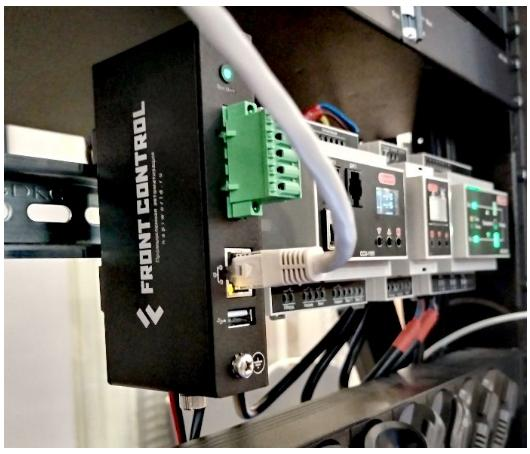

# Шлюз ModBus с памятью FrontGate-M

## О чем речь

Сборщик-М (FrontGate-M) шлюз Modbus TCP - Modbus RTU выполняет прозрачное шлюзования протокола Modbus RTU (физический порт RS485) в Modbus TCP (физический порт Ethernet). Разработан на основе Сборщик-Компакт и оснащен процессором RK3308, 512Мб ОЗУ, 4Гб ПЗУ. Устройство поставляется с NapiLinux и Веб-интерфейсом управления шлюзом NapiConfig.

> В отличие от большинства аналогов, Сборщик-М (Frontgate-M) может собирать данные, являясь клиентом своего шлюза, а также выполнять другие операции. Для продвинутых пользователей доступны тулкиты для работы с GPIO, язык программирования Python, возможность запускать любые программы и скрипты для ARM64. 

### Состав изделия 

С точки зрения "железа" это Сборщик-Компакт.

В состав ПО Сборщик-М  входит: 

- ОС NapiLinux с возможностью обновления 
- Свободное ПО mbusd (доступно в исходных кодах)
- Веб-интерфейс NapiConfig

Также могут быть активированы следующие сервисы:

- Telegraf - комбайн по сбору данных (в применении к Сборщику-М нас интересует съем данных по протоколу Modbus TCP)
- InfluxDB - база данных для складирования однотипных данных и доступа к ним. 
- Mosquitto - сервис трансляции данных по протоколу MQTT

> Все сервисы уже инсталлированы и преднастроены - достаточно включить их через Веб.

## Быстрый старт

### Настройка сети 

- Если в Вашей сети есть DHCP, то Сборщик-М получит IP самостоятельно. Как понять, какой IP получен, можно прочитать в статье. 

- Если в сети DHCP нет, то нужен компьютер с Ethernet и возможностью установить на этот компьютер IP адрес вручную.

### Настройка mbusd