# FGM0801. Шлюз ModBus RTU - Modbus TCP с памятью.


:::caution  FGM0801 - программно аппаратный комплекс (ПАК)

Представляем первый программно-аппаратный комплекс FGM0801 на основе [Сборщик-Компакт](/docs/computers-industrial/FCC3308/) и [NapiLinux](http://napilinux.ru) -
шлюз Modbus RTU - Modbus TCP с функциями настройки, мониторинга и логгирования данных. Все управление ПАК-ом осуществляется через Веб-интерфейс NapiConfig.

Все программное обеспечение предустановлено, предоставляется в открытых кодах "как есть" и бесплатно. Открытые лицензии на ПО можно узнать на сайтах всех используемых продуктов.
:::

>:boom: **[Руководство пользователя](pdf/fgm0801-userguide-1-1.pdf)**\
>:boom: **[Взять на бесплатное тестирование](https://nnz-ipc.ru/fc/anketa_compact/)**\
>:boom: **[База знаний и программное обеспечение](/software/)**

## Введение

**FGM0801 шлюз Modbus TCP - Modbus RTU выполняет прозрачное шлюзование протокола Modbus RTU (физический порт RS485) в Modbus TCP (физический порт Ethernet).**

>Разработан на основе [Сборщик-Компакт](/docs/computers-industrial/FCC3308/) ( на основе процессора ARM RK3308BS, 512Мб ОЗУ, 4Гб ПЗУ).

В отличие от большинства аналогов, **FGM0801** может собирать данные, являясь клиентом своего шлюза, а также выполнять другие операции. Для продвинутых пользователей доступны тулкиты для работы с GPIO, язык программирования Python, возможность запускать любые программы и скрипты для ARM64.

## Схема включения

Схема шлюза без сохранения данных

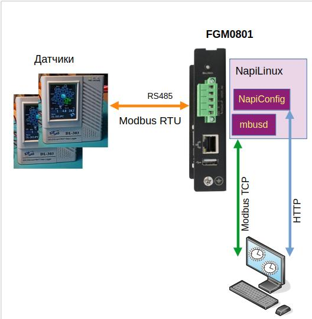

Схема шлюза с хранением данных

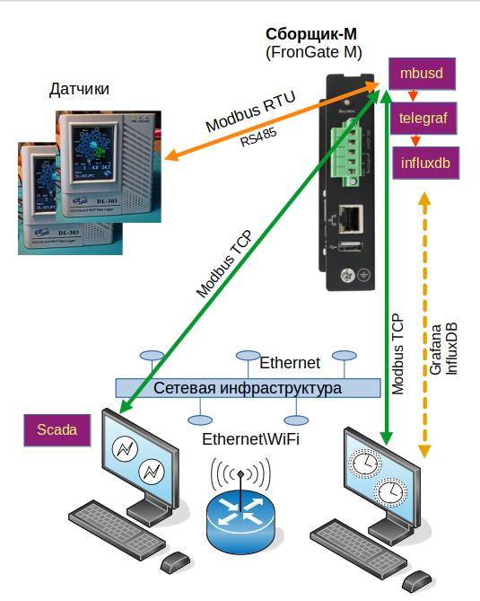

1. **FGM0801** подключается к датчикам по RS485
2. **FGM0801** подключается к сети по Ethernet
3. На **FGM0801** настраивается и запускается сервис mbusd.


## Алгоритм работы

1. Оператор или программа опроса  обращается к Сборщик-М по Modbus TCP;
2. **FGM0801** транслирует запросы из Modus TCP в ModBus RTU;
3. **FGM0801** опрашивает устройства по Modbus RTU, получает ответ в Modbus RTU;
4. **FGM0801** транслирует ответы в Modbus TCP.

Опционально Сборщик также может.

- Опрашивать по Modbus TCP самого себя и сохранять данные.
- Показывать графики сохраненных данных
- Предоставляет интерфейс к базе данных Influx для дальнейшего анализа в таких инструментах как Grafana.

> Это позволяет более четко понимать есть ли связь с датчиком, видеть когда она прерывалась, оперативно анализировать данные.


## Состав изделия

С точки зрения "железа" это [Сборщик-Компакт](/docs/computers-industrial/FCC3308/).

В состав ПО Сборщик-М  входит:

- ОС NapiLinux с возможностью обновления
- Свободное ПО mbusd (доступно в исходных кодах)
- Веб-интерфейс NapiConfig

Также предустановлены и могут быть активированы следующие сервисы:

- Telegraf - комбайн по сбору данных (в применении к Сборщику-М нас интересует съем данных по протоколу Modbus TCP)
- InfluxDB - база данных для складирования однотипных данных и доступа к ним.
- Mosquitto - сервис трансляции данных по протоколу MQTT

> Все сервисы уже инсталлированы и преднастроены - достаточно включить их через Веб.


## Быстрый старт

### Настройка TCP\IP сети

- Если в Вашей сети есть DHCP, то Сборщик-М получит IP самостоятельно.

>Как понять, какой IP получен, можно прочитать в **[статье](../../../software/notes/findip/)**.

- Если в сети DHCP нет, то нужен компьютер с Ethernet и возможностью установить на этот компьютер IP адрес вручную.

> Как это делать, написано в отдельной **[статье](../../../software/notes/staticip/)**.

### Настройка mbusd

1. Подсоедините датчик по RS485 порту к Сборщик-М

>Как подсоединить датчик и как проверить что он опрашивается написано в отдельной **[статье](../../../software/sensors/modbus-rtu/)**.

2. Убедитесь, что опрос датчика работает

>:warning: ** Проводите опрос по RS485 порту ДО активации службы mbusd ! **

3. Зайдите в Меню "Настройки - ModbusGW".

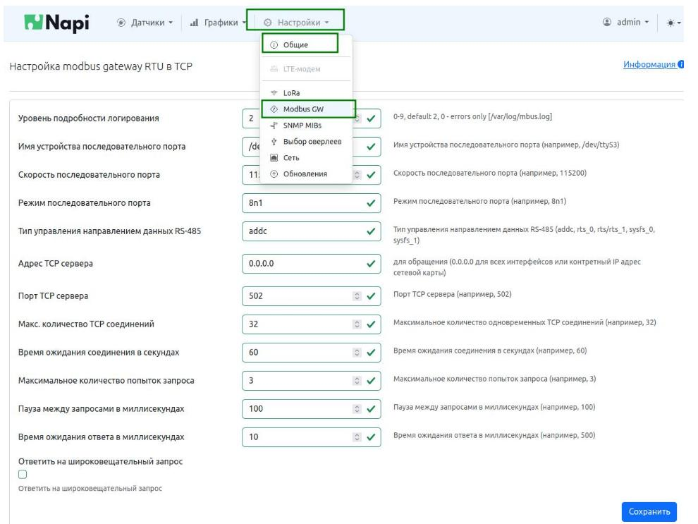

** Часть1. Настроим обязательные параметры **

 - Скорость порта (1)
 - Параметры порта (2)

> Эти параметры "диктуются" настройками датчика. Если Вы его уже "прочли" вручную, то Вы их точно знаете. В этих параметрах важна не только скорость, но и параметры работы порта (8n1, 8e1 и тп) - необходимо отнестись к этому внимательно !

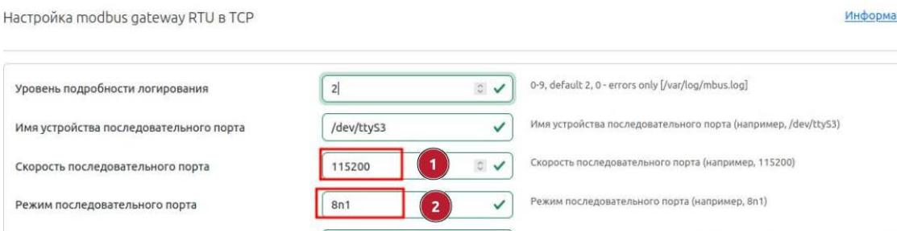

** Остальные параметры нужно менять или при проблемах или при необходимости нестандартной работы \ поведения ** !


** Часть2. Посмотрите параметры, которые рекомендуется оставить по умолчанию **

- Адрес сервера (3). Поясним, что 0.0.0.0 позволяет принимать запросы на любой IP сборщика, это можно сменить ограничив только определенный адрес. Как правило, этот параметр остается по умолчанию.

- Порт TCP (4). Стандартный порт для Modbus TCP - 502. Если Вам нужно, чтобы Сборщик отвечал  по другому порту, можно сменить этот параметр.

- Количество одновременных соединений. Если у вас нет проблем с опросом огромного количества датчиков, оставьте этот параметр по умолчанию.


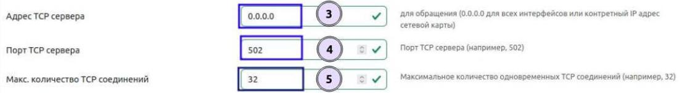

** Часть3. Параметры, которые нужны только продвинутым пользователям **

- Пауза в запросах. Этот параметр нужен при "шторме" из одновременных запросов. Рекомендуется при спокойных запросах оставить по умолчанию, при запросах без паузы этот параметр надо подбирать от 3 до 10 мс.


> ** Несмотря на обилие параметров, по сути Вам нужно ввести два параметра - скорость и характеристики порта. **

### Запуск службы mbusd

Заходим в "Настройки - Общие", среди сервисов ищем mbusd.

- Нажимаем на Inactive (переводим в состояние Active)
- Нажимаем на Disabled (переводим в состояние Enabled)

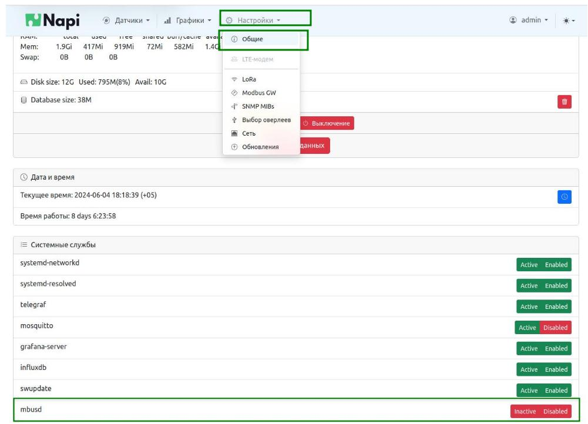

Обе кнопки должны стать зеленые - это значит что служба запустилась и будет автоматически запущена при дальнейшем рестарте системы.


### Проверка работы mbusd

Убедиться, что шлюз работает можно посылая ему запросы в Modbus TCP по его IP-адресу. Можно делать это с самого шлюза, опрашивая адрес 127.0.0.1 командой `modpoll`

> Как проверять работу шлюза описано в отдельной [статье](../../../software/sensors/mgate/#проверка-работы-читаем-датчик).

## Проверка с помощью встроенного логгирования

Вы можете проверить, что служба гейта работает корректно, настроив логгирование данных во внутреннюю базу данных.

Для этого мы включим опрос по ModbusTCP "самого себя" по адресу 127.0.0.1.

### Активируем датчик

Необходимо активировать датчик `anysensor-modbus-tcp-localhost` в разделе "Датчики\Управление"

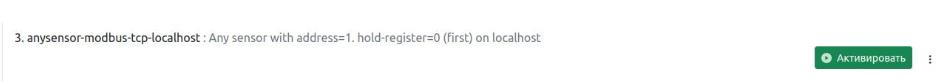

Если датчика нет, то создайте новый Шаблон.

- [Скачайте](https://raw.githubusercontent.com/lab240/telegraf-grafana-configs/main/conf-telegraf/default-sensors/anysensor-modbus-tcp-localhost.conf) шаблон для датчика опроса по ModBus.
- Выберите "Загрузить шаблон", найдите скачанный файл и нажмите "Загрузить"

Датчик появиться в списке датчиков. Нажмите "Активировать" датчик.

:::tip

Датчик из шаблона настроен на чтение 1-го регистра (с адресом 0) с устройства с modbus адресом 1.

Если вы присоединили устройство с другим адресом или в вашем устройстве другие регистры, необходимо отредактировать датчик. Нажмите "Редактировать". Появиться окошко редактора файла.

```
## Any sensor with address=1. hold-register=0 (first) on localhost
[[inputs.modbus]]

  #change name="YOUR_SENSOR" and measurement="YOUR_SENSOR"

  name = "anysensor-modbus-localhost"

  #change to your modbus address if your address is not equal 1
  slave_id = 1

  ## Timeout for each request
  timeout = "1s"

  # TCP - connect via Modbus/TCP
  controller = "tcp://127.0.0.1:502"

  input_registers = [
    { measurement="anysensor-modbus-localhost", name = "First_Hold_Register",   byte_order = "AB",   data_type = "UINT16",   scale=1.0,     address = [0]},
  ]

```

Если у Вас дугой адрес, то измените параметр slave_id, если другой регистр, то отредактируйте строчку с описанием регистра.

Нажмите "Применить"

Если Вы все сделали правильно, то появиться зеленая надпись "Конфигурация применена"

:::

### Проверка работы

- Зайдите в "Графики - Сенсоры"
- Выберите Датчик - anysensor-modbus-localhost
- Выберите  Измерение - First_Hold_Register
- Оставьте период "1мин"
- Нажмите "Показать"

Если система увидела данные вы получите какое-либо значение (или несколько значений), примерно как на картинке ниже

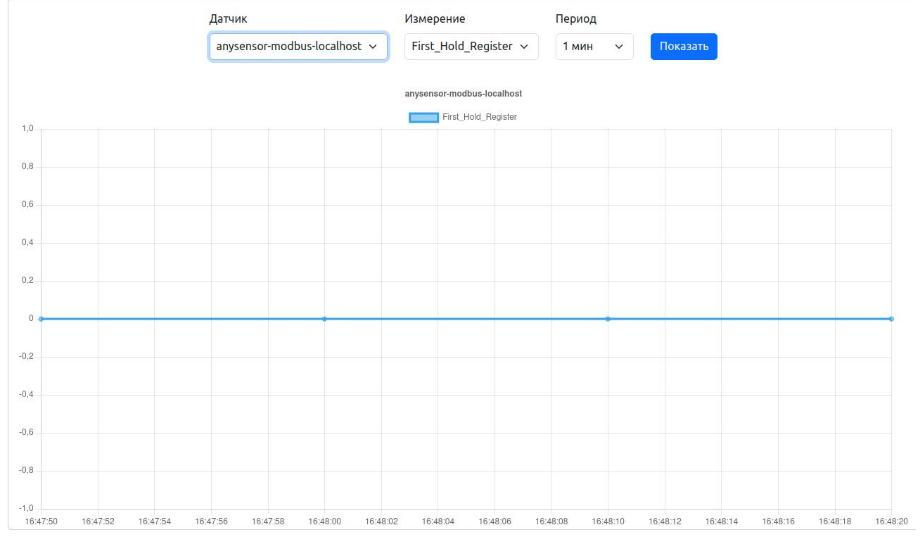

>Поздравляем, mbusd работает а система пишет первый регистр. Теперь, если Вам не нужно логгирование можно отключить датчик в "Управлении датчиками".

### Возможные проблемы

Если Вы не увидели данные, как на картинке ниже (но проверяйте как минимум выждав минуту!)


Значит датчик не опрашивается и скорее всего mbusd не транслирует данные.

В таком случае рекоменуем

- Зайти в раздел "Настройки - Modbus GW" и еще раз проверить параметры порта (скорость, четность, стоп бит). Убедитесь что на датчики такие же параметры.
- Проверить правильное подсоединение датчика к RS485 (A-A, B-B) или (D+ - A, D- - B)
- Проверить что никакие программы больше не используют порт RS485 (в частности, не включены опросы по Modbus RTU).


## Включение полноценного логгирования

Для включение полноценного логгирования, надо вместо "универсального" датчика создать шаблон с конфигурацей именного того датчика, который подключен.

Рассмотрим, например, датчик ICPDAS DL-303. У него несколько HOLD регистров, некоторые из которых мы опишем для опроса.

Вот корректный пример шаблона опроса для датичка DL-303:

```
## Тут пишем комментарий
## DL-303 (CO,CO2,temp,humidity) ModbusTCP
[[inputs.modbus]]

  name = "DL-303"

  ## Slave ID - addresses a MODBUS device on the bus
  ## Range: 0 - 255 [0 = broadcast; 248 - 255 = reserved]
  slave_id = 1

  ## Timeout for each request
  timeout = "1s"

  # TCP - connect via Modbus/TCP
  controller = "tcp://127.0.0.1:502"

  input_registers = [
    { measurement="DL-303", name = "CO",   byte_order = "AB",   data_type = "UINT16",   scale=1.0,     address = [0]},
    { measurement="DL-303", name = "CO2",   byte_order = "AB",   data_type = "UINT16",   scale=1.0,     address = [1]},
    { measurement="DL-303", name = "Humidity",   byte_order = "AB",   data_type = "UINT16",   scale=1.0,     address = [2]},
    { measurement="DL-303", name = "Temp",   byte_order = "AB",   data_type = "UINT16",   scale=1.0,     address = [3]},
    { measurement="DL-303", name = "DewPoint",   byte_order = "AB",   data_type = "UINT16",   scale=1.0,     address = [5]},
  ]


```

Так это выглядит в интерфейсе

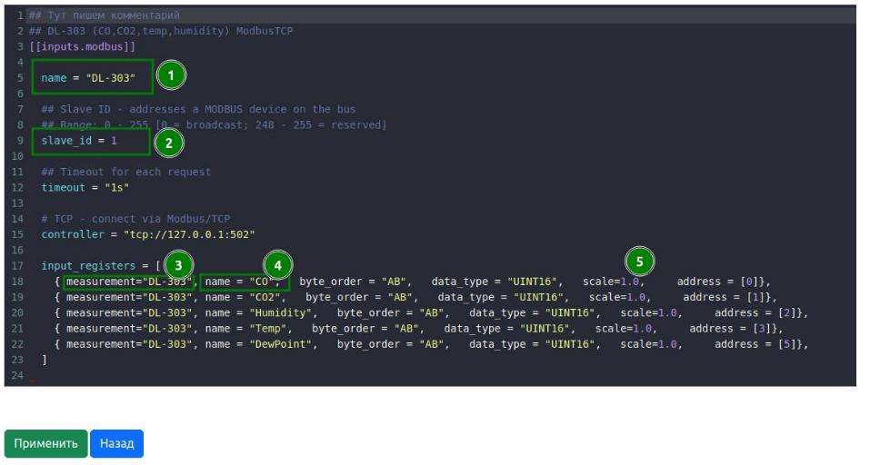

Параметры, которые необходимо указывать:

1) и 3) это имя датчика. Если датчиков несколько (даже одной модели), у каждого датчика должны быть уникальные номера.

2) Modbus адрес
3) name= имя регистра
4) scale= множитель
5) address= номер регистра

После редактирования нажмите "Применить" и "Протестировать конфигурацию" и система покажет сумела ли она прочитать данные

Данные корректные

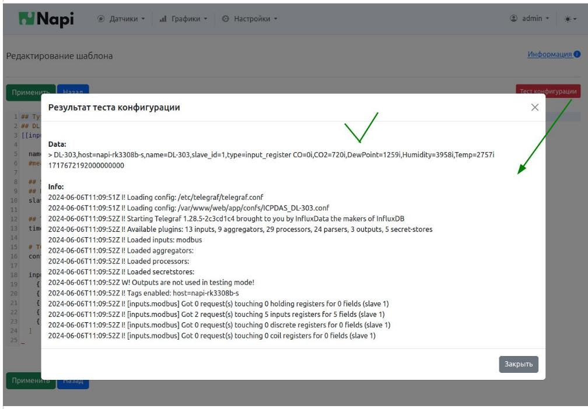

Ошибка

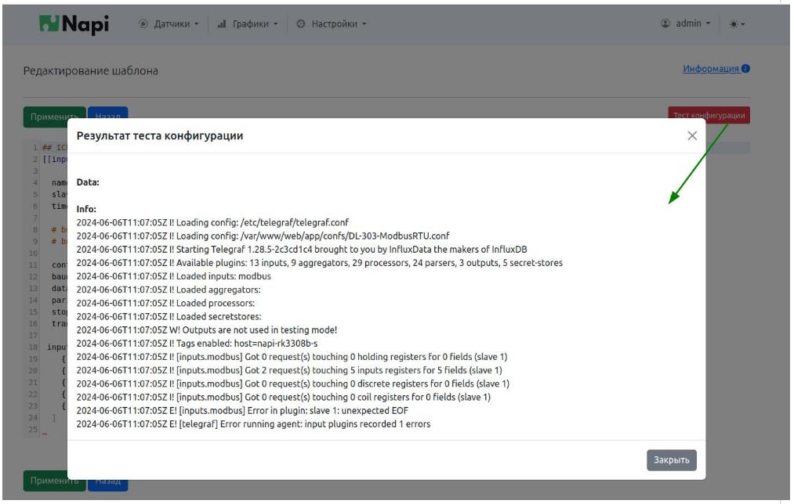
