# FGS0801. Шлюз SNMP V2 - SNMP V3.
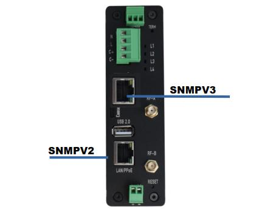

## Зачем нужен шлюз

:::caution  FGM0801 - программно аппаратный комплекс (ПАК)

Зачастую устройства поддерживают только опросы по SNMP V2, а требования безопасности не позволяют "ходить" открытым данным по сети и требуется протокол SNMP V3. Для этого мы сделали сервис SNMP Proxy - вы делаете запросы по SNMP V3, а мы транслируем их в SNMP V2 и передаем обратно.
:::

:fire: **Сделан на основе Сборщик-Компакт** и **NapiLinux** :fire:

## Схема работы шлюза

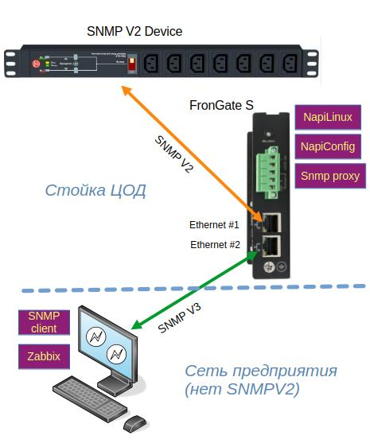

## Настройка и проверка общих параметров


:::caution  Предустановленное ПО

Мы поставляем FrontGate-S вместе с ОС NapiLinux и Веб-интерфейсом NapiConfig с помощью которого можно настроить SNMP Proxy через Веб-интерфейс.

Также вы можете использовать ArmBian Linux и настроить шлюз с помощью ручного редактирования конфига snmpd.conf
:::

### Настройте оба сетевых интерфейса


:::caution  Доступ к FrontGate-S

Так как в аппаратной части FrontGate-S это Сборщик-Компакт, то рекомендуем ознакомится с разделом "Первое включение" [руководства пользователя](../../computers/pdf/fcc-userguide-10.pdf).

:::

Настройте оба сетевых интерфейса (или один) из меню **Настройки - Сеть**

В случае если у Вас два интерфейса выберете и настройте последовательно сначала один, потом второй.

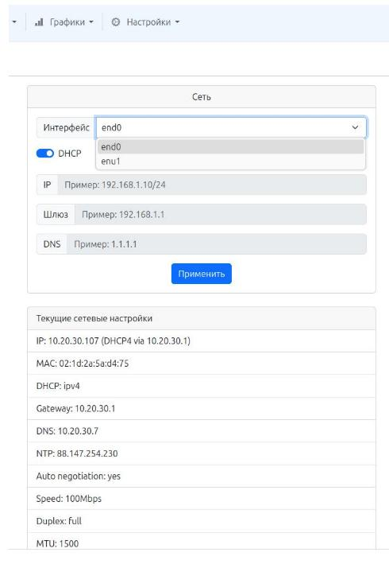

### Включите сервис snmpd

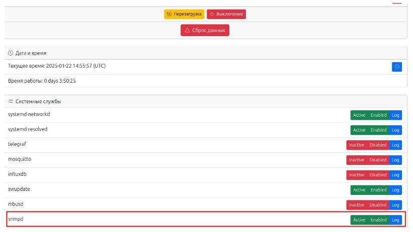

### Проверьте что целевое устройство откликается по SNMP V2

Если есть возможность, убедитесь, что устройство откликается по SNMP V2. Например, это можно сделать через iReasoning MIBBrowser (есть под Win\Linux).

В данном примере устройство с IP: 192.168.16.130 отзывается по SNMPv2

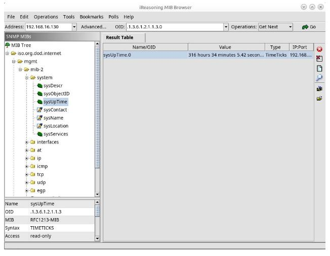

## Настройка параметров SNMP-шлюза

В левом меню: Сервисы → SNMP → Management.

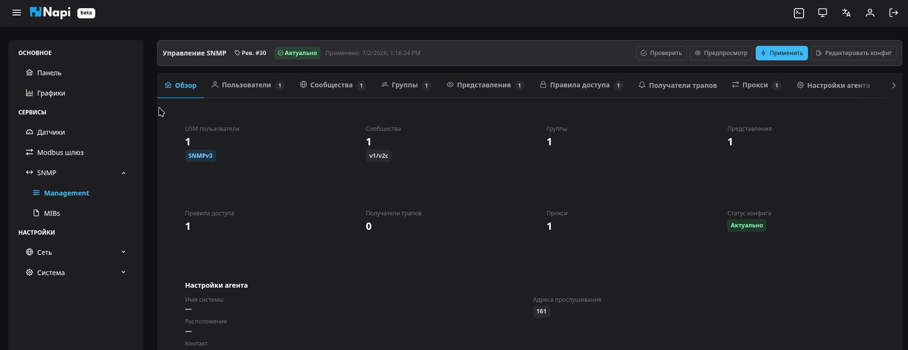

### Создадим пользователя

В правом меню: ***Пользователи → + Новый пользователь***

Заполните поля:

- Имя пользователя: userq
- Протокол аутентификации: SHA
- Пароль (аутентификация): authpassword
- Протокол шифрования: AES
- Пароль (шифрование): privpassword

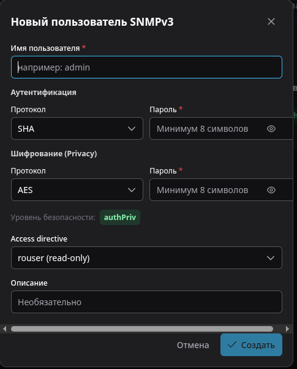

### Создадим сообщество

Вкладка Сообщество  ***+ Новое сообщество***

Имя сообщества: public

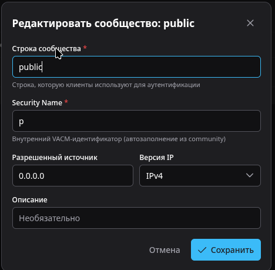

### Создаем Группу

Создайте новую группу ***+ Новая группа***

Имя группы: **red**

Добавьте в группу **red** ранее созданного пользователя **userq**

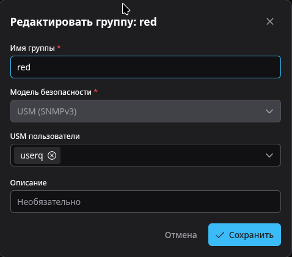

### Создадим представление

Вкладка "Представления" -> ***+ Новое представление***

Имя представления: **sys**

Вы можете добавить пресеты, включая быстрые пресеты.

Для добавления нажмите быстрый пресет System - в итоговый конфиг попадёт поддерево .1.3.6.1.2.1.1.

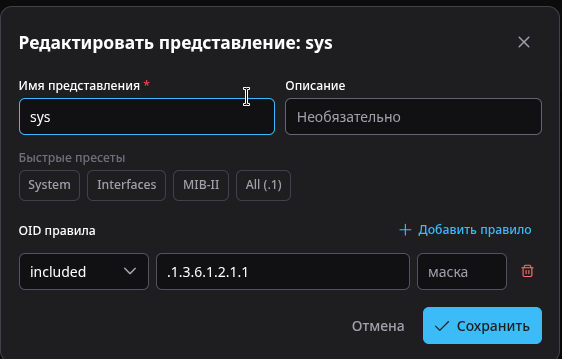

> Вы можете добавить свои правила (добавить правило)

### Настраиваем прокси

Вкладка "Прокси" -> ***+ Новый прокси***

Имя прокси: qqqq

Указываем параметры опрашиваемого snmpV2 хоста

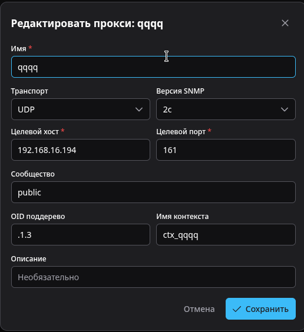

### Настраиваем правила доступа

Вкладка "Правила доступа" ***+ Новое правило доступа***

- Группа: red
- Модель безопасности: USM (v3) — по умолчанию
- Уровень безопасности: priv
- Сопоставление контекста: exact
- Прокси: qqqq
- Read View: sys

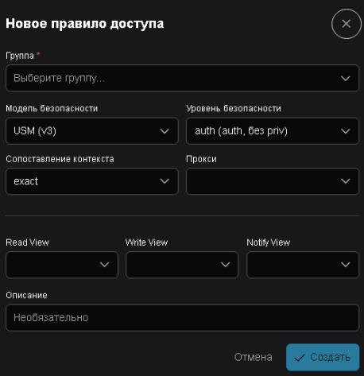

## Итоговый конфиг на proxy (FCC)

После сохранения настроек на устройстве формируется конфигурация вида:

```
# --- Agent ---
agentAddress 161
dontLogTCPWrappersConnects yes

# --- USM Users ---
createUser userq SHA "authpassword" AES "privpassword"
rouser userq

# --- Security Names (com2sec) ---
com2sec p 0.0.0.0 public

# --- Groups ---
group red usm userq

# --- Views ---
view sys included .1.3.6.1.2.1.1

# --- Access ---
access red "ctx_qqqq" usm priv exact sys none none

# --- Proxy ---
proxy -Cn ctx_qqqq -v 2c -c public 192.168.16.194:161 .1.3

```

## Проверка работы системы

### Локальная проверка конфига на хосте

```
snmpwalk -v2c -c public localhost sysName
snmpwalk -v2c -c public localhost
```

Результат

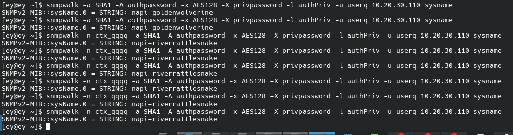

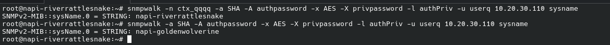


### Проверка доступности прокси

```
snmpwalk -a SHA -A authpassword -x AES -X privpassword \
  -l authPriv -u userq 10.20.30.110 sysName
```

Результат — имя хоста самого прокси

```
SNMPv2-MIB::sysName.0 = STRING: napi-goldenwolverine
```

### Проверка работы контекста

```
snmpwalk -n ctx_qqqq -a SHA -A authpassword -x AES -X privpassword \
  -l authPriv -u userq 10.20.30.110 sysName
```

Результат — имя хоста, к которому обращается прокси

```
SNMPv2-MIB::sysName.0 = STRING: napi-riverrattlesnake

```

:::note

Утилиты SNMP свободно доступны для Windows по ссылке: https://sourceforge.net/projects/net-snmp/files/net-snmp%20binaries/5.4.2.1%20binaries/
:::
