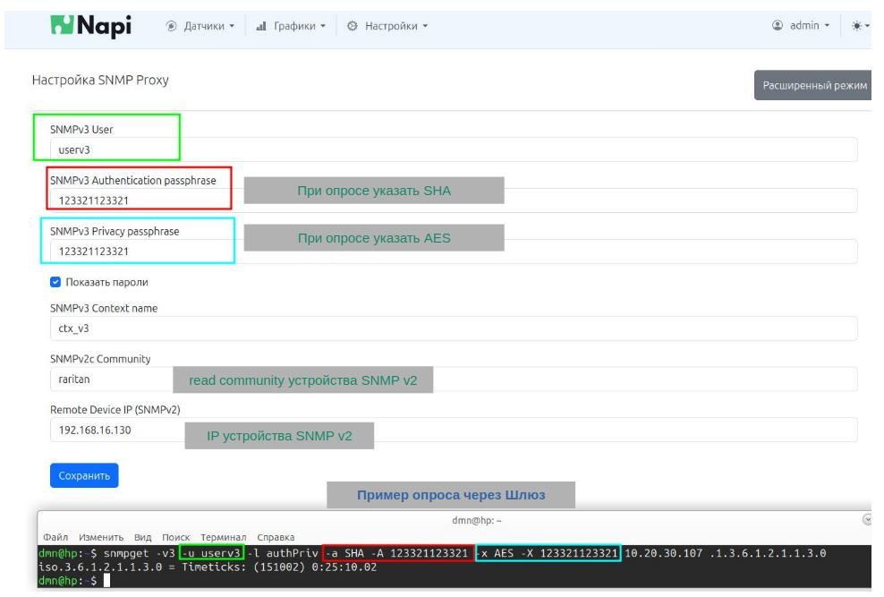

# FrontGate-S. Шлюз SNMP V2 - SNMP V3.


## Зачем нужен шлюз

:::caution  FGM0801 - программно аппаратный комплекс (ПАК)

Зачастую устройства поддерживают только опросы по SNMP V2, а требования безопасности не позволяют "ходить" открытым данным по сети и требуется протокол SNMP V3. Для этого мы сделали сервис SNMP Proxy - вы делаете запросы по SNMP V3, а мы транслируем их в SNMP V2 и передаем обратно.
:::

:fire: **Сделан на основе Сборщик-Компакт** и **NapiLinux** :fire:

## Схема работы шлюза


## Настройка FrontGate-S


:::caution  Предустановленное ПО

Мы поставляем FrontGate-S вместе с ОС NapiLinux и Веб-интерфесом NapiConfig с помощью которого можно настроить SNMP Proxy через Веб-интерфейс.

Также вы можете использовать ArmBian Linux и настроить шлюз с помощью ручного редактирования конфига snmpd.conf
:::

## Настройте оба сетевых интерфейса


:::caution  Доступ к FrontGate-S

Так как в аппаратной части FrontGate-S это Сборщик-Компакт, то рекомендуем ознакомится с разделом "Первое включение" [руководства пользователя](../../computers/pdf/fcc-userguide-10.pdf).

:::

Настройте оба сетевых интерфейса (или один) из меню **Настройки - Сеть**

В случае если у Вас два интерфейса выберете и настройте последовательно сначала один, потом второй.


## Включите сервис snmpd


## Проверьте что устройство откликается по SNMP V2

Если есть возможность, убедитесь, что устройство откликается по SNMP V2. Например, это можно сделать через iReasoning MIBBrowser (есть под Win\Linux).

В данном примере устройство с IP: 192.168.16.130 отзывается по SNMPv2


## Настройте параметры шлюза


Вам нужно придумать

- Имя пользователя
- Пароль на доступ
- Пароль на шифрование

Вам надо знать

- SNMP V2 community для опроса
- IP SNMP V2 устройства

## Проверяем работу шлюза (опрос)

> К сожалению, MIBBrowser не поддерживает в свободной версии запросы SNMP V3, поэтому покажем как это делается стандартной утилитой snmpget.


:::note

Утилиты SNMP свободно доступны для Windows по ссылке: https://sourceforge.net/projects/net-snmp/files/net-snmp%20binaries/5.4.2.1%20binaries/
:::



- Если не меняли конфигурационный файл нужно указать

- Тип шифрования авторизации **SHA**
- Тип шифрования сессии **AES**

Также нужно знать IP FrontGate-S для опроса по SNMP V3

```bash

dmn@hp:~$ snmpget -v3 -u userv3 -l authPriv -a SHA -A 123321123321 -x AES -X 123321123321 10.20.30.107 .1.3.6.1.2.1.1.3.0
iso.3.6.1.2.1.1.3.0 = Timeticks: (34084122) 3 days, 22:40:41.22


```
