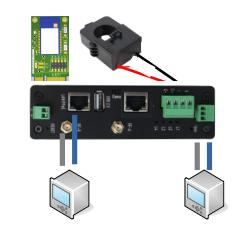

# Программно аппаратные комплексы и решения

| [**FCU3308PG**](/docs/special/FCU3308PG/) | [**FGM0801**](/docs/special/frontgate-m/) | [**FGS0801**](/docs/special/frontgate-s/) |
|:---:|:---:|:---:|
|  |  |  |
| **Токо-сборщик** | **Modbus TCP/RTU шлюз** | **SNMP V2/V3 шлюз** |
| Программно-аппаратный комплекс для измерения тока | Специализированное решение для работы с протоколом Modbus | Решение для интеграции с системами мониторинга по SNMP |

## Новинка

|[**FCU3308PZ**](/docs/special/FCU3308PZ/) |
|:---:|
|  |
| **Шлюз Modbus - ZigBee** |
| Система передачи данных Modbus - Zigbee |
