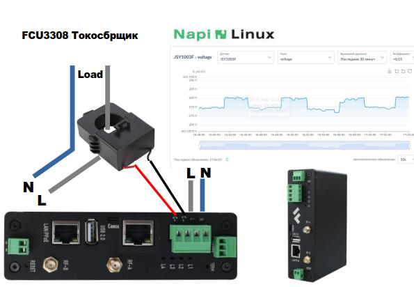

# Программно аппаратные комплексы и решения

| FrontGate-M | FrontGate-S | FCP3308PG |
|:---:|:---:|:---:|
|  |  |  |
| **Модбас шлюз** | **SNMP шлюз** | **Датчик тока** |
| Специализированное решение для работы с протоколом Modbus | Решение для интеграции с системами мониторинга по SNMP | Программно-аппаратный комплекс для измерения тока |
| [**FrontGate-M**](/docs/special/frontgate-m/) | [**FrontGate-S**](/docs/special/frontgate-s/) | [**FCP3308PG**](/docs/special/FCP3308PG/) |
