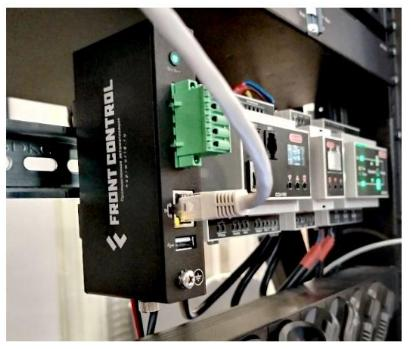

# Программно аппаратные комплексы и решения

| FCU3308PG | FrontGate-M | FrontGate-S |
|:---:|:---:|:---:|
|  |  |  |
| **Токо-сборщик** | **Modbus TCP/RTU шлюз** | **SNMP V2/V3 шлюз** |
| Программно-аппаратный комплекс для измерения тока | Специализированное решение для работы с протоколом Modbus | Решение для интеграции с системами мониторинга по SNMP |
| [**FCU3308PG**](/docs/special/FCU3308PG/) | [**FrontGate-M**](/docs/special/frontgate-m/) | [**FrontGate-S**](/docs/special/frontgate-s/) |
