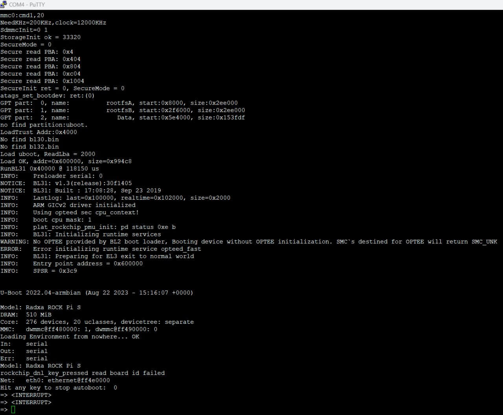

# (!) Доступ к устройствам NAPI через консоль

Если сеть отсутствует или что-то пошло не так или Вам не вычислить IP, единственный способ посмотреть что происходит при загрузке - получить доступ через консоль. По сути это аналогично подключению монитора.

:::tip

Также без консоли не обойтись, если  что-то нужно сделать до загрузки ОС в загрузчике u-boot.

:::


## Как подсоединить

1. Ищем выход для консоли на NAPI P\C или на Сборщик-компакт (см рисунок)
2. Подсоединяем согласно схеме (RX на преобразователе -TX на плате, TX на преобразователе -RX на плате, GND-GND)
3. Если у Вас в поставке есть готовый преобразователь (как на рисунке), он подключается по такой же схеме (белый (RX) - TX на плате, зеленый (TX) - RX на плате, GND - GND)

**Сборщик-компакт и Napi С\P**


**Плата разработчика для Napi S**


### Преобразователь UART-USB в виде платы

Преобразователь USB-UART может выглядеть как плата (см рисунок),
подключение через нее аналогичное - ищем RX, TX, GND и подключаем к TX, RX, GND.


Для подключения понадобиться комплект проводков (всего нужно 3 проводка), мы пользуемся такими


Так как у нас со стороны NAPI "штырьки", а со стороны преобразователя "кроватки", нам нужен именно такой вариант.

Преобразователь UART-USB мы соединяем с USB компьютера \ ноутбука. Понадобиться стандартный проводок USB-A - USB-C, как для смартфона.

### Особенности подсоединения

>:warning: Если вы перепутаете последовательность ничего не сгорит, но работать не будет. Дело в том, что выход NAPI это вход преобразователя и, наоборот. Поэтому мы перекрещиваем проводки.

>:warning: Проводок VCC подсоединять не нужно !

:::tip

Проводки консоли не питают плату ! Если даже какие-то сигнальные диоды горят, плату Napi или Сборщик нужно запитать стандартным способом.

:::

## Соединение с хостом (общие моменты)

Итак как попасть в консоль и там работать.

1. Нам понадобиться софт программы терминала. К сожалению, они разные для Windows и Linux и если в Linux он есть в любой системе (minicom), то в Win нужно установить программу putty.

2. Настроить программу терминала и присоединится
Если кратко, то нужно настроить параметры порта

- Armbian: 1500000\8n1
- NapiLinux: 115200\8n1

И отключить Flow Control (Аппаратное управление потоком).

В minicom после соединения нажать Control-A, далее Z, далее O, выбрать "Настройки последовательного порта" нажать F (параметр "Аппаратное управление потоком должно" быть "НЕТ") и проверить чтобы параметр "Программное управление потоком" тоже было "НЕТ".

В putty настройках Serial найти параметр "Flow Control" и установить в "None".

:::tip
Для продвинутых "консолеводов" этой информации достаточно, дальше можно не читать. Мы, однако, далее распишем как подключиться и настроить софт.
:::


## Консоль в Windows: putty

Сначала опишем как пользоваться софтом для Windows.

### Определяем порт

Вставьте преобразователь в USB компьютер\нотубука. Теперь надо понять какой COM-порт система зарезервировала за преобразователем. Идем в диспетчер устройств в раздел  "COM-порты" и находим наш преобразователь и там номер порта.


Запомним номер порта. В нашем случае это COM3 (у Вас может быть другой !).

### Ставим putty

Вам необходимо скачать и установать программку [putty] (www.putty.org).

Арес для скачивания: https://www.chiark.greenend.org.uk/~sgtatham/putty/latest.html

### Настроим putty

После установки запустите Putty и сразу идем в раздел Serial


Выставляем параметры COM-порта

:::tip

Для ARMbian ставим скорость 1500000 (1,5Мбит)

Для NapiLinux ставим скорость 115200

Flow Control отключаем !

:::

Идем в Sessions. Выбираем Serial (отобразятся введенные нами параметры) и нажимаем OPEN.


### Работаем в консоли

Появиться окно (скорее всего пустое). Если нажать на любую клавишу,
появиться приглашение для входа в Linux


Вводите логин\пароль и начинайте работать


Для того чтобы посмотреть процесс загрузки и прервать для входа в uboot, перезагрузите NAPI - вы увидите полный процесс загрузки.


### Войдем в uboot

Чтобы войти в uboot надо при загрузке быстро нажать

- Для Armbian: Control-C
- Для NapiLinux: любую клавишу



Поздравляем, теперь вы полноценно можете работать c NAPI из консоли, хотя намного удобнее работать по сети по ssh, что мы и рекомендуем.


## Консоль в Linux: Minicom

Для Linux есть стандартный универсальный программный продукт: minicom. Как правило он присутствует в системе, но если нет его можно поставить командой

```bash

apt install minicom

```

Для того, чтобы каждый раз не отключать FlowControl через настройки порта можно сделать два фаила конфигураций (для Armbian и Linux) и использовать их при запуске.

Сделайте на своем компьютере\нотубуке два файла

1. Файл для Armbian:  `.minirc.napi-1M.minicom`
```text

pu rtscts           No
pu xonxoff          No
pu baudrate         1500000

```
2. Файл для NapiLinux: `.minirc.napi-115200.minicom`

```text

pu rtscts           No
pu xonxoff          No
pu baudrate         115200

```

3. Запускайте minicom, указав устройство через параметр -D

Для Armbian:

```bash

minicom -D /dev/ttyUSB0 napi-1M.minicom

```

Для NapiLinux:

```bash

minicom -D /dev/ttyUSB0 napi-115200.minicom

```

Надеемся, этот материал был полезен и Вам не придется много работать с NAPI в консоли.
