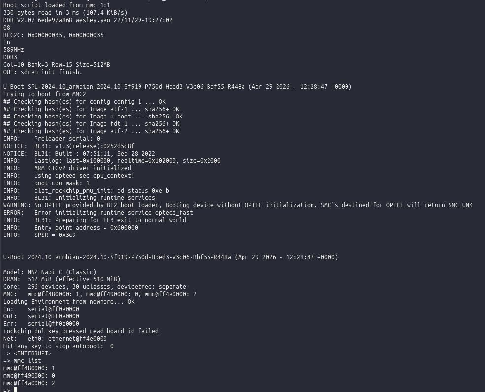

# U-Boot для NAPI (RK3308)

## Введение

>**U-Boot** — это загрузчик (bootloader), который запускается сразу после включения устройства, инициализирует базовое железо и загружает операционную систему (например, Linux) из памяти, сети или другого носителя.

### Что делает делает U-boot

- Включился процессор
- Запустился U-Boot
- U-boot:
  - проверяет железо (память, интерфейсы)
  - загружает ядро Linux (с eMMC / SD / сети)
  - передаёт управление Linux

###  Цепочка загрузки
Питание → U-Boot → Linux kernel → система

### Почему U-Boot важен
Без него:
- Linux просто не стартанёт
- нечем загрузить ядро
- нечем выбрать откуда грузиться

## Попасть в U-Boot prompt

>Применимо к mainline U-Boot 2024.10 и vendor 2017.09. Различия отмечены.

Подключи USB-UART к UART0, baud 1500000 8N1. На загрузке жми быстро жми Control-C несколько раз,
поа не увидишь значок "=>".




## Проверка устройств

### MMC (eMMC, SD)

```
mmc list                 # список контроллеров и их индексов
mmc dev 0                # переключиться на mmc0 (eMMC)
mmc dev 1                # переключиться на mmc1 (SD)
mmc info                 # инфо о текущем mmc
mmc part                 # таблица разделов на текущем mmc
```

### USB

```
usb start                # инициализация USB host
usb info                 # список USB-устройств
usb tree                 # дерево USB
usb storage              # список USB mass storage
usb part 0               # разделы на usb device 0
usb stop                 # выключить USB
usb reset                # перезапустить USB
```

## Чтение файловых систем

### Список файлов

```
ls mmc 0:1 /             # корень первого раздела eMMC
ls mmc 1:1 /boot         # /boot на SD
ls usb 0:1 /
```

### Прочитать файл в RAM

```
load mmc 0:1 ${kernel_addr_r} /boot/Image
load usb 0:1 0x4000000 /boot/armbianEnv.txt
```

### Показать содержимое памяти — `md` (memory display)

```
md[.суффикс] <адрес> [<длина>]
```

Суффикс — размер элемента: `.b` (байт), `.w` (16 бит), `.l` (32 бит, дефолт),
`.q` (64 бит). Длина — количество **элементов**, не байт. Если не указана — 64.

```
md.b 0x4000000 0x100              # 256 байт hex+ASCII
md.l 0x4000000 0x40               # 64 long-слова = 256 байт
md 0x4000000                      # дефолт: 64 long-слова
```

После первого `md` можно жать просто `md` без аргументов — продолжит с того
места где остановился.

Связанные: `mw` (memory write), `cp` (copy), `cmp` (compare) — те же суффиксы.

### Показать содержимое файла

```
load usb 0:1 0x4000000 /etc/hostname
md.b 0x4000000 0x100
```

### Поддерживаемые ФС

ext2/3/4, FAT, exFAT (если включено в defconfig). Для exFAT в mainline нужен
`CONFIG_FS_EXFAT=y`.

## Boot targets и порядок загрузки

### Посмотреть текущий

```
printenv boot_targets
printenv bootcmd
```

### Изменить временно (до перезагрузки)

```
setenv boot_targets "usb0 mmc1 mmc0"
boot
```

### Сохранить навсегда

```
setenv boot_targets "usb0 mmc1 mmc0"
saveenv
```

`saveenv` пишет env в ту память, откуда U-Boot его читает (обычно eMMC offset).
Если env корраптится или не сохраняется — проверь `CONFIG_ENV_IS_IN_*` в defconfig.

### Сбросить env к дефолту

```
env default -a
saveenv
```

## Загрузка с USB-флешки

USB-флешка обычно имеет на borad один из двух форматов:

1. **Distro-style** (Armbian, Debian) — раздел с `/boot/extlinux/extlinux.conf`
   или `/boot/boot.scr`. Достаточно `usb0` в `boot_targets`, distro_bootcmd
   найдёт сам.
2. **Manual** — ядро + initrd + dtb лежат отдельными файлами.

### Distro-автомат

```
setenv boot_targets "usb0"
boot
```

### Вручную (для отладки)

```
usb start
load usb 0:1 ${kernel_addr_r} /boot/Image
load usb 0:1 ${ramdisk_addr_r} /boot/uInitrd
load usb 0:1 ${fdt_addr_r} /boot/dtb/rockchip/rk3308-napi-c.dtb
setenv bootargs "root=/dev/sda1 rootwait console=ttyS0,1500000"
booti ${kernel_addr_r} ${ramdisk_addr_r} ${fdt_addr_r}
```

## Стереть U-Boot из самого U-Boot

⚠️ После этого плата не загрузится с eMMC. Если SD-слот доступен и на SD есть
U-Boot — грузишься с SD и перешиваешь eMMC через `dd`. Если SD тоже пуст —
остаётся только maskrom (`rkdeveloptool`).

U-Boot на RK3308 живёт в начале eMMC: idbloader на offset 64 (32 KiB),
u-boot.itb на offset 16384 (8 MiB). Стереть:

```
mmc dev 0
mmc erase 0x40 0x2000          # затереть idbloader (0x40 = 64 секторов с 0)
mmc erase 0x4000 0x2000        # затереть u-boot.itb (0x4000 = 16384)
```

`mmc erase <start_block> <count>` — единицы блоков по 512 байт.

Можно одной командой стереть первые 16 МБ eMMC:

```
mmc erase 0 0x8000             # 0x8000 блоков * 512 = 16 MiB
```

После этого:
- если SD-слот свободен и есть SD с U-Boot → грузимся с SD, шьём eMMC из Linux
- если нет → maskrom через `rkdeveloptool` по USB-OTG

## Сборка и прошивка mainline U-Boot

### Сборка (из ~/d400/uboot-mainline-2024)

```
export CROSS_COMPILE=aarch64-linux-gnu-
export ARCH=arm64
export ROCKCHIP_TPL=$PWD/blobs/rk3308_ddr_589MHz_uart0_m0_v2.07.bin
export BL31=$PWD/blobs/rk3308_bl31_v2.26.elf
make napi-rk3308_defconfig
make -j$(nproc)
```

Артефакты: `u-boot-rockchip.bin` (single-file для прямой dd на SD/eMMC),
`idbloader.img` + `u-boot.itb` (раздельно).

### Прошить на SD из Linux

```
sudo dd if=u-boot-rockchip.bin of=/dev/mmcblk1 bs=1M conv=fsync
```

или раздельно (offset в секторах по 512):

```
sudo dd if=idbloader.img of=/dev/mmcblk1 seek=64 conv=notrunc,fsync
sudo dd if=u-boot.itb    of=/dev/mmcblk1 seek=16384 conv=notrunc,fsync
```

### Прошить на eMMC из U-Boot (с USB-флешки)

```
usb start
load usb 0:1 0x4000000 /u-boot-rockchip.bin
mmc dev 0
mmc write 0x4000000 0x40 0x4000     # запись с offset 64, 16 MiB (8000h блоков)
```

## Полезные переменные окружения

```
${kernel_addr_r}     # адрес для загрузки ядра
${ramdisk_addr_r}    # для initrd
${fdt_addr_r}        # для DTB
${loadaddr}          # generic
```

Посмотреть все:

```
printenv
```

## Различия mainline vs vendor

| Что              | vendor 2017.09         | mainline 2024.10            |
|------------------|------------------------|-----------------------------|
| Распакованный    | u-boot.bin + trust.img | u-boot-rockchip.bin (single)|
| binman           | нет                    | да                          |
| BL31 blob        | в дереве U-Boot        | внешний (`BL31=`)           |
| DDR blob         | в дереве U-Boot        | внешний (`ROCKCHIP_TPL=`)   |
| USB host         | требует DTS-патчей     | TBD                         |
| eMMC             | работает               | TBD                         |
