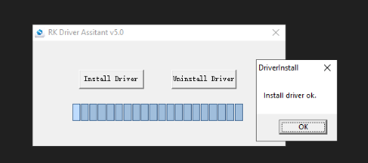
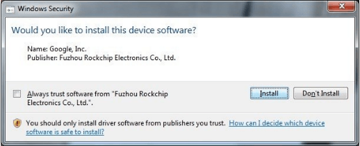
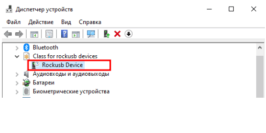
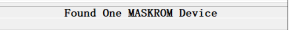
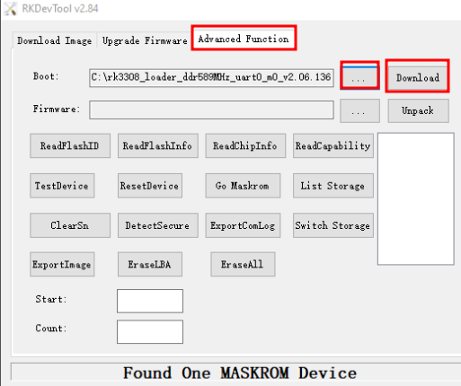
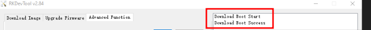
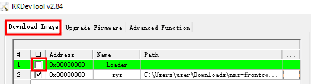
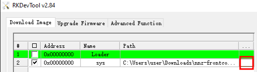
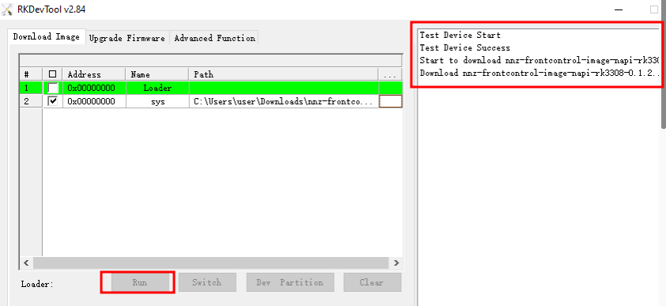

# Прошивка через кабель (Windows Host)

Прошивка образа в NAPI из Windows.

:boom: Мы рекомендуем пользоваться Linux, но из среды Windows возможно полноценно работать в NAPI.

## Драйверы для работы

Необходимо скачать и установить драйверы для ОС Windows: **https://download.napilinux.ru/tools/rk-win/**


- RKDevTool on Windows
- RK Driver Assistant

## Loader и прошивки для устройств NAPI

Необходимо скачать корректный bootloader

- Napi на основе RK3308 (Napi-C. Napi-P, Napi-Slot и компьютеры на их основе): https://download.napilinux.ru/bootloader/nap-c-p-slot/

- Napi2 (RK3568): https://download.napilinux.ru/bootloader/napi2/

Скачайте прошивку. Выбирайте подходящую прошивку в разделе ["Скачать"](/downloads)

## ШАГ 1. Установка драйвера rockusb

- Распаковываем архив DriverAssitant_v5.0.zip
- В папке с распакованными файлами запускаем DriverInstall.exe
- В появившемся окне нажимаем кнопку Install Driver и ждем сообщения «Install driver ok.»



Может появиться запрос от защиты системы Windows доверять ли данному драйверу. С запросом нужно согласиться.



## ШАГ 2. Загрузка платы в режиме Maskrom

- С помощью кабеля USB Type-C подключаем устройство к ПК в слот USB-A;
- Нажимаем и удерживаем клавишу Maskrom, затем коротко нажимаем клавишу Reset не отпуская Maskrom, через несколько секунд отпускаем Maskrom;

```text
При успешной установке драйверов и правильном подключении в диспетчере устройств должно появиться устройство Rockusb Device в классе устройств Class for rockusb devices.
```


## Шаг 4. Прошивка bootloader

- Распаковываем архив с программой RKDevTool
- Запускаем RKDevTool.exe
```text
Если предыдущие шаги были выполнены верно и Napi подключен к ПК, мы увидим сообщение в нижней части программы: Found One MASKROM Device;
```


- В окне программы переходим во вкладку Advanced Function;
Нажимаем на кнопку «...» в строке Boot:
В появившемся окне указываем путь к нужному файлу bootloader’а, нажимаем кнопку «Открыть»;



Следом нажимаем кнопку «Download», если выбран правильный файл и переход Napi в режим загрузки прошел успешно, то в правой части окна программы отобразится сообщение Download Boot Success;



:boom: Поздравляем, вы "прошили" bootloader, осталось совсем немного - прошить прошивку.

## Шаг 5. Прошивка образа системы (NapiLinux)

- Возвращаемся во вкладку Download Image;
Убираем(!) чекбокс в первой строке с именем Loader (так как мы уже произвели загрузку bootloader’а в ручном режиме, это исключает ошибки, иногда возникающие в режиме автоматической загрузки);



- Во второй строке с именем sys нажимаем левой кнопкой мыши в области с именем «...», в появившемся окне выбираем нужный образ системы.



- Нажимаем кнопку Run. Процесс загрузки образа будет отображаться в правой части программы.



При у спешной загрузке отобразиться сообщение Download image OK.
После данного сообщения плату можно перезагрузить и использовать в обычной режиме.

:boom: Поздравляем, вы успешно прошили NaPi

## Если что-то пошло не так

:boom: Если процесс загрузки завершился с ошибкой, можно попробовать повторно нажать кнопку Run.

:boom: Если во время прошивки произошел разрыв соединения по USB, то шаги нужно повторить с момента подключения платы в режиме Maskrom и загрузки bootloader’а.

## Ссылки

[Прошивка из Linux](install_lin)

[Прошивка без кабеля](flash_to_nand)
