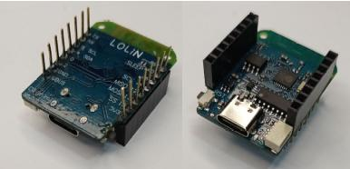
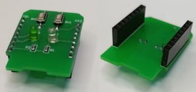
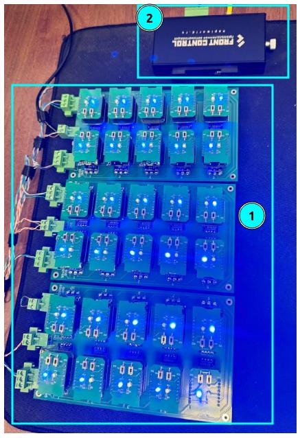

# Стенд эмуляции множества датчиков Modbus

Разрабатывая оборудование, которое используется для работы с датчиками по протоколам Modbus TCP\RTU, мы получаем много вопросов по скоростям опроса и шлюзования, по количеству датчиков в цепочке и так далее. 

Для ответа на вопросы и проверке теорий мы сделали собственный Modbus стенд 
на 30 "датчиков".   

Датчиками у нас выступают микроконтроллеры Wemos D1 mini (на основе MK ESP8266), интерфейсом опроса - RS485.  Датчики собраны на принципиальных платах по 10шт на плате. Сейчас у нас в работе 3 платы по 10 датчиков. 

## Общий вид и функционал стенда

- Wemos D1 mini ("Датчик") + UART-RS485 x 10шт, 3 платы.
- Каждый "Датчик" имеет свой уникальный Modbus address от 1 до 30.
- Платы соединяются по RS485 интерфейсу, что обеспечивает все датчики на всех платах в одной линии. 
- Питание плат: 5В DC


## Компоненты стенда

### Wemos D1 mini

- программируется из сети Arduino
- есть библиотеки Modbus
- доступный и мощный
- позволяет делать платы расширения
- прошивается через встроенный USB порт



### Плата расширения

Мы сделали простейшую плату расширения с мигающим диодом в режиме настройки и "моргающим" при modbus запросах. 



## Логика работы стенда

- Каждый Wemos прошивается написанной нами простенькой прошивкой из среды Arduino.

- Получившийся "Датчик" на Modbus запрос "отдает" 4 регистра INT32:

  1. Адрес датчика
  2. Часы с включения
  3. Минуты с включения
  4. Секунды с включения


- При старте датчик ждет ввода через USB свой новый адрес и записывает его в постоянную память. При рестарте датчик будет "знать" свой адрес, прочитав его из постоянной памяти (EPROM).

## Опрос стенда

Для опроса стенда, необходимо подключиться к стенду по RS485 интерфейсу. Это можно сделать с обычного компьютера (ноутбука) через преобразователь USB-RS485 или через компьютер с встроенным RS485-м интерфейсом. 

Мы для опроса стенда (1) используем Сборщик компакт (2)




## Пример опроса

Единичный опрос. Почитаем регистры Датчика 1 и Датчика 2

```bash
root@napi-rk3308b-s:~# modpoll -m rtu -b 115200 -a 1 -r 1 -c 4 -1 /dev/ttyS3
modpoll 3.10 - FieldTalk(tm) Modbus(R) Master Simulator
Copyright (c) 2002-2021 proconX Pty Ltd
Visit https://www.modbusdriver.com for Modbus libraries and tools.

Protocol configuration: Modbus RTU, FC3
Slave configuration...: address = 1, start reference = 1, count = 4
Communication.........: /dev/ttyS3, 115200, 8, 1, even, t/o 1.00 s, poll rate 1000 ms
Data type.............: 16-bit register, output (holding) register table

-- Polling slave...
[1]: 1
[2]: 26
[3]: 21
[4]: 51
root@napi-rk3308b-s:~# modpoll -m rtu -b 115200 -a 2 -r 1 -c 4 -1 /dev/ttyS3
modpoll 3.10 - FieldTalk(tm) Modbus(R) Master Simulator
Copyright (c) 2002-2021 proconX Pty Ltd
Visit https://www.modbusdriver.com for Modbus libraries and tools.

Protocol configuration: Modbus RTU, FC3
Slave configuration...: address = 2, start reference = 1, count = 4
Communication.........: /dev/ttyS3, 115200, 8, 1, even, t/o 1.00 s, poll rate 1000 ms
Data type.............: 16-bit register, output (holding) register table

-- Polling slave...
[1]: 2
[2]: 26
[3]: 21
[4]: 53
root@napi-rk3308b-s:~# 

```
## Тест всего стенда

Мы написали скрипт (на bash), который по очереди опрашивает все датчики.

```bash
#!/bin/bash

verbose=false
# Задержки для кругов 1 и 2 в сек
delay1=1
delay2=0.2
port="/dev/ttyS3"
speed=115200
first_address=1
registers_to_read=5
unlimited=false
sensors_amount=30
mode=rtu
tcp_address=127.0.0.1

echo "Modbus stand test"
echo "-m (rtu|tcp) -p <uart_port> -P <tcp_address> -v (verbose) -u (infinity circle)"
echo "default params: -m mtu -p /dev/ttyS3 -P 127.0.0.1"
echo "default opions: noverbose,one cycle"


while getopts ":u:D:m:P::p:v:" opt; do
  case $opt in
    u) unlimited=true ;;
    u) verbose=true ;;
    D) port=$OPTARG ;;
    m) mode=$OPTARG ;;
    P) tcp_address=$OPTARG ;;
    p) port=$OPTARG ;;
    \?) echo "Неверный параметр: -$OPTARG" >&2; exit 1 ;;
  esac
done


run_cycle(){
    echo "*********** READ MODBUS STAND ****************"
    # Начало цикла
    last_address=$((first_address+sensors_amount-1))
    for i in $(seq $first_address $last_address)
    do
        echo "Read sensor # $i"
        # Запуск modpoll с текущим значением $i в качестве параметра -a и анализ вывода с помощью awk
        start_time=$(date +%s%N)
	if [ "$mode" == "rtu" ]; then
		output=$(modpoll -m rtu -b $speed -r 1 -a $i -c $registers_to_read -1 $port 2>&1)
		if $verbose; then
			echo "$output"
		fi
	elif [ "$mode" == "tcp" ]; then
		output=$(modpoll -m tcp -r 1 -a $i -c $registers_to_read -1 $tcp_address 2>&1)
		if $verbose; then
			echo "$output"
		fi
	else	
		echo "Bad parameter: $mode -m <rtu|tcp>"
	fi
	end_time=$(date +%s%N)
	duration=$((end_time - start_time)) # Длительность в наносекундах
        duration_ms=$((duration / 1000000)) # Длительность в миллисекундах
        echo $output | awk '/\[1\]\:/ {print "Status:OK"; found=1}
        /time.+out/ {print "Status:Error"; found=1}
        END {if (!found) print "No data or unexpected response"}'
	echo "Duration of mbpoll command: ${duration_ms}ms"
        sleep $delay2

    done
    echo "************************************************"
}

if $unlimited; then
  echo "Universe mode"
  while true; do
    run_cycle
    sleep $delay1
  done
else
  run_cycle
fi

```

Сохраните этот скрипт на сборщик или другой компьютер под управлением Linux и запустите в файл `modbustest5.sh`

```bash
sh modbustest5.sh 
```

:::tip
Если вы запускаете не под сборщиком, вам нужно установить программу `mbpol`

```bash
apt install mbpoll
```

И указать порт, к которому присоединили стенд через параметр -p

```bash
sh modbustest5.sh -p /dev/ttyUSB0 

```
:::

```bash
root@napi-rk3308b-s:~# sh modbustest5.sh 
Modbus stand test
-m (rtu|tcp) -p <uart_port> -P <tcp_address> -v (verbose) -u (infinity circle)
default params: -m mtu -p /dev/ttyS3 -P 127.0.0.1
default opions: noverbose,one cycle
*********** READ MODBUS STAND ****************
Read sensor # 1
Status:OK
Duration of mbpoll command: 38ms
Read sensor # 2
Status:OK
Duration of mbpoll command: 36ms
Read sensor # 3
Status:OK
Duration of mbpoll command: 32ms
Read sensor # 4
Status:OK
Duration of mbpoll command: 43ms
Read sensor # 5
Status:OK
Duration of mbpoll command: 37ms
Read sensor # 6
Status:OK
Duration of mbpoll command: 37ms
Read sensor # 7
Status:OK
Duration of mbpoll command: 38ms
Read sensor # 8
Status:OK
Duration of mbpoll command: 40ms
Read sensor # 9
Status:OK
Duration of mbpoll command: 32ms
Read sensor # 10
Status:OK
Duration of mbpoll command: 33ms
Read sensor # 11
Status:OK
Duration of mbpoll command: 42ms
Read sensor # 12
Status:OK
Duration of mbpoll command: 34ms
Read sensor # 13
Status:OK
Duration of mbpoll command: 37ms
Read sensor # 14
Status:OK
Duration of mbpoll command: 41ms
Read sensor # 15
Status:OK
Duration of mbpoll command: 32ms
Read sensor # 16
Status:OK
Duration of mbpoll command: 39ms
Read sensor # 17
Status:OK
Duration of mbpoll command: 44ms
Read sensor # 18
Status:OK
Duration of mbpoll command: 38ms
Read sensor # 19
Status:OK
Duration of mbpoll command: 38ms
Read sensor # 20
Status:OK
Duration of mbpoll command: 32ms
Read sensor # 21
Status:OK
Duration of mbpoll command: 41ms
Read sensor # 22
Status:OK
Duration of mbpoll command: 39ms
Read sensor # 23
Status:OK
Duration of mbpoll command: 35ms
Read sensor # 24
Status:OK
Duration of mbpoll command: 39ms
Read sensor # 25
Status:OK
Duration of mbpoll command: 39ms
Read sensor # 26
Status:OK
Duration of mbpoll command: 33ms
Read sensor # 27
Status:OK
Duration of mbpoll command: 37ms
Read sensor # 28
Status:OK
Duration of mbpoll command: 40ms
Read sensor # 29
Status:OK
Duration of mbpoll command: 37ms
Read sensor # 30
Status:OK
Duration of mbpoll command: 42ms
************************************************
root@napi-rk3308b-s:~# 
```

Скрипт выдает статус датчика и скорость ответа команды mbpoll по каждому датчику.

## Преимущества нашего стенда

1. Он простой и собирается буквально вставлением одних элементов в другие

2. Компоненты (микорконтроллеры\шилды) легко заменяются

3. Вы можете сделать свою шилду с любым датчиком для Arduino.

4. Возможно разнести платы на реальные линии передачи данных и проверить стабильность и скорость опросов датчиков.
   
6. Можно запрограммировать "симуляцию" любого датчика в среде Arduino это делается максимально просто. Вы можете запрограммировать любое количество регистров различного типа.
   
7. Wemos D1 позволяет прошивать себя через сеть WiFi поэтому при соединении с WiFi, можно перепрошивать датчики без соединения по USb (пока не реализовано)


## Интересно ? Поможем !

Мы можем помочь в программировании Wemos D1, создании плат расширения для Wemos D1, сделать вариант платы с меньшим или большим количеством датчиков. 

## Ссылки

- Как настроить Arduino IDE для Wemos D1: https://github.com/esp8266/Arduino
- На русском языке: https://wiki.iarduino.ru/page/WEMOS_start/


