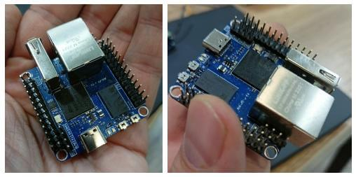
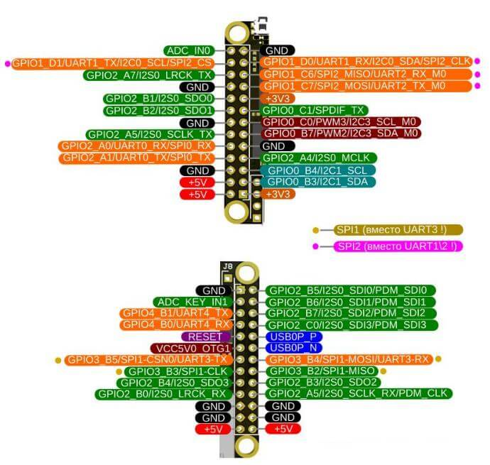
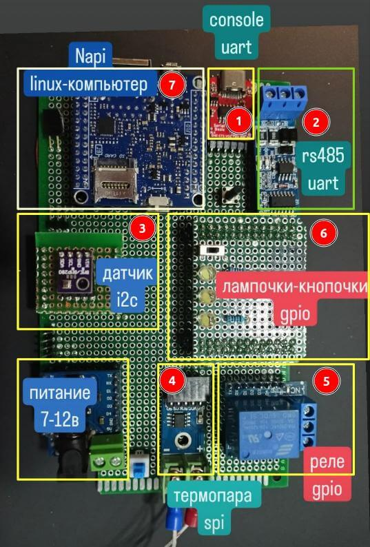
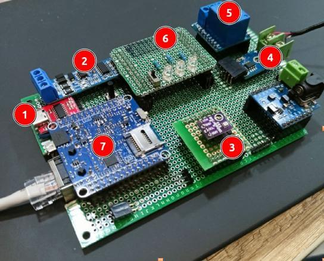
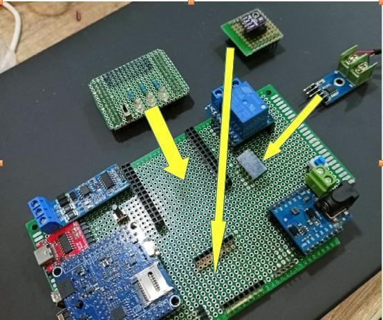
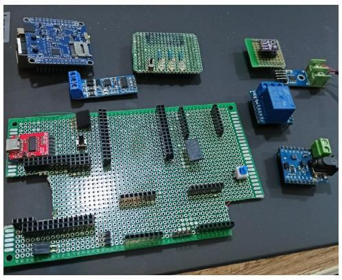
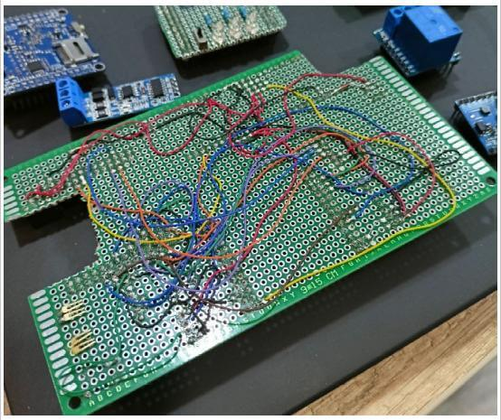

# Плата на NAPI-C своими руками. Часть 1. Прототип.

Во [второй части](../napi-diy-part2/) мы описываем как работать со всеми интерфейсами из Linux.

## Почему мы делаем плату на NAPI-C

Когда мы задумали одноплатный компьютер Napi с штырьками c шагом 2.54мм, основная идея была в том, что на нем легко будет делать прототипы и проверять теории. Имея уже на борту сеть и USB, можно с ножек (GPIO) "забирать" интерфейсы и строить свои устройства. 

Доказывать теорию будем живым примером демонстрационной платы, которая будет сделана на монтажной плате, несложной навесной пайкой. 

Притом, имея опыт прототипирования для микроконтроллеров, некоторые интерфейсы сделаем взаимозаменяемыми, в формате популярных плат расширения для МK wemos d1 mini.

## Интерфейсы для тестирования

Какие интерфейсы позволяет подключить NAPI ? 

- UART: Консоль вывода, RS485\RS232, Lora\Zigbee модемы
- I2C: цифровые датчики, ЦАП-ы, часы реального времени
- SPI: цифровые датчики, накопители, дисплеи, микроконтроллеры

Через цифровые GPIO можно управлять реле, светодиодами, кнопками и другими "кастомными" устройствами.  

## Выберем устройства для подключения

1. На **UART0** (**GPIO2_A0, GPIO2_A1**) у нас стандартная консоль Linux. Но мы можем сразу на плате установить преобразователь на USB-C для удобства работы. 

2. На **UART3** (**GPIO3_B5, GPIO3_B4**) мы "подвесим" готовый модуль преобразования в RS485 порт для работы с дастчиками по протоколу modbus

3. На **I2C3** (**GPIO0_C0 (SCL), GPI0_B7 (SDA)**) мы присоединим цифровой датчик bmp280, который покажет нам температуру, давление, влажность. Но сделаем мы присоединение не напрямую а через сменяемую платку в формате расширений Wemos D1 mini. Это позволит нам менять такие модули и присоединять в будущем другие устройства i2c.

4. На **SPI2** (**GPIO1_D0 (CLK), GPIO1_C6 (MISO), GPIO1_C7 (MOSI), GPIO1_D1 (CS)**) мы "подвесим" готовый модуль термопары MAX6675K, которая опрашивается по интерфейсу SPI.

5. Для демонстрации работы модуля Реле, возьмем готовый модуль реле для Wemos D1, на который надо подать TTL 3.3 для механического замыкания контактов. Для этого используем **GPIO2_B5**

6. Дальше для собственных фантазий можно вывести кроватки для произвольной платы расширения в формате ножек NAPI. Мы не стали слишком фантазировать и сделали платку расширения с 3-мя лампочками (**GPIO2_B6, GPIO2_B7, GPIO2_C0**) и кнопкой с фиксацией (**GPIO2_B3**).
   
7. Не забудем саму NAPI-C (не стали ее впаивать намертво, а поместили в кроватки, сделав вырез в монтажке под ETH\USB)

## Результат - на картинках

Вот так выглядит собранная плата (номера соответствуют пунктам из перечисления интерфейсов).

Довершила картинку платка внешнего питания с кнопкой вкл\выкл, кнопочка Reset (слева от RS485).

А так плата выглядит сбоку в сборе:

Для демонстрации сменяемости модулей вытащим датчик bmp280, снимем термопару, снимем платку расширения с лампочками. 

Мы можем придумать другие датчики, платы расширения сохраняя распиновку GPIO!

А теперь откроем небольшой секрет: все элементы на плате можно "снять" и "одеть". Это мы сделали для того, чтобы, если мы будем делать следующую версию прототипа, перенести эти же элементы на другую версию платы (ведь всегда знаешь как надо сделать лучше, когда закончил).

## Обратная сторона луны

На обратной стороне конечно вся коммутация элементов. Выглядит жутковато, но
это не так все страшно, если соблюдать цвета и некоторые приемы при пайке.

## А что дальше

Следующим шагом специалисты сделают принципиальную плату, а платы расширения с датчиками и другими идеями можно делать самим.

## А софт ?

В следующей части мы покажем как управлять лампочками, щелкать реле, опрашивать датчики, ловить положение кнопки в ОС Linux. У нас уже все работает, но описание требует времени, а, значит, второй части статьи. 

## Ссылки

- Одноплатный компьютер [NAPI-C](/docs/napi-intro)
- BMP280: https://3d-diy.ru/wiki/arduino-datchiki/sensor-bmp280/ 
- MAX6675K: https://3d-diy.ru/product/normalizator-signala-termopary-k-tipa-max6675
- Relay shield: https://iarduino.ru/shop/Expansion-payments/wemos-relay-shield.html
- RS485: https://3d-diy.ru/wiki/arduino-moduli/interfeys-ttl-rs485/
- Power shield: https://aliexpress.ru/item/32960055175.html?sku_id=66493320637
- UART-USB converter: https://voltiq.ru/shop/ch340e-usb-c-uart-converter/