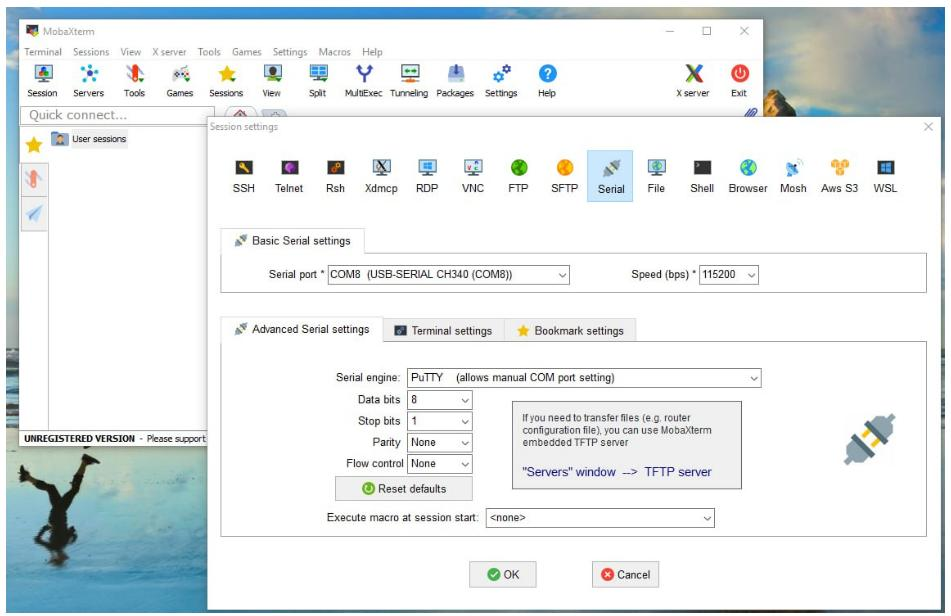
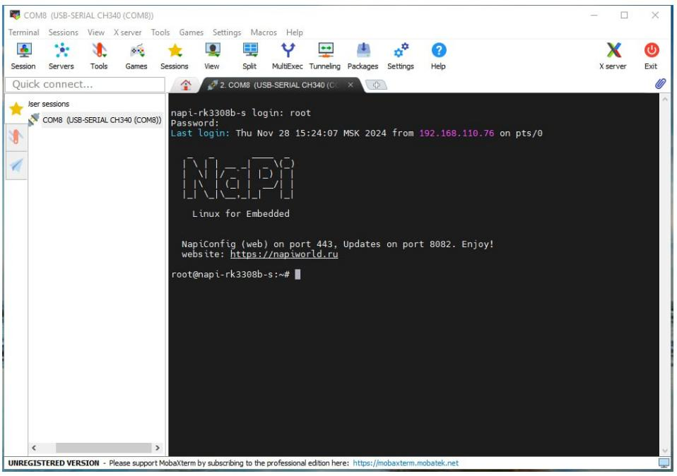

# Запуск и проверка NapiSci


1. Убедимся что подключены нужные overlay-файлы при загрузке

```bash
root@napi-rk3308b-s:~# cat /boot/uEnv.txt
verbosity=7
fdtfile=rk3308-rock-pi-s.dtb
console=ttyS0,115200n8
overlays=rk3308-i2c3-m0 rk3308-spi2-spidev rk3308-uart3 rk3308-i2c1-ds3231 rk3308-usb-pcie-modem rk3308-usb20-host
kernelimg=Image
extraargs=
root@napi-rk3308b-s:~#
```

>В разделе `overlay=` должны быть указаны модули как с приведенного листинга. Если Вы скачали прошивку для NapiSci, то они файл `uEnv.txt` уже заполнен правильно, если Вы скачали NapiLinux, надо указать оверлеи, как указано выше

Также можно проверить появились ли нужные устройства в linux в виде файлов в каталоге `/dev`

```bash
root@napi-rk3308b-s:~# ls /dev/i2c-1
/dev/i2c-1
root@napi-rk3308b-s:~# ls /dev/spidev2.0
/dev/spidev2.0
root@napi-rk3308b-s:~#

```

2. Проверим какие i2c устройства мы видим на шине

```bash
root@napi-rk3308b-s:~# i2cdetect -y 1
     0  1  2  3  4  5  6  7  8  9  a  b  c  d  e  f
00:                         -- -- -- -- -- -- -- --
10: -- -- -- -- -- -- -- -- -- -- -- -- -- -- -- --
20: -- -- -- 23 -- -- -- -- -- -- -- -- -- -- -- --
30: -- -- -- -- -- -- -- -- -- -- -- -- -- -- -- --
40: -- -- -- -- -- -- -- -- -- -- -- -- -- -- -- --
50: 50 -- -- -- -- -- -- -- -- -- -- -- -- -- -- --
60: -- -- -- -- -- -- -- -- UU -- -- -- -- -- -- --
70: -- -- -- -- -- -- 76 --
root@napi-rk3308b-s:~#
```

Мы видим три устройства:

1. Устройство с адресом 50 - RTC часы
2. Устройство с адресом 23 - датчик освещенности bh1750
3. Устройство с адресом 76 - датчик температуры\влажности bmp280 (или bme280)

3. Проверим работу RTC

```bash
root@napi-rk3308b-s:~# hwclock -r
2024-11-28 16:01:19.718061+03:00
root@napi-rk3308b-s:~#
```

4. Скачаем скрипты для работы

> В прошивке для NapiSci скрипты уже будут "на месте"

```bash
root@napi-rk3308b-s:~# curl -L -k -o master.zip  http://github.com/lab240/napi-scripts/archive/master.zip && unzip master.zip
  % Total    % Received % Xferd  Average Speed   Time    Time     Time  Current
                                 Dload  Upload   Total   Spent    Left  Speed
  0     0    0     0    0     0      0      0 --:--:-- --:--:-- --:--:--     0
  0     0    0     0    0     0      0      0 --:--:-- --:--:-- --:--:--     0
100 13305    0 13305    0     0   7623      0 --:--:--  0:00:01 --:--:--  128k
Archive:  master.zip
   creating: napi-scripts-main/
  inflating: napi-scripts-main/README.md
   creating: napi-scripts-main/sensors/
   creating: napi-scripts-main/sensors/py/
  inflating: napi-scripts-main/sensors/py/SSD1306.py
  inflating: napi-scripts-main/sensors/py/bh1750.py
  inflating: napi-scripts-main/sensors/py/napi_display_bh1750.py
  inflating: napi-scripts-main/sensors/py/napi_display_demo.py
  inflating: napi-scripts-main/sensors/py/napi_sci_bh1750.py
  inflating: napi-scripts-main/sensors/py/napi_sci_bme280.py
  inflating: napi-scripts-main/sensors/py/napi_sci_bmp280.py
  inflating: napi-scripts-main/sensors/py/napi_sci_hw.py
  inflating: napi-scripts-main/sensors/py/napi_sci_sht30.py
  inflating: napi-scripts-main/sensors/py/requirements.txt
root@napi-rk3308b-s:~# ls
master.zip  napi-scripts-main

```

5. Читаем разово датчики


- Датчик освещенности

```bash
root@napi-rk3308b-s:~/napi-scripts-main/sensors/py# python3 napi_sci_bh1750.py
Light level: 195.83 lux
root@napi-rk3308b-s:~/napi-scripts-main/sensors/py#
```

- Датчик температуры и давления

```
root@napi-rk3308b-s:~/napi-scripts-main/sensors/py# python3 napi_sci_bmp280.py
Temperature: 28.37 °C, Pressure: 956.99 Pa
root@napi-rk3308b-s:~/napi-scripts-main/sensors/py#

```

>Если у вас датчик BME280 надо запустить другой скрипт `napi_sci_bme280.py`

6. Проверяем дисплей, реле, светодиод

Запускаем `napi_display_demo.py`

```bash
root@napi-rk3308b-s:~/napi-scripts-main/sensors/py# python3 napi_display_demo.py
HWDate:2024-11-28; HWTime:16:39:36; LED:0; RELAY:0
HWDate:2024-11-28; HWTime:16:39:38; LED:1; RELAY:1
HWDate:2024-11-28; HWTime:16:39:40; LED:0; RELAY:0
HWDate:2024-11-28; HWTime:16:39:42; LED:1; RELAY:1
^CTraceback (most recent call last):
  File "/home/root/napi-scripts-main/sensors/py/napi_display_demo.py", line 64, in <module>
    time.sleep(0.5)
KeyboardInterrupt


```

Вы должны увидеть информацию на дисплее, реле должно щелкать а светодиод зажигаться и гаснуть.

>Демонстрация: https://youtu.be/JsNaNfP74Jw?si=ivfDaCiE-eF_-39M

Ура ! Мы проверили почти все ! Угадайте, что мы не проверили ? =)

7. Мы не проверили консоль

Для этого достаточно соединить порт консоли с USB портом хоста (вашего компьютера \ ноутбука) и настроить параметры параметры

```
Скорость: 115200
Параметры порта: 8N1
Контроль Flow: отключить
```

Для Windows мы используем программку [MobaXterm](https://mobaxterm.mobatek.net/), также можно использовать putty. Для Linux есть прекрасный minicom.

Настройки консоли




Результат успешного входа (нажмите любую клавишу), чтобы увидеть приглашение и введите логин\пароль.



Поздравляем, консоль работает !

> :point_ip: Если вы запутались в сетевых настройках всегда можно войти через консоль и вручную исправить файл `/etc/systemd/network/20-wired.network`
