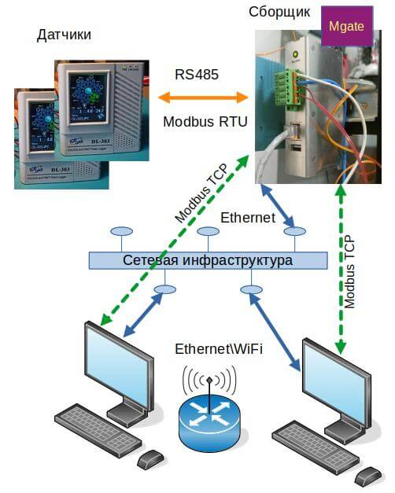
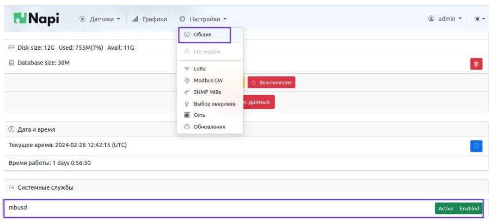
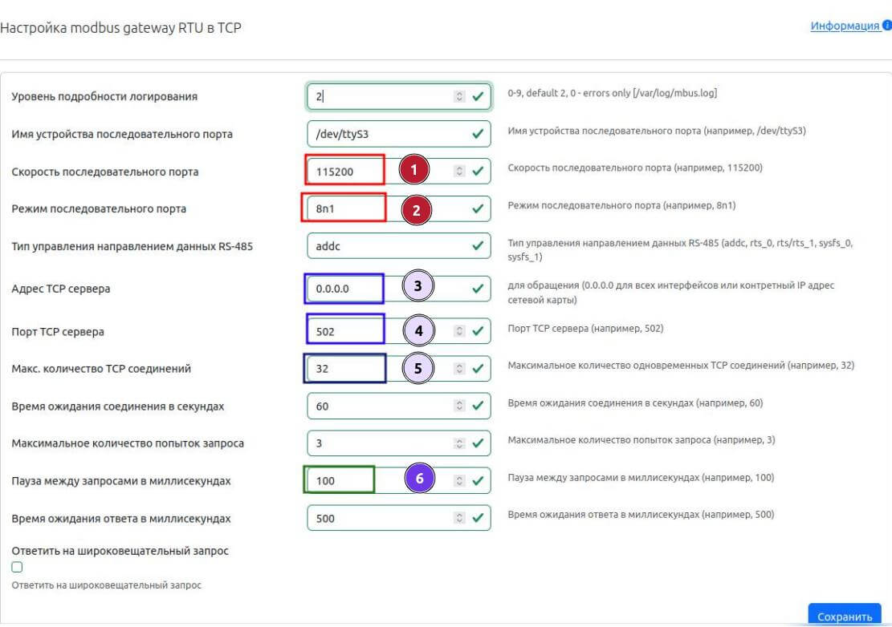

# Шлюз Modbus RTU - Modbus TCP

Зачастую в датчиках имеется только последовательный порт для опроса (RS485). Для того, чтобы имелась возможность опросить такие датчики по сети (Modbus TCP) применяются специальные шлюзы Modbus RTU-Modbus TCP. 

Сборщик-компакт имеет порт RS485 и Ethernet и хорошо подходит для реализации сервиса такого шлюза. 

## Как это работает

- Опрос от пользователей идет на сборщик по IP сборщика с помощью протокола Modbus TCP. 
- Сборщик преобразует запрос в Modbus RTU, опрашивает датчик(и) по RS485 и возвращает ответы по Modbus TCP пользователю  

Схема коммутации показана на схеме. 

- Датчики соединяются с Сборщиком через последовательный порт. 
- Сборщик соединен с сетью, имеет IP-адрес



## Проверка сервиса mbusd

В NapiConfig зайдите в меню "Настройки - Общие". В списке "Системные Службы" Сервис mbusd должен быть в статусе "Enabled", "Active".



Если сервис не активирован, нажмите сначала на поле "Disabled" (1), затем "Inactive" (2)


Статус сервиса должен измениться. 

:::tip 

Без Веб-интерфейса работа сервиса определяется следующими командами

Включить сервис

```systemctl enable mbusd``` 

Запустить сервис (при старте будет запускаться вручную)

```systemctl start mbusd```

После изменения конфига перезапустить сервис

```systemctl restart mbusd``` 

Остановить сервис

```systemctl stop mbusd```

Выключить сервис 

```systemctl disable mbusd``` 

:::

>:warning: Рекомендуем пользоваться Веб-интерфейсом, в нем нельзя "испортить" конфигурационный файл. 


## Настройка Сборщика 

В Сборщике мы используем свободное программное обеспечение mbusd (https://github.com/3cky/mbusd)

В сборке NapiLinux и в подготовленном ARMbian этот пакет уже установлен, если необходимо установить пакет самостоятельно, это можно сделать по [нашей инструкции](/software/armbian-tune#скомпилируем-mbusd).

Настройка mbusd производится через файл /etc/mbusd.conf или через систему NapiConfig (где мы выводим все параметры этого конфига в Веб-интерфейс).




### Настройки последовательного порта

Основные настройки, которые необходимо сделать - это настроить параметры порта (настройки 1,2). Скорость, четность, стоп-бит необходимо установить как в датчиках. 

>:warning: В 90% случаев настройки датчика 9600\8n1 или 115200\8n1

Если датчиков несколько, то у них должны быть одинаковые параметры порта и разные modbus адреса ! В случае одного датчика, modbus адрес знать необязательно.

:::tip
По большому счету, остальные параметры можно оставить по умолчанию, если нет особенных требований.  
:::

### Сетевые настройки

:warning: В стандартных случаях менять сетевые настройки нет необходимости.

Адрес TCP-сервера (3) это IP, который "слушает" сервис. По умолчанию (0.0.0.0), сервис слушает все интерфейсы.

Порт (4) также можно сменить на нестандартный. Это может понадобиться, например, при запуске нескольких подобных сервисов. 

### Тюнинг

:warning: В стандартных случаях менять сетевые настройки нет необходимости.

Количество TCP-соединений (5) можно увеличить, если датчиков очень много и данные "застревают". 

Можно также уменьшить паузу между запросами (6), если этого требуется.

## Перезапуск службы после изменения параметров

Перезапуск службы после изменения параметров происходит автоматически. 

:::tip

Без Веб-интерфейса, необходимо редактировать файл `/etc/mbusd/mbusd.conf`

```nano /etc/mbusd/mbusd.conf```

и перезапустить службу командой

```systemctl restart mbusd```

также можно посмотреть статус сервиса командой 

```systemctl status mbusd```

:::

## Проверка работы: читаем датчик 

Итак, датчик подсоединен к Сборщику с верными параметрами по RS485.  Попробуем прочитать его через шлюз. 

Для этого необходим компьютер с установленной утилитой modpoll (или mbpoll). 

Допустим, IP адрес Сборщика: 10.10.10.114

:::tip 

Проверить доступен ли Сборщик по сети можно командой ping

```bash
dmn@hp:~$ ping  10.10.10.114
PING 10.10.10.114 (10.10.10.114) 56(84) bytes of data.
64 bytes from 10.10.10.114: icmp_seq=1 ttl=63 time=3.56 ms
64 bytes from 10.10.10.114: icmp_seq=2 ttl=63 time=3.60 ms
^C
--- 10.10.10.114 ping statistics ---
2 packets transmitted, 2 received, 0% packet loss, time 1002ms
rtt min/avg/max/mdev = 3.560/3.581/3.603/0.021 ms
```

Бывает, что ping закрыт файрволом, тогда можно проверить командой telnet на порт по которому отвечает mbusd

```bash
dmn@hp:~$ telnet 10.10.10.114 502
Trying 10.10.10.114...
Connected to 10.10.10.114.
Escape character is '^]'.
```

:::

### Выполняем опрос датчика

На компьютере (НЕ НА Сборщике) выполняем команду опроса Сборщика по Modbus TCP

```bash
dmn@hp:~$ modpoll -m tcp -a 1 -r 1 -c 5 -t 3 10.10.10.114
modpoll 3.10 - FieldTalk(tm) Modbus(R) Master Simulator
Copyright (c) 2002-2021 proconX Pty Ltd
Visit https://www.modbusdriver.com for Modbus libraries and tools.

Protocol configuration: MODBUS/TCP, FC4
Slave configuration...: address = 1, start reference = 1, count = 5
Communication.........: 10.10.10.114, port 502, t/o 1.00 s, poll rate 1000 ms
Data type.............: 16-bit register, input register table

-- Polling slave... (Ctrl-C to stop)
[1]: 0
[2]: 1102
[3]: 2797
[4]: 2717
[5]: 8090
-- Polling slave... (Ctrl-C to stop)
[1]: 0
[2]: 1102
[3]: 2798
[4]: 2716
[5]: 8088
-- Polling slave... (Ctrl-C to stop

```

Поздравляем, шлюз работает !

## Решение проблем

Если данные не идут, то необходимо проверить а доступен ли датчик со Сборщика по Modbus RTU

1. Зайдите по ssh на Сборщик
   
2. Остановите сервис mbusd 

```bash
systemctl stop mbusd

```

3. Запустите команду опроса по modbus rtu с правильными параметрами

```bash
root@napi-rk3308b-s:~# modpoll -m rtu -b 115200 -p none -d 8 -a 1 -r 1  -c 5 -t 3 /dev/ttyS3
modpoll 3.10 - FieldTalk(tm) Modbus(R) Master Simulator
Copyright (c) 2002-2021 proconX Pty Ltd
Visit https://www.modbusdriver.com for Modbus libraries and tools.

Protocol configuration: Modbus RTU, FC4
Slave configuration...: address = 1, start reference = 1, count = 5
Communication.........: /dev/ttyS3, 115200, 8, 1, none, t/o 1.00 s, poll rate 1000 ms
Data type.............: 16-bit register, input register table

-- Polling slave... (Ctrl-C to stop)
[1]: 0
[2]: 1100
[3]: 2801
[4]: 2729
[5]: 8112
-- Polling slave... (Ctrl-C to stop)
[1]: 0
[2]: 1100
[3]: 2802
[4]: 2726
[5]: 8106
-- Polling slave... (Ctrl-C to stop)

```

Необходимо добиться, чтобы данные шли ! 

Проверяйте физическое соединение и совпадение параметров порта RS485 с датчиком

4. Когда регистры начнут читаться, снова запустите mbusd

```bash
systemctl start mbusd
```

5. Убедитесь, что в конфигурации mbusd верные параметры порта !