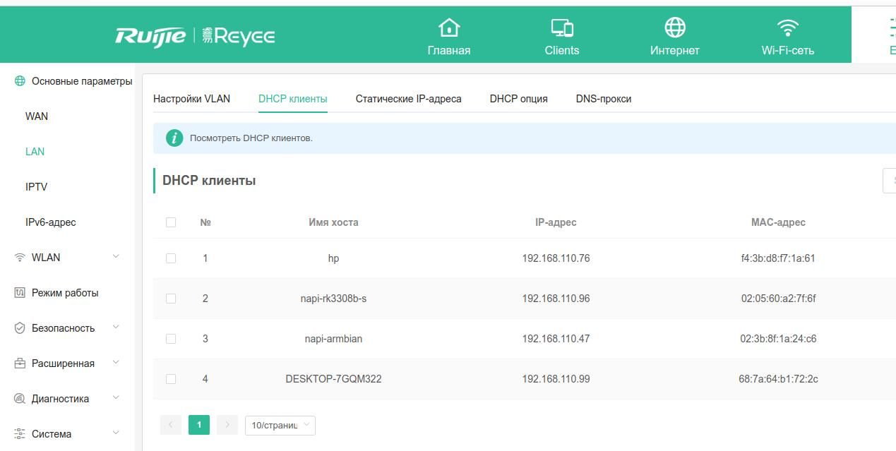
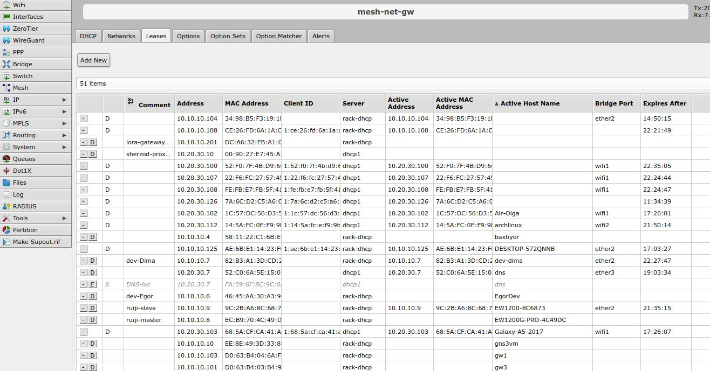
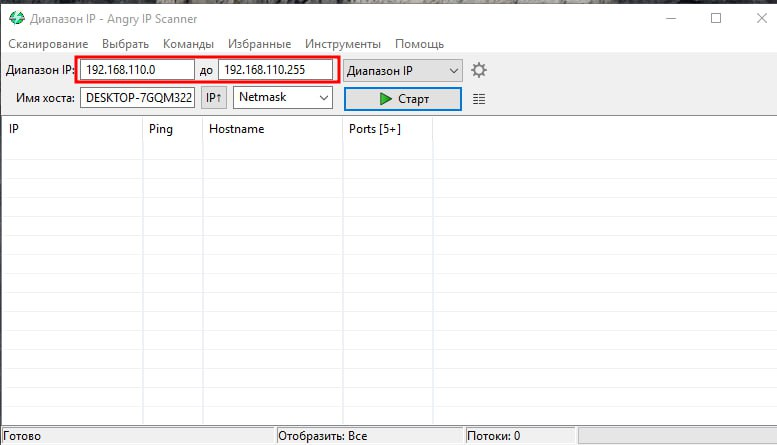
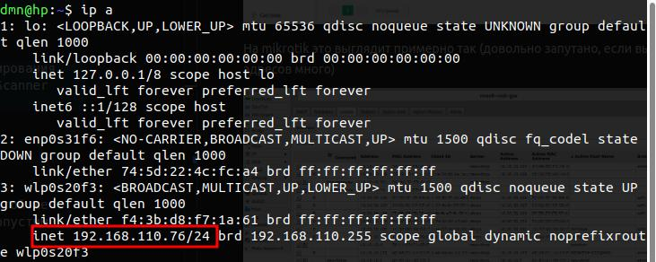
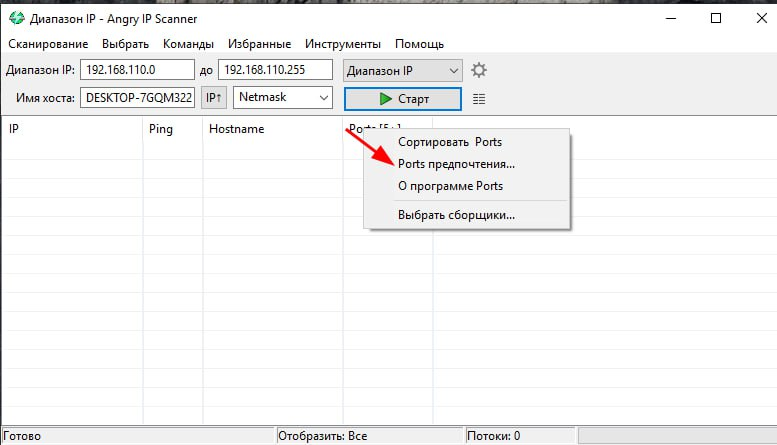
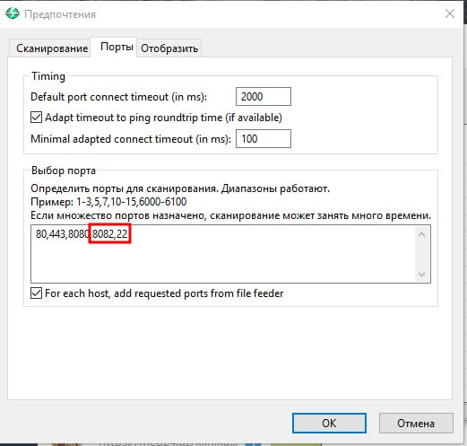
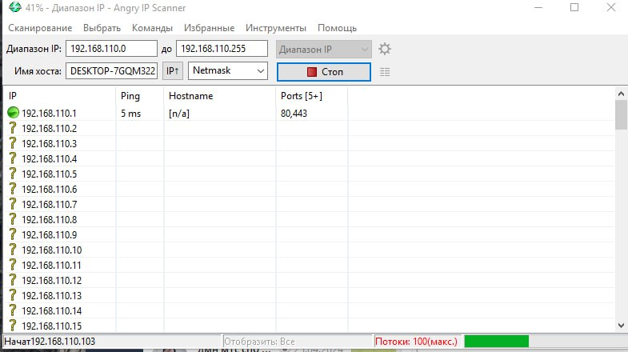
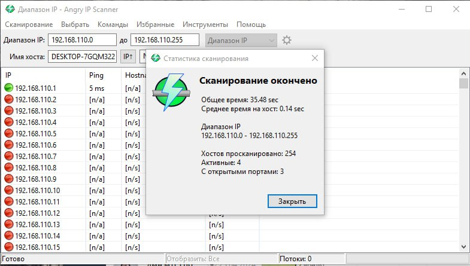
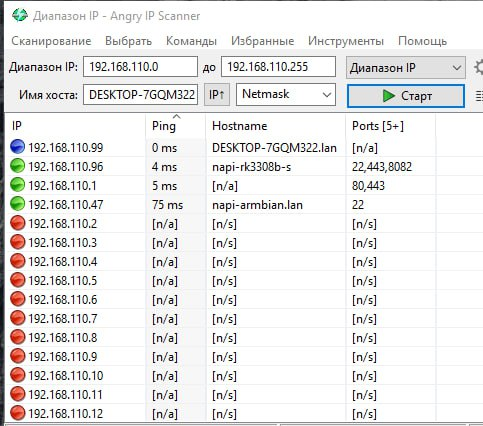
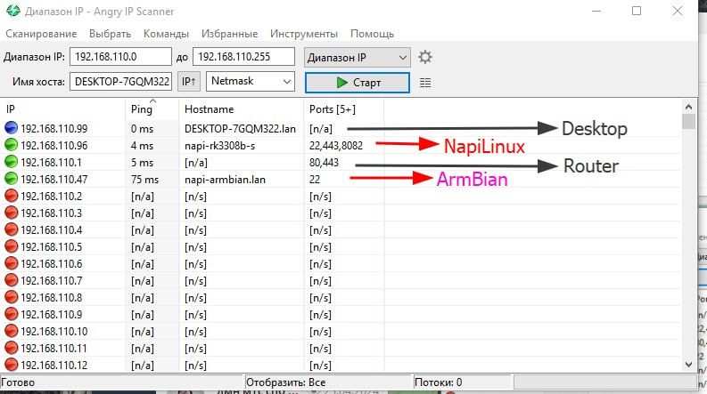

# Как найти NAPI по IP

Так как у NAPI P\C\S нет дисплея, то часто возникает вопрос при подключении в сеть, какой IP получило устройство ? Вопрос этот не праздный и мы в этой статье продемонстрируем как найти IP, если он выдан по DHCP службой (как правило, это роутер типа Mikrotik \ Keenetic, но может быть и выделенный DHCP-сервер).

## Если есть доступ к роутеру\DHCP-серверу

Итак, Вы включили NAPI или Сборщик, вставили Ethernet, он замигал и явно работает, но какой IP получен ? Первый способ - посмотреть на сервере какой IP выдан последним или просто список выданных IP. Если у вас локальный вай-фай роутер и на нем немного устройств, то это сделать довольно просто в Веб-интерфейсе роутера. 

Например, так выглядит таблица выданных IP роутера Ruijie



На mikrotik это выглядит примерно так (довольно запутано, если выданных адресов много)



Поэтому один из способов - подключить к локальной сети аплинк любого вай-фай роутера в режиме роутинга и подключать NAPI к нему. Так как выданные адреса из внутренней сети роутера будут принадлежать только NAPI, довольно легко в веб-интерфейсе найти, какой IP они получили. 

Картинка будет примерно такая же, как на нашем роутере Ruijie.

# Метод сканирования

Если нет вариантов зайти на роутер или там очен много устройств, то есть вариант сканирования сети. Для этого нужно скачать программку сканирования, мы будем пользоваться **[Angry IP Scanner](https://angryip.org/)**. Программку можно скачать и для Win и для Linux. 

Итак, ставим программу и делаем первый запуск



Нам надо задать диапазон сканируемых IP. Для этого, посмотрите IP любого компьютера в той же локальной сети: 

```
 - в Win:`ipconfig`
 - в Linux: `ip a` 
 
 или через графический интерфейс.
```
 Допустим адрес вашего компьютера `192.168.110.76`



Зададим диапазон от 192.168.110.0 - 192.168.110.255 или сеть 192.168.110.0 netmask /24, что одно и тоже. На моем ноутбуке AngyIP сам предложил правильный диапазон. 

Теперь нужно добавить порты, которые мы будем проверять хосты. У нас на Armbian и NapiLinux открыт порт 22 (SSH), а на NapiLinux еще открыт порт 443 (Web) и порт 8082 (обновление).

Добавим их в сканируемые (нажать на Ports)



И добавляем порты



Теперь мы готовы к сканированию, запускаем !



Ждем пока сканирование закончится, о чем будет отдельное предупреждение



Теперь отсортируем по столбику ping, чтоб все "живые" хосты оказались наверху



Посмотрим внимательно на хосты (hostname) у которых нашелся порт 22 и 22,443,8082.

>Параметр hostname передается не всегда, он может быть тем, который назначил пользователь или 
пустым, поэтому смотрим на открытые порты также. 



Логично предположить, что  

- хост 192.168.110.96 это NapiLinux
- хост 192.168.110.47 это ARMbian

Теперь вы можете зайти на Веб или по ssh на указанные хосты и убедиться, что так оно и есть.

:::note
Надо отметить, что при наличии одинаковых устройств в сети, скан покажет все устройства, но на каком IP конкретно устройство, понять невозможно. 

Можно запустить ping устройства и физически отключив сеть убедиться, что ping прервался и это именно тот экземпляр, который мы ищем. 

Таж ке можно задать уникальный hostname устройства в Linux.
:::

## Как получить фиксированный IP

Чтобы получить гарантированный IP от DHCP-сервера нужно, чтобы на роутере (DHCP-сервере) администратор "привязал" MAC-адреc (является уникальным для каждого устройства) к определенному IP и сообщил IP. Тогда DHCP служба будет выдавать однозначный IP устройству с определенным MAC.

Вот так немного "заморочено" работает система DHCP и приходиться применять специальные способы поиска своего устройства, но это позволяет не настраивать ip-параметры вручную на каждом устройстве и исключает дублирование IP-адресов. 

:::tip

Вы можете также подключиться по консоли и посмотреть на выданный IP через 
команду `ip a`

:::
