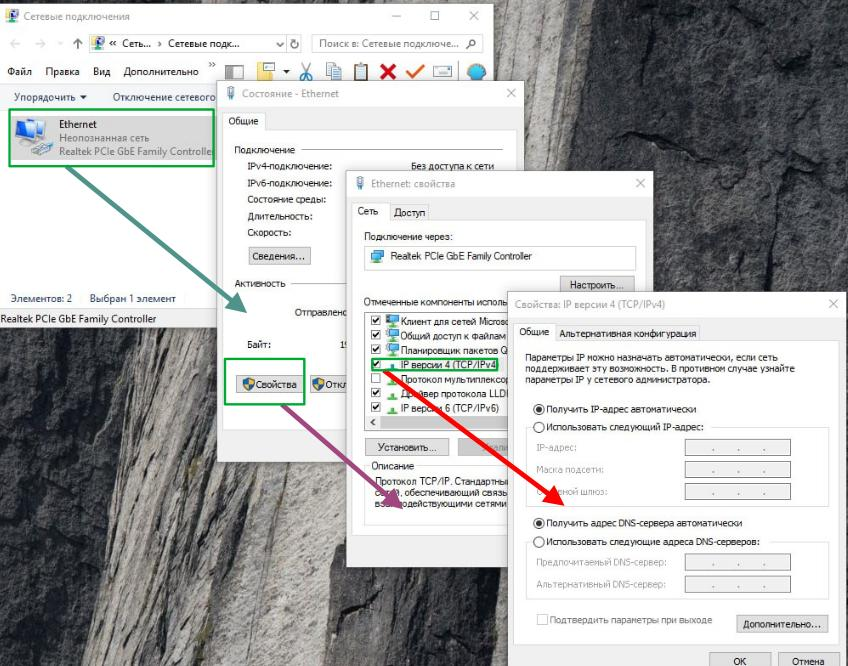
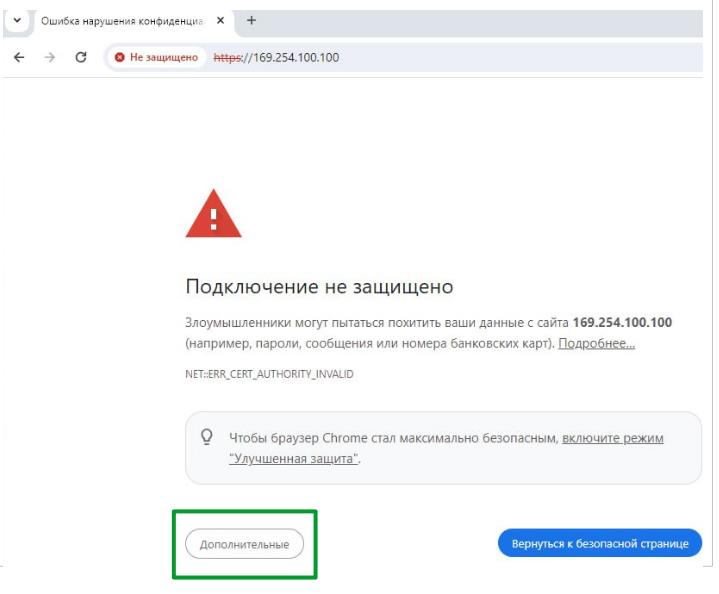
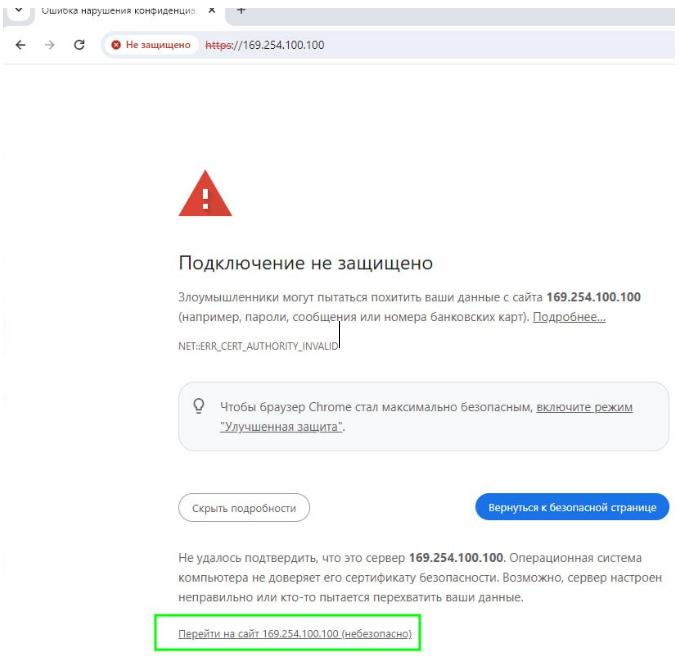
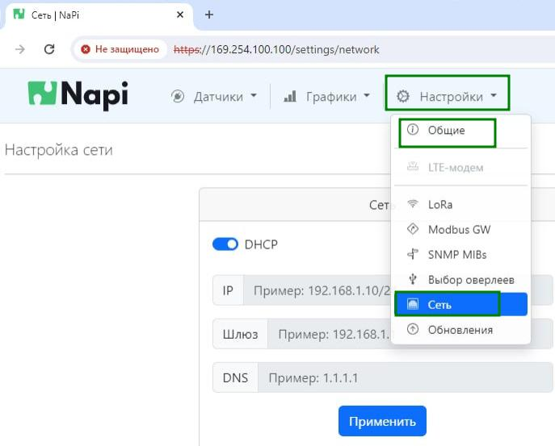
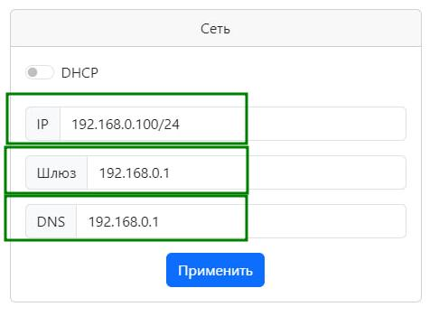
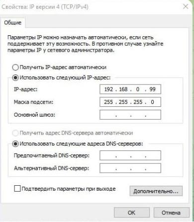
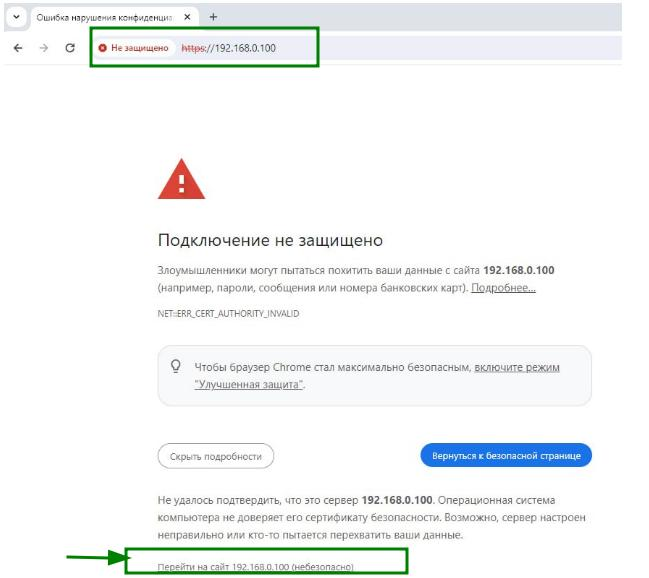
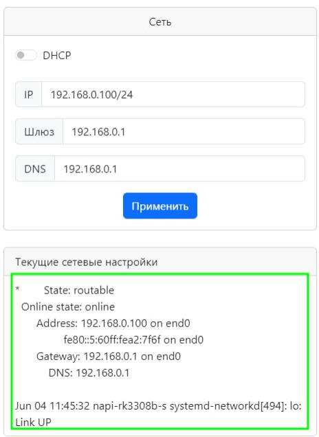
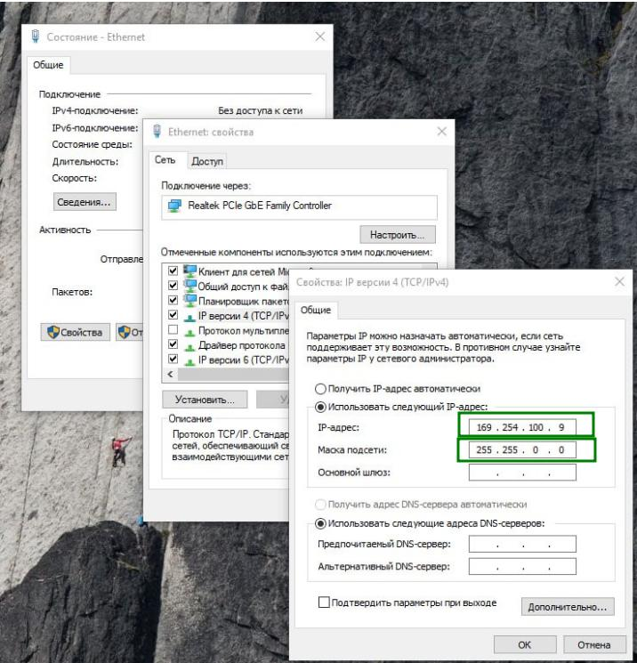

# Как настроить статический IP через NapiConfig

## Соединить напрямую 

Соедините напрямую Сборщик (любое устройства на Napi под управлением NapiLinux)

>Убедитесь, что на Вашем хосте не установлен никакой статический ip-адрес (должно быть как на картинке ниже).

## Заходим на IP по умолчанию

Откройте Веб-броузер и зайдите на адрес: `https://169.254.100.100

>:warning: https:// вначале **обязательно**

Откроется такая картинка (или похожая). 

> Нажать дополнительно

Далее появится возможность зайти на Веб-интерфейс 

Войдите с логином\паролем по умолчанию или с тем, который Вы установили до того и выберите "Общие-Сеть" в верхнем меню.

## Настроим параметры сети

- Отключите флажок "DHCP" - у Вас появиться возможность вводить параметры IP вручную.

:::tip

Для IPv4 мы должны ввести IP и маску сети. Маска сети может быть в нотации X.X.X.X или /XX. У нас принята вторая нотация, поэтому посмотрите таблицу соответствия наиболее популярных масок

| Нотация 1         | Нотация 2   |
| ----------------- | ----------- |
| 255.255.255.255.0 | /24         |
| 255.255.0.0       | /16         |
| 255.0.0.0         | /8          |

:::

Введите параметры 
- IP/MASK
- Шлюз
- DNS

Нажмите "Применить"

>После этого, вы утратите связь с вашим компьютером, это совершенно нормально. Окошко настройки сети станет "мутным". Проверить сеть можно уже по новому адресу.

## Проверим сеть

1. Вы можете отсоединить Сборщик от компьютера и установить в сеть с адресацией, которую Вы задали на Сборщике.

2. Вы можете установить адрес в той же сети на своем компьютере вручную и зайти на Сборщик по введенному ранее адресу. 

В нашем примере установим адрес `192.168.0.99` (помним, что на Сборщике мы поставили `192.168.0.100`)

3. Снова зайдем на Сборщик по адресу `https://192.168.0.100`

> Не забвайте https:// в начале

4. Убеждаемся, что параметры на месте

5. Ура, Вы (Мы) справились !

## Что делать при проблемах

1. Если вы не можете зайти на Сборщик по адресу `169.254.100.100`, попробуйте прописать на своем компьютере настройки вручную, как показано на картинке. `IP: 169.254.100.9, MASK: 255.255.0.0` 

2. *** И самое "страшное". Если на Сборщике был прописан статический IP-адрес, а Вы его не знаете, то мы не сможем подключиться к Сборщику по IP . В таком случае необходимо воспользоваться доступом через Консоль ([см статью](../../console/index.md)) или [перешить](http://localhost:3000/software/category/%D0%BF%D1%80%D0%BE%D1%88%D0%B8%D0%B2%D0%BA%D0%B0-%D0%B1%D0%B5%D0%BA%D0%B0%D0%BF) Сборщик. ***

