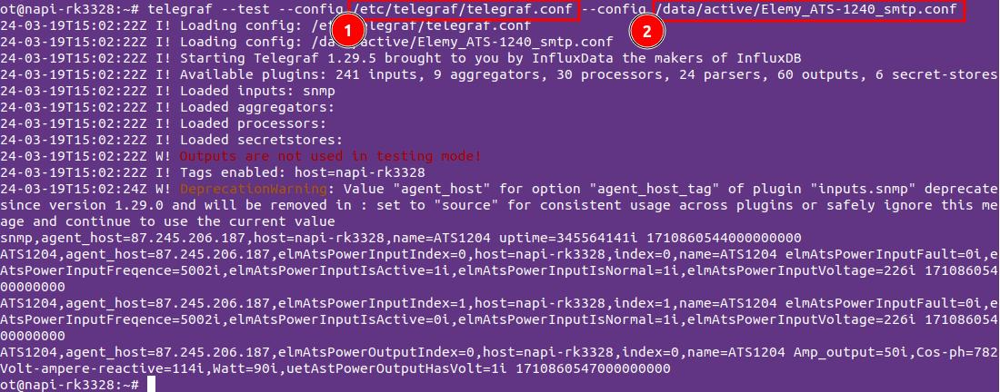
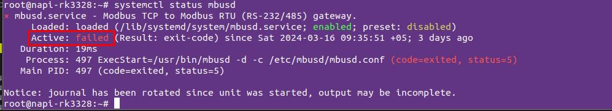
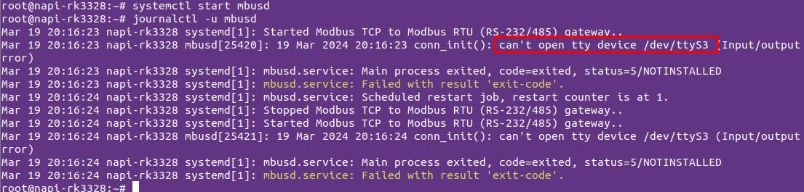

# Работа с службами в NapiLinux\Armbian

Для остановки, запуска, перезапуска и проверки состояния служб необходимо знать как работать с сервисом systemd.

Службы под управлением сервиса systemd управляются через утилиту systemctl.

Общие параметры запуска

```bash

systemctl start|stop|restart|enable|disable|status <service>

```

Уметь работать с сервисами полезно при отладке и настройке датчиков,
шлюзов, конфигураций.

- `systemctl stop telegraf` остановит сервис telegraf
- `systemctl start telegraf` запустит сервис telegraf
- `systemctl restart telegraf` перезапустит сервис telegraf (следует выполнять, когда вы исправили конфиг)
- `systemctl start telegraf` выведет статус сервиса telegraf

Даже остановив или запустив сервис -  при перезагрузке системы, он не "вспомнит" последнее свое состояние.

Чтобы сервис запускался при загрузке  следует его "включить" командой (на примере сервиса telegraf) `systemctl enable telegraf`, а чтобы сервис не запускался при загрузке, его следует "выключить" командой `systemctl disable telegraf`.

Рассмотрим несколько примеров.

## Служба mbusd

Служба моста Modbus RTU - Modbus TCP mbusd перехватывает доступ к порту, на котором находятся датчики и невозможно прочитать датчик вручную. Допустим mbusd не работает как полагается и нам надо проверить отвечает датчик или нет.

Остановим mbusd

```bash
systemctl stop mbusd
```

Прочитаем датчики вручную

```bash
root@napi-rk3308b-s:~# modpoll -m rtu -b 115200 -a 2 -r 1 -c 1 /dev/ttyS3
modpoll 3.10 - FieldTalk(tm) Modbus(R) Master Simulator
Copyright (c) 2002-2021 proconX Pty Ltd
Visit https://www.modbusdriver.com for Modbus libraries and tools.

Protocol configuration: Modbus RTU, FC3
Slave configuration...: address = 2, start reference = 1, count = 1
Communication.........: /dev/ttyS3, 115200, 8, 1, even, t/o 1.00 s, poll rate 1000 ms
Data type.............: 16-bit register, output (holding) register table

-- Polling slave... (Ctrl-C to stop)
[1]: 2
-- Polling slave... (Ctrl-C to stop)
[1]: 2
-- Polling slave... (Ctrl-C to stop)
[1]: 2
-- Polling slave... (Ctrl-C to stop)

```

Видим, что датчик  читается и дело в настройках mbusd (внимательно проверяйте параметры порта !)

Включим, чтобы сервис mbusd стартовал при загрузке системы

```bash
systemctl enable mbusd
```

## Служба telegraf

Если автоматически telegraf не читает датчик, то необзодимо его протетстировать в ручном режиме. Для этого остановим службу telegraf

```

systemctl stop telegraf

```

Прочтем датчик вручную, запустив telegraf  с параметром --test



```bash

В данном примере мы читаем два конфига: один общий (1), другой конфиг датчика (2)

root@napi-rk3328:~# telegraf --test --config /etc/telegraf/telegraf.conf --config /data/active/Elemy_ATS-1240_smtp.conf
2024-03-19T15:02:22Z I! Loading config: /etc/telegraf/telegraf.conf
2024-03-19T15:02:22Z I! Loading config: /data/active/Elemy_ATS-1240_smtp.conf
2024-03-19T15:02:22Z I! Starting Telegraf 1.29.5 brought to you by InfluxData the makers of InfluxDB
2024-03-19T15:02:22Z I! Available plugins: 241 inputs, 9 aggregators, 30 processors, 24 parsers, 60 outputs, 6 secret-stores
2024-03-19T15:02:22Z I! Loaded inputs: snmp
2024-03-19T15:02:22Z I! Loaded aggregators:
2024-03-19T15:02:22Z I! Loaded processors:
2024-03-19T15:02:22Z I! Loaded secretstores:
2024-03-19T15:02:22Z W! Outputs are not used in testing mode!
2024-03-19T15:02:22Z I! Tags enabled: host=napi-rk3328
2024-03-19T15:02:24Z W! DeprecationWarning: Value "agent_host" for option "agent_host_tag" of plugin "inputs.snmp" deprecated since version 1.29.0 and will be removed in : set to "source" for consistent usage across plugins or safely ignore this message and continue to use the current value
> snmp,agent_host=87.245.206.187,host=napi-rk3328,name=ATS1204 uptime=345564141i 1710860544000000000
> ATS1204,agent_host=87.245.206.187,elmAtsPowerInputIndex=0,host=napi-rk3328,index=0,name=ATS1204 elmAtsPowerInputFault=0i,elmAtsPowerInputFreqence=5002i,elmAtsPowerInputIsActive=1i,elmAtsPowerInputIsNormal=1i,elmAtsPowerInputVoltage=226i 1710860546000000000
> ATS1204,agent_host=87.245.206.187,elmAtsPowerInputIndex=1,host=napi-rk3328,index=1,name=ATS1204 elmAtsPowerInputFault=0i,elmAtsPowerInputFreqence=5002i,elmAtsPowerInputIsActive=0i,elmAtsPowerInputIsNormal=1i,elmAtsPowerInputVoltage=226i 1710860546000000000
> ATS1204,agent_host=87.245.206.187,elmAtsPowerOutputIndex=0,host=napi-rk3328,index=0,name=ATS1204 Amp_output=50i,Cos-ph=782i,Volt-ampere-reactive=114i,Watt=90i,uetAstPowerOutputHasVolt=1i 1710860547000000000
root@napi-rk3328:~#
```

## Проверка статуса службы

Проверить запущена ли служба можно командой  `systemctl status <service>`

Проверим запущен ли и в коаком стаусе сервис telegraf

```bash
root@napi-rk3328:~# systemctl status telegraf
● telegraf.service - Telegraf
     Loaded: loaded (/lib/systemd/system/telegraf.service; enabled; preset: disabled)
     Active: active (running) since Sat 2024-03-16 09:35:50 +05; 3 days ago
       Docs: https://github.com/influxdata/telegraf
   Main PID: 415 (telegraf)
      Tasks: 13 (limit: 2278)
     Memory: 174.9M
     CGroup: /system.slice/telegraf.service
             ├─415 /usr/bin/telegraf -config /etc/telegraf/telegraf.conf -config-directory /data/active
             └─488 /usr/bin/dbus-daemon --syslog --fork --print-pid 4 --print-address 6 --session

```

Проверим в каком статусе сервис mbusd



```bash
root@napi-rk3328:~# systemctl status mbusd
× mbusd.service - Modbus TCP to Modbus RTU (RS-232/485) gateway.
     Loaded: loaded (/lib/systemd/system/mbusd.service; enabled; preset: disabled)
     Active: failed (Result: exit-code) since Sat 2024-03-16 09:35:51 +05; 3 days ago
   Duration: 19ms
    Process: 497 ExecStart=/usr/bin/mbusd -d -c /etc/mbusd/mbusd.conf (code=exited, status=5)
   Main PID: 497 (code=exited, status=5)

Notice: journal has been rotated since unit was started, output may be incomplete.
root@napi-rk3328:~#


```

Видно, что сервис не запущен.

Сервис может быть не запущен, потому что остановлен или потому что не смог прочитать конфиг. Узнать подробнее, что случилось с сервисом можно командой
`journalctl -u <service>`

Например, если сервис mbusd не запущен и записей по нему нет, вывод будет такой

```
root@napi-rk3328:~# journalctl -u mbusd
-- No entries --
root@napi-rk3328:~#

```
При неудачной попытке запуска сервиса вывод будет такой



```bash
root@napi-rk3328:~# systemctl start mbusd
root@napi-rk3328:~# journalctl -u mbusd
Mar 19 20:16:23 napi-rk3328 systemd[1]: Started Modbus TCP to Modbus RTU (RS-232/485) gateway..
Mar 19 20:16:23 napi-rk3328 mbusd[25420]: 19 Mar 2024 20:16:23 conn_init(): can't open tty device /dev/ttyS3 (Input/output error)
Mar 19 20:16:23 napi-rk3328 systemd[1]: mbusd.service: Main process exited, code=exited, status=5/NOTINSTALLED
Mar 19 20:16:23 napi-rk3328 systemd[1]: mbusd.service: Failed with result 'exit-code'.
Mar 19 20:16:24 napi-rk3328 systemd[1]: mbusd.service: Scheduled restart job, restart counter is at 1.
Mar 19 20:16:24 napi-rk3328 systemd[1]: Stopped Modbus TCP to Modbus RTU (RS-232/485) gateway..
Mar 19 20:16:24 napi-rk3328 systemd[1]: Started Modbus TCP to Modbus RTU (RS-232/485) gateway..
Mar 19 20:16:24 napi-rk3328 mbusd[25421]: 19 Mar 2024 20:16:24 conn_init(): can't open tty device /dev/ttyS3 (Input/output error)
Mar 19 20:16:24 napi-rk3328 systemd[1]: mbusd.service: Main process exited, code=exited, status=5/NOTINSTALLED
Mar 19 20:16:24 napi-rk3328 systemd[1]: mbusd.service: Failed with result 'exit-code'.
```

## Мониторинг процессов через ps

Есть еще один способ понять запущен процесс или нет. Бывает, Вы можете не знать имя службы до конца, но запушен ли процесс понять можно.

Команда `ps` из под root выводит список всех процессов, поэтому командой

```ps | grep <process>```

в некоторых системах нужно запускать

```ps ax | grep <process>```

Можно узнать а работает ли процесс и какой у него PID.

Узнаем, работает ли у нас telegraf (да, работает pid=415)

```bash
root@napi-rk3328:~# ps ax | grep telegraf
    415 ?        SLsl 139:23 /usr/bin/telegraf -config /etc/telegraf/telegraf.conf -config-directory /data/active
  25487 pts/0    S+     0:00 grep telegraf

```

Узнаем, работает ли у нас mbusd (нет не работает, его нет в списке процессов)

```bash
root@napi-rk3328:~# ps ax | grep mbusd
  25516 pts/0    S+     0:00 grep mbusd
root@napi-rk3328:~#
```

Если мы не знаем как называется сервис, но знаем хоть начало названия, все равно ps покажет запущен или нет процесс по любому шаблону, например по шаблону "tele".

```bash
root@napi-rk3328:~# ps ax | grep tele
    415 ?        SLsl 139:31 /usr/bin/telegraf -config /etc/telegraf/telegraf.conf -config-directory /data/active
  25527 pts/0    S+     0:00 grep tele
root@napi-rk3328:~#
```

Но в целом, это уже метод "последней надежды", пользуйтесь `systemctl`.

P.S.
В Ubuntu также есть команда `service`
