# Установка и запуск Grafana

>Grafana — это популярная платформа для визуализации данных, мониторинга и аналитики. Она позволяет создавать настраиваемые дашборды и графики, подключаясь к разным источникам данных, таким как InfluxDB, Prometheus, Elasticsearch и другие. Grafana широко используется для мониторинга инфраструктуры, приложений и IoT-систем благодаря своей гибкости и поддержке множества интеграций.


## Установка Grafana в Microsoft Windows

Для установки Grafana в Microsoft Windows нужно скачать соответствующую
версию программы установки с [сайта Grafana](https://grafana.com/) (рис.
5.4) и запустить ее.


**Рис. 5.4. Выбор программы установки для Microsoft Windows**

Для установки версии Open Source выберите в списке **Edition** строку
**OSS**, а затем щелкните ссылку **Download the installer**.

После запуска установки вы, возможно, получите предупреждение от
Microsoft Defender о предотвращении запуска неопознанного приложения
(рис. 5.5).

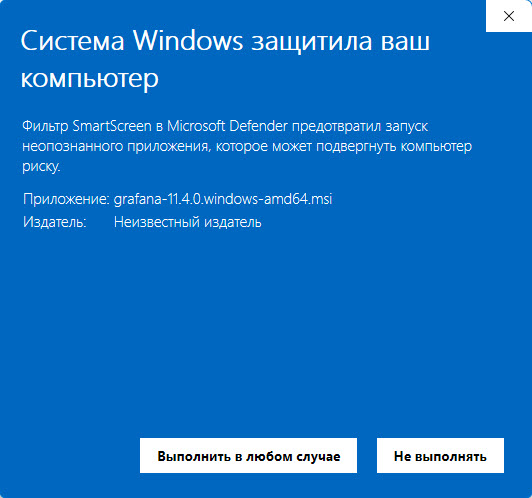

**Рис. 5.5. Предупреждение о запуске неопознанного приложения**

Для продолжения установки щелкните кнопку **Выполнить в любом случае**.
После этого на экране появится первая панель программы установки (рис.
5.6).

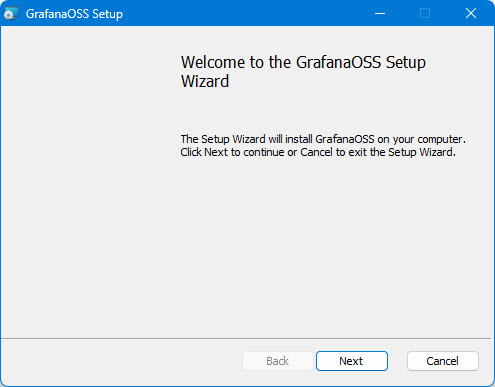

**Рис. 5.6.Первая панель программы установки Grafana**

Здесь нужно щелкнуть кнопку **Next** для перехода к просмотру
лицензионного соглашения (рис. 5.7).

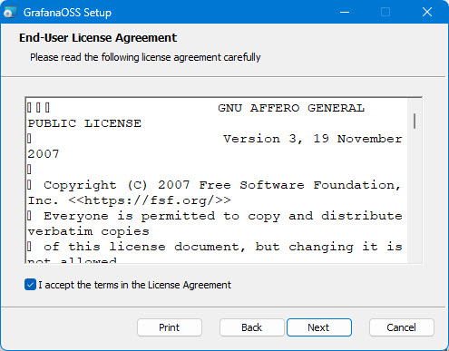

**Рис. 5.7. Просмотр лицензионного соглашения**

Установите флажок **I accept the terms in the License Agreement** и
щелкните кнопку **Next**.

Следующий шаг --- выбор параметров установки (рис. 5.8).

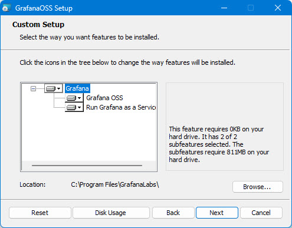

**Рис. 5.8. Выбор параметров установки**

Здесь все можно оставить по умолчанию, щелкнув снова кнопку **Next**. Вы
увидите панель с кнопкой **Install**, которая запустит процесс установки
(рис. 5.9).

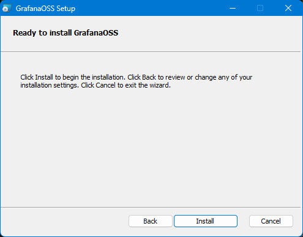

**Рис. 5.9. Панель для запуска процесса установки**

Здесь опять может появиться запрос подтверждения на установку, с которым
вам нужно будет согласиться. Как только вы это сделаете, начнется
процесс установки (рис. 5.10).

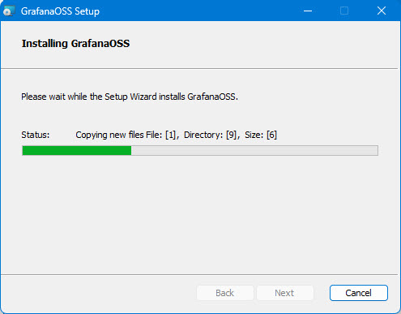

**Рис. 5.10. Ход процесса установки**

После завершения установки на экране появится последняя панель
установщика, где нужно щелкнуть кнопку **Finish** (рис. 5.11).


**Рис. 5. 11. Последняя панель установщика Grafana**

После установки Grafana сразу будет запущена как служба, стартующая
автоматически при загрузке Windows.

Если у вас на компьютере или сервере установлен брандмауэр или антивирус
с функциями брандмауэра, необходимо разрешить входящие соединения TCP на
порту 3000. На рис. 5.12 показан соответствующий запрос от антивируса
Dr.Web, настроенного для работы в режиме обучения.

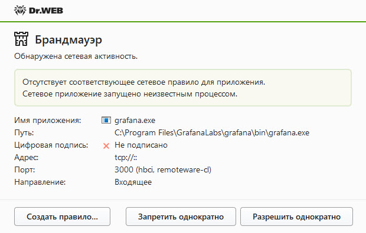

**Риc. 5.12. Запрос на открытие порта 3000**

Здесь вам нужно щелкнуть кнопку **Создать правило** и добавить два
правила, показанных на рис. 5.13, разрешив приложениям Grafana сетевые
подключения на порт 3000.

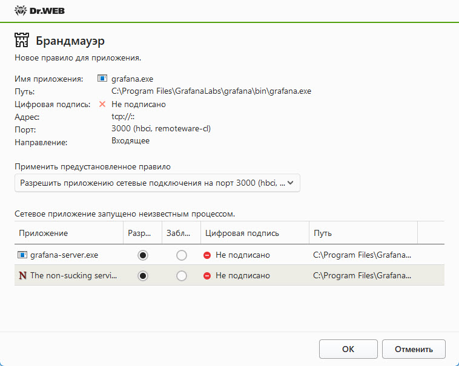

**Рис. 5.13. Правила для разрешения сетевых подключений на порт 3000**

Когда вы это сделаете, откройте в браузере страницу по адресу:
http://127.0.0.1:3000/login. Появится страница с приглашением для
входа в Grafana (рис. 5.16).

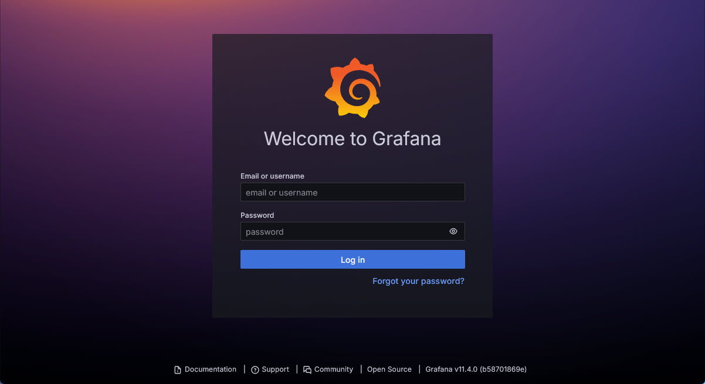

**Рис. 5.16. Страница с приглашением для входа в Grafana**

По умолчанию нужно указать логин admin и пароль admin. При первом входе
вам будет рекомендовано изменить этот пароль.


## Установка Grafana из пакета в Ubuntu и Debian

Перед установкой Grafana на сервер (физический или виртуальный) Ubuntu
обновите список пакетов и установите необходимые зависимости:

`sudo apt-get update`

Далее добавьте пользователя, скачайте и установите нужный пакет:

```bash
sudo apt-get install -y adduser libfontconfig1 musl
wget https://dl.grafana.com/oss/release/grafana_11.4.0_amd64.deb
sudo dpkg -i grafana_11.4.0_amd64.deb
```

Теперь вы можете запустить сервис Grafana и проверить его состояние:

```
sudo /bin/systemctl start grafana-server
sudo /bin/systemctl status grafana-server
```

Чтобы сервис Grafana запускался автоматически при перезагрузке OC,
введите такую команду:

```
sudo /bin/systemctl enable grafana-server
```

После запуска сервиса откройте в браузере адрес вида
http://192.168.0.20:3000/, где вместо 192.168.0.20 укажите адрес IP
узла, на который вы только что установили Grafana.

Для доступа по этому адресу нужно использовать протокол HTTP, а не
HTTPS. Логин для входа admin, пароль --- также admin.

>При первом входе вам будет предложено его заменить.

После входа вы увидите главное окно Grafana

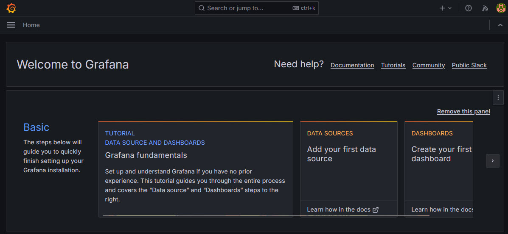

>Здесь нужно ввести логин admin и пароль admin.

## Установка для процессоров ARM

Систему Grafana можно установить на сервер или микрокомпьютер с
процессором ARM. Ниже представлена соответствующие команды установки:

```
sudo apt-get install -y adduser libfontconfig1 musl
wget https://dl.grafana.com/oss/release/grafana_11.4.0_arm64.deb
sudo dpkg -i grafana_11.4.0_arm64.deb

```
После установки запустите сервис и проверьте его состояние:

```
sudo /bin/systemctl start grafana-server
sudo /bin/systemctl status grafana-server
```

Если установка прошла без ошибок, то введите в браузере адрес вида:
http://192.168.0.20:3000. Появится главное окно Grafana.

## Запуск Grafana в Docker

Прежде всего, установите Docker, если он еще не установлен. Для Ubuntu
выполните следующие подготовительные команды:

```
sudo apt-get update
sudo apt-get install ca-certificates curl
sudo install -m 0755 -d /etc/apt/keyrings
sudo curl -fsSL https://download.docker.com/linux/ubuntu/gpg -o
/etc/apt/keyrings/docker.asc
sudo chmod a+r /etc/apt/keyrings/docker.asc

echo
"deb [arch=$(dpkg --print-architecture)
signed-by=/etc/apt/keyrings/docker.asc]
https://download.docker.com/linux/ubuntu
$(. /etc/os-release && echo "$VERSION_CODENAME") stable" |
sudo tee /etc/apt/sources.list.d/docker.list > /dev/null
sudo apt-get update

```
Затем запустите саму установку:

```

sudo apt-get install docker-ce docker-ce-cli containerd.io
docker-buildx-plugin docker-compose-plugin

```
Проверьте, что все работает:

```
sudo docker run hello-world
```

После запуска этой команды на консоли должно появиться сообщение,
содержащее строку «Hello from Docker!».

Для запуска Grafana в Docker проще всего воспользоваться файлом
docker-compose.yml из репозитория: https://github.com/lab240/grafana-docker

```
services:

grafana:
image: grafana/grafana
container_name: lab_grafana
restart: always
volumes:
- grafana-data:/var/lib/grafana
ports:
- "3000:3000"
networks:
- lab240-monitoring
environment:
# - GF_LOG_LEVEL=debug
# - GF_LOG.CONSOLE_LEVEL=debug
- GF_SECURITY_ADMIN_USER=${ADMIN_USER:-admin}
- GF_SECURITY_ADMIN_PASSWORD=${ADMIN_PASSWORD:-admin}
- GF_USERS_ALLOW_SIGN_UP=${ALLOW_SIGN_UP:-false}
- GF_AUTH_ANONYMOUS_ENABLED=${ANONYMOUS_ENABLED:-true}
networks:
lab240-monitoring:
volumes:
grafana-data:
```

Файл docker-compose.yml можно скачать по ссылке:
https://raw.githubusercontent.com/lab240/grafana-docker/refs/heads/main/docker-compose.yml.

Чтобы запустить Grafana, выполните следующую команду из каталога, в
котором находится файл docker-compose.yml:

```
sudo docker compose up -d
```

Через некоторое время Grafana запустится и вы сможете открыть главную
страницу его web-интерфейса, как это было описано ранее.

Для остановки контейнера выдайте такую команду:

```
sudo docker compose down
```

Команда docker ps покажет список всех запущенных контейнеров вместе с их
именами и идентификаторами:

```
sudo docker ps
CONTAINER ID IMAGE COMMAND CREATED STATUS PORTS NAMES
3b65c707014a grafana/grafana "/run.sh" 18 seconds ago Up 17 seconds
0.0.0.0:3000->3000/tcp, :::3000->3000/tcp lab_grafana
```

#  Настройка Grafana

Перед тем как приступить к настройке Grafana, убедитесь, что
соответствующий сервис запущен:

```
sudo /bin/systemctl status grafana-server

```
## Добавление источника данных

Откройте главное меню и в разделе **Connections** выберите меню **Data
sources** (рис. 6.1).

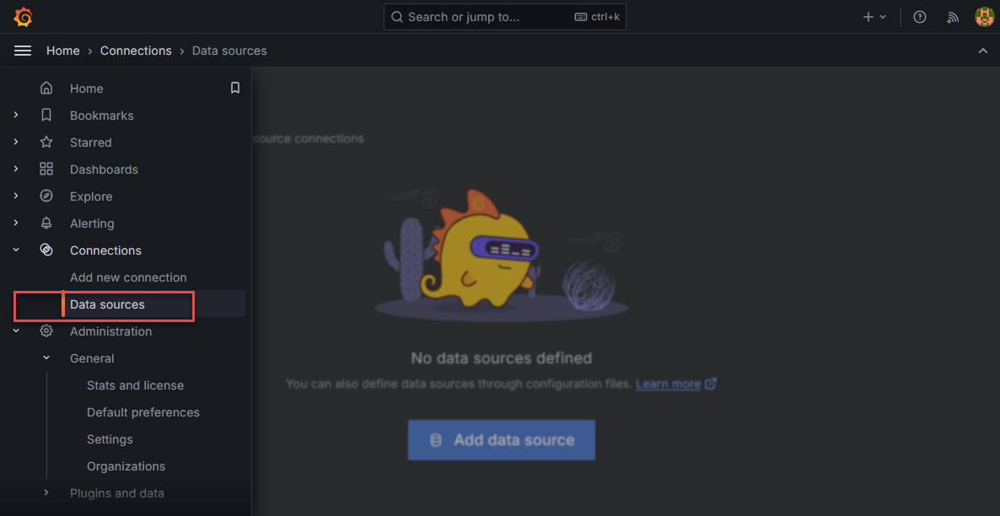

**Рис. 6.1. Вход в раздел добавления источника данных**

Щелкните здесь кнопку **Add data source** и выберите базу данных
**InfluxDB** (рис. 6.2).

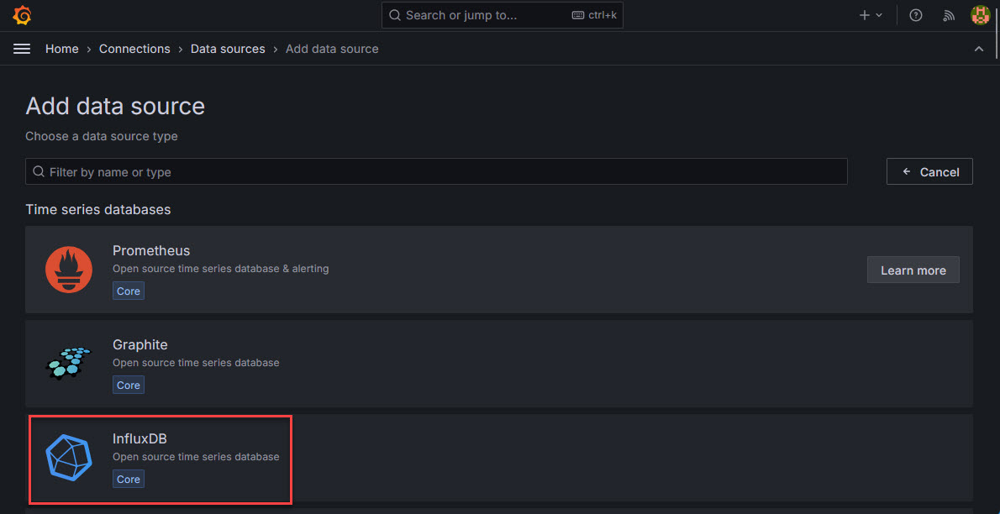

**Рис. 6.2. Выбор базы данных InfluxDB**

Появится страница настройки источника данных, верхняя часть которой
показана на рис. 6.3.

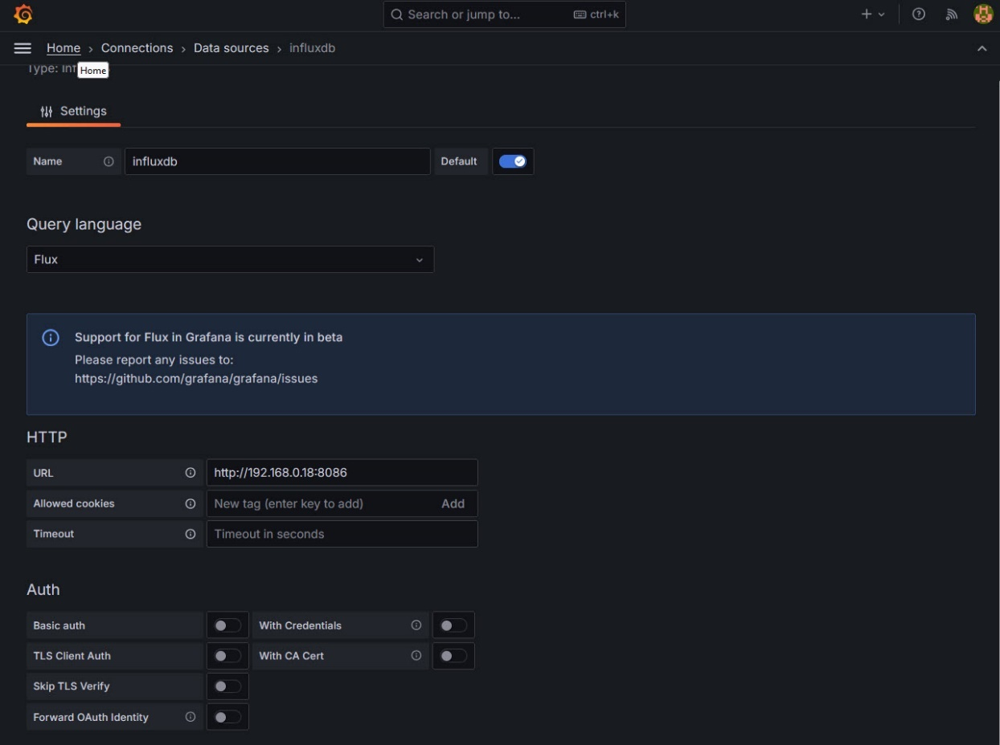

**Рис. 6.3. Верхняя часть окна настройки источника данных**

Здесь в списке **Query language** выберите строку **Flux**, а в поле
**URL** введите адрес, по которому доступна база данных InfluxDB.

Если вы настраиваете Grafana для работы на модуле сборщика FrontControl
Compact, то в поле **URL** адрес InfluxDB нужно указать как
[http://127.0.0.1:8086](http://127.0.0.1:8086/). Если Grafana
настраивается для работы на другом узле, то вместо 127.0.0.1 укажите
адрес IP, выделенный модулю FrontControl Compact.

Также отключите здесь режим **Basic auth** для того, чтобы использовать
токены при авторизации в InfluxDB.

На рис. 6.4 показана нижняя часть окна настройки источника данных.


**Рис. 6.4. Нижняя часть окна настройки источника данных**

Здесь в поле **Organization** укажите строку «nnz», если будет
подключение к узлу FrontControl Compact.

В поле **Token** необходимо ввести токен авторизации в InfluxDB, который
можно узнать через командную строку модуля FrontControl Compact:

```
cat /etc/telegraf/telegraf.conf | grep token
```

Также вы можете запросить токен в службе сервисного обслуживания.

В поле **Default Bucket** следует ввести строку названия контейнера
«bucket1».

Закончив заполнение перечисленных выше полей формы, щелкните кнопку
**Save & test**. Если поля были заполнены верно, и Grafana смогла
подключиться к источнику данных InfluxDB, в нижней части окна настройки
появится сообщение об успехе (рис. 6.5) или сообщение об ошибке.


**Рис. 6.5. Сообщение об успешном подключении к источнику данных**

## Подключение панелей Dashboard

Чтобы Grafana могла отображать данные измерений, полученные от датчиков,
нужно создать панели Dashboard или подключить уже готовые.

Откройте главное меню Grafana и выберите строку **Dashboards** (рис.
6.6).

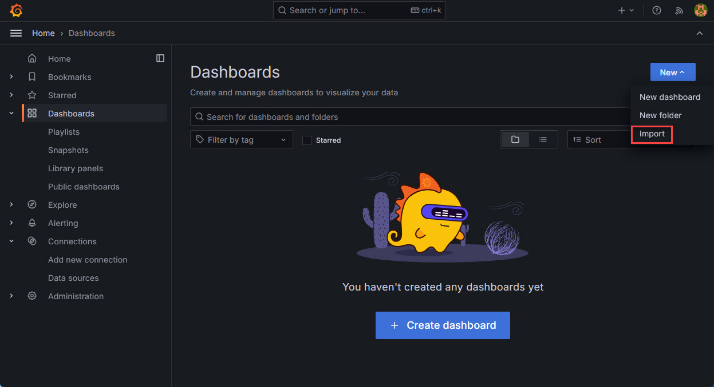

**Рис. 6.6. Страница создания панелей Dashboard**

Выберите здесь из меню **New** строку **Import** (выделена рамкой
красного цвета на рис. 6.6).

Готовые шаблоны Grafana для датчиков вы можете найти в репозитории:
https://github.com/lab240/telegraf-grafana-configs/tree/main/conf-grafana-dashboards.

В качестве примера выберем шаблон датчика ICPDAS DL-303 (рис. 6.7).

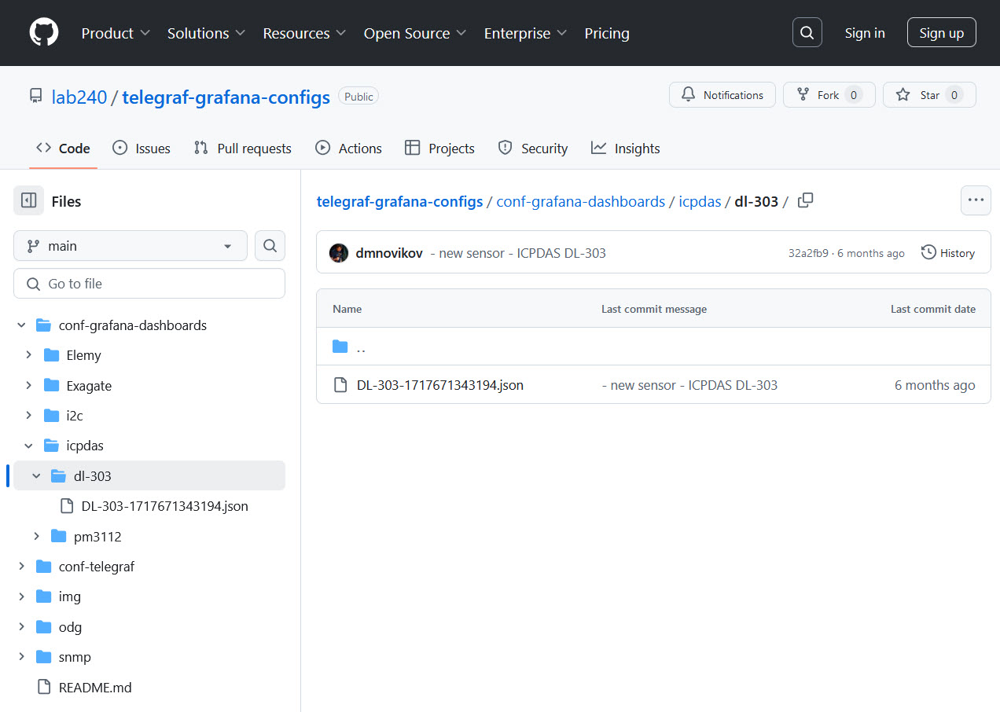

**Рис. 6.7. Готовый шаблон Grafana для датчика ICPDAS DL-303**

Вы можете скачать шаблон в виде файла, или загрузить его в Grafana по
его адресу URL.

Щелкните имя файла шаблона, чтобы открыть его для просмотра (рис. 6.8).

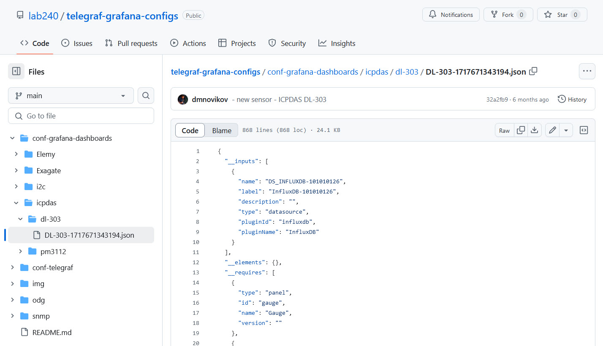

**Рис. 6.8. Просмотр файла шаблона для датчика ICPDAS DL-303**

Скачайте JSON-файл шаблона с помощью кнопки **Download raw file**.
Загруженный файл загрузите в поле Upload dashboard JSON file (рис. 6.9).


**Рис. 6.9. Ввод адреса файла шаблона для импорта**

После загрузки файла появится окно **Import dashboard** (рис. 6.10).

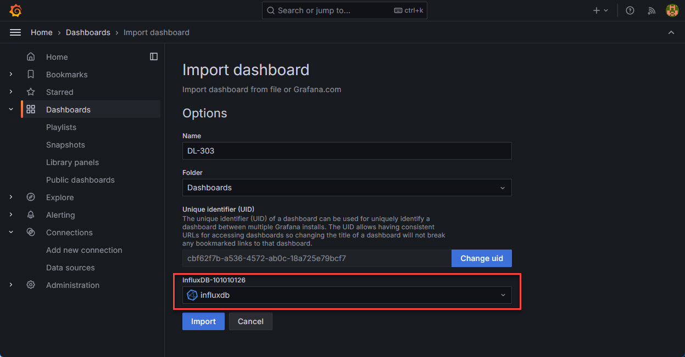

**Рис. 6.10. Окно Import dashboard**

Выберите источник данных influxdb, затем щелкните кнопку **Import**. Вы
увидите импортированную панель, в которой будут отображаться данные
измерений от датчика ICPDAS DL-303 (рис. 6.11).

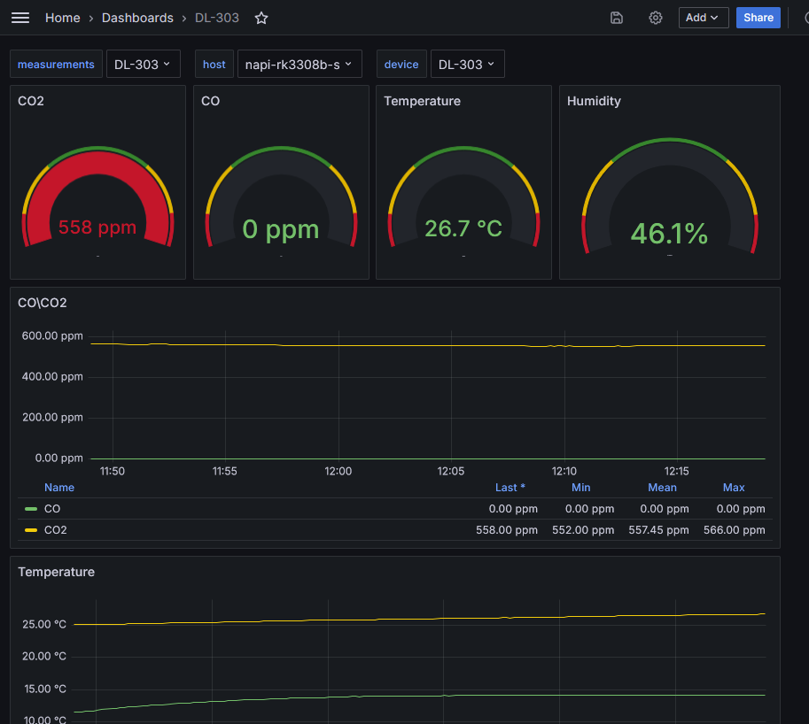

**Рис. 6.11. Панель с данными измерений от датчика ICPDAS DL-303**

Вы можете просмотреть и отредактировать шаблон, находясь в этой панели.
Например, откроем редактор для просмотра и редактирования CO.

Чтобы это сделать, щелкните кнопку с тремя точками в блоке CO, а затем
выберите из контекстного меню строку **Edit** (рис. 6.12).

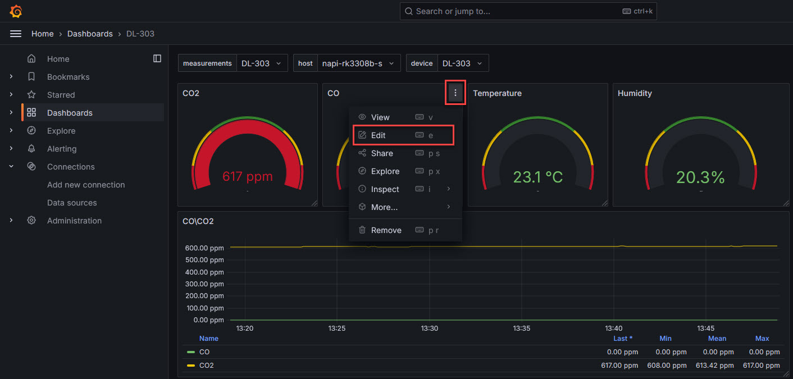

**Рис. 6.12. Редактирование шаблона для блока CO**

В нижней части окна находится запрос на языке Flux, соответствующий
отображению панели CO в Dashboard (рис. 6.13).


**Рис. 6.13. Редактирование шаблона панели для CO**

Здесь в блоке **Panel options** вы можете отредактировать параметры
шаблона, например, заголовок.

В блоке **Standard options** можно изменить единицы измерения Unit,
которые используются в панели для отображения данных (рис. 6.14).

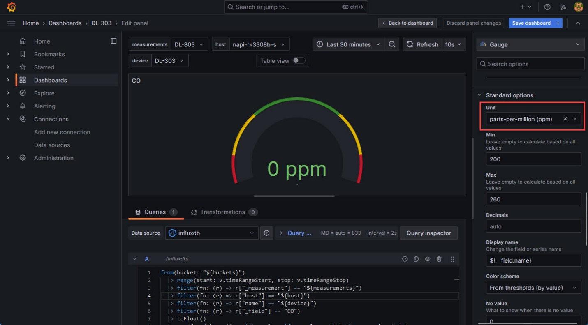

**Рис. 6.14. Изменение единиц измерения для отображения данных**
