# Опрашиваем датчик по Modbus RTU через RS485

## Схема опроса датчика Modbus RTU через Сборщик-компакт

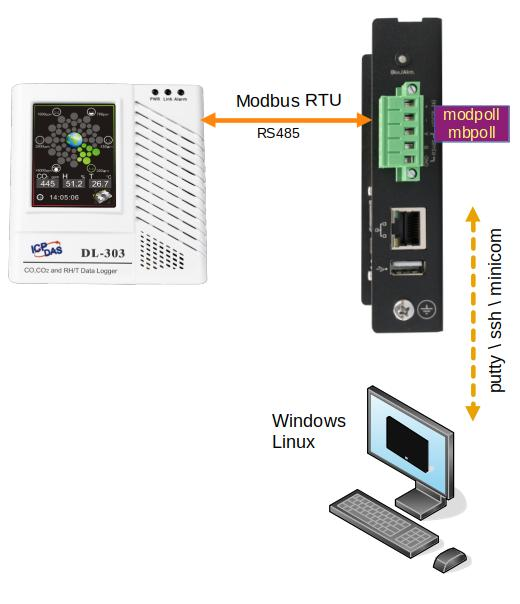

> :point_up: Эта инструкция подходит для любого Сборщика

## Присоединим датчик к Сборщику

1. На сборщике контакты называются "A" и "B"

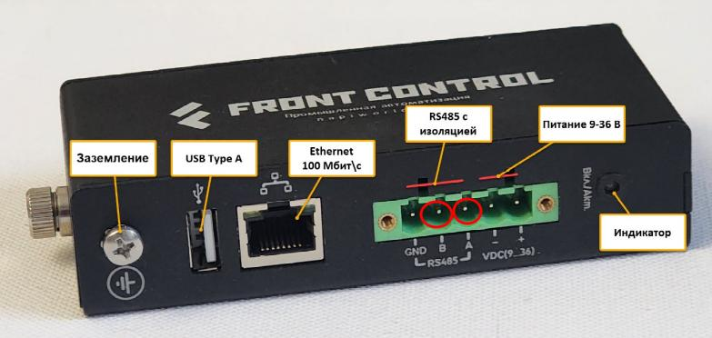


2. На датчике надо найти соответствующую «пару». Она может быть обозначена также «A/B», но часто также обозначают D+/D-

Например датчик ICPDAS DL-303

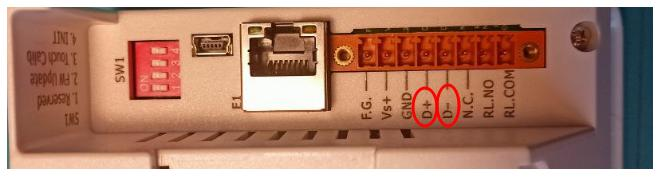

3. Соединяем контакты

Контакт A <-> контакт D+

Контакт B <-> контакт D-

:::tip

При длинных линиях и различных источниках питания для сборщика и датчика, рекомендуется также соединять контакты GND для согласования уровней.

:::

В нашем примере Сборщик и датчик имеют зажимные колодки, поэтому нам не нужна даже отвертка (в других датчика часто бывает зажим под винт)

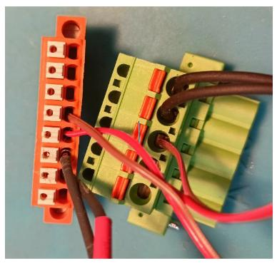

Теперь "на столе" это выглядит так

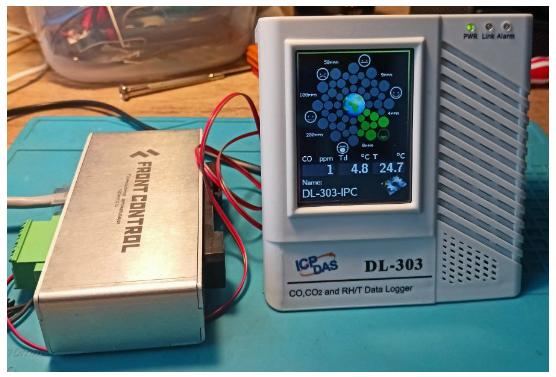

## Параметры датчика для опроса по ModBus RTU

>В датчике DL-303 эти параметры можно менять прямо на экране датчика, но это скорее исключение из правил.

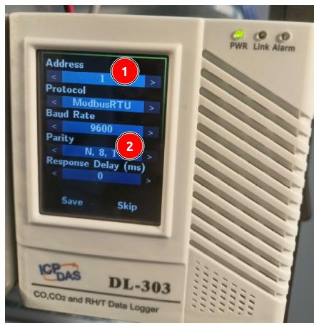

- Узнаем адрес датчика (1)

Так как возможен последовательный опрос нескольких датчиков, то важно знать адрес устройства (это цифра от 1 до 255). Все датчики по умолчанию имеют адрес "1", но у всех его можно поменять (и могли поменять до Вас)

- Узнаем параметры порта RS485 (2)

Для чтения датчика необходимо знать параметры подключения к RS485-му порту. Эта информация точно есть в документации к датчику. Скорость шины RS485 по умолчанию часто 9600, но может быть 115200. Параметры порта как правило 8N1 (8бит, без проверки четности, 1 стоп бит).

>:warning: При подключении нескольких устройств, важно чтобы на всех устройствах были одинаковые параметры RS485.

- Узнаем регистры для опроса

Здесь нам точно понадобиться документация, в которой должны быть указаны номера ModBus регистров для опроса и их тип. Если тип регистров одинаковый, то можно одной командой читать "пачку" регистров.

В нашем датчике для чтения доступны регистры

- 1 - CO (ppm)
- 2 - CO2 (ppm)
- 3 - H (влажность в %)
- 4 - Т (температура в С)
- 5 - Т (температура в F)

## Читаем датчик

Когда мы знаем все необходимые параметры, можно читать датчик. Наш датчик поддерживает Modbus, будем опрашивать по протоколу Modbus RTU.

- Заходим на Сборщик по ssh (надо знать его IP)

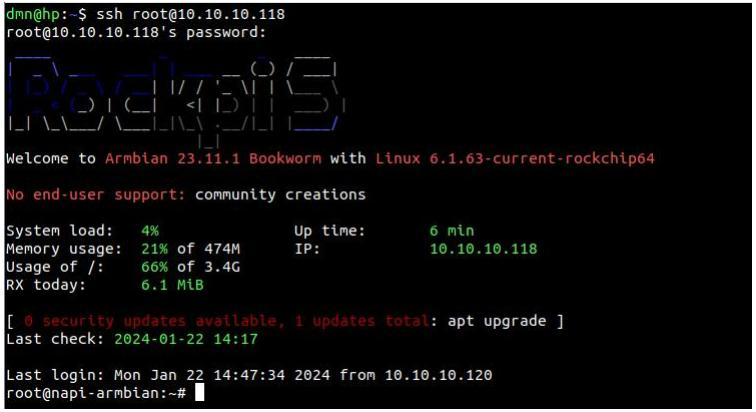

- Запускаем утилиту modpoll (читаем сразу 5 регистров по адресу 1)

```bash
modpoll -b 9600 -p none -d 8 -m rtu -a 1 -r 1  -c 5 -t 3  /dev/ttyS3

```

> Как установить утилиту [modpoll](/software/notes/armbian-tuning/#установим-утилиту-modpoll)

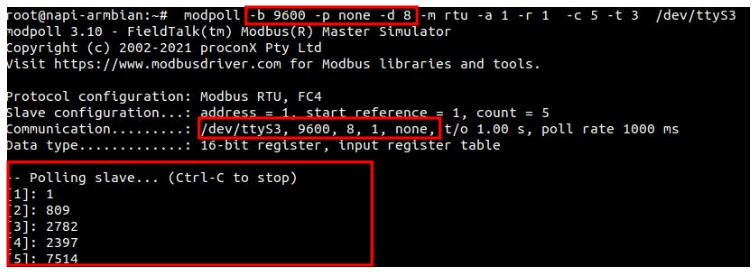

Получаем значения из регистров (с множителем)

- CO = 1
- CO2 = 8.09
- H = 27,82%
- T = 23,97C
- T = 75,14F

Также можно воспользоваться утилитой mbpoll, которая очень похожа на modpoll

>Установить утилиту mbpoll можно командой  `apt install mbpoll`

```bash
mbpoll -b 9600 -P none -d 8 -m rtu -a 1 -r 1  -c 4 -t 3  /dev/ttyS3
```

> Отметим разницу в парамтере P и p, остальное аналогично

Результат

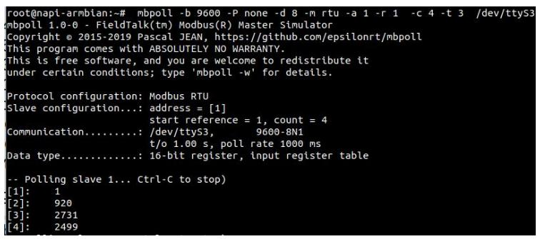

## Возможные ошибки

Если указать неправильный порт, получим ответ `timeout`

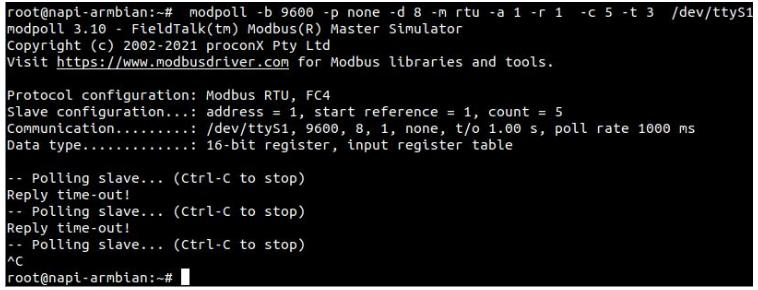

Если указать неправильные параметры порта, получим `checksum error`

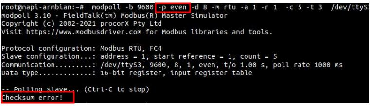

Если указать неправильную скорость порта,  получим ответ `timeout`

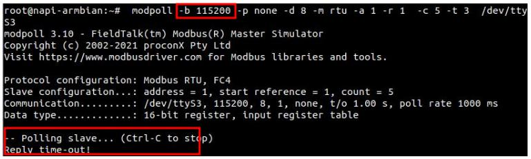

Если указать неправленый адрес, получим ответ `timeout`

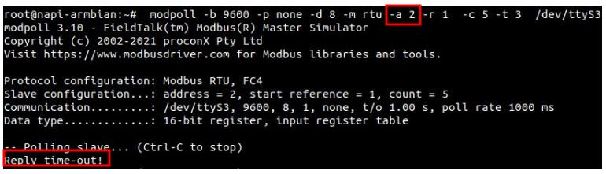

Если указать неправильные регистры, получим ответ `Illegal Data Address`

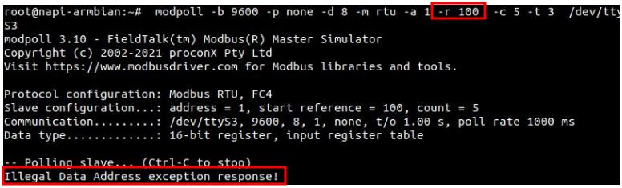

>:warning: Вводите параметры опроса правильно !
