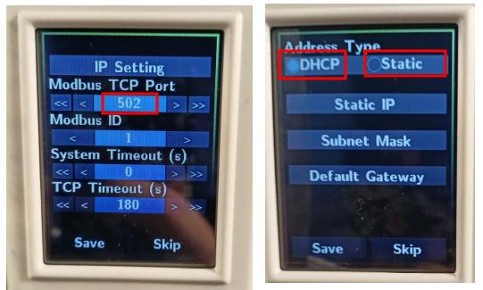
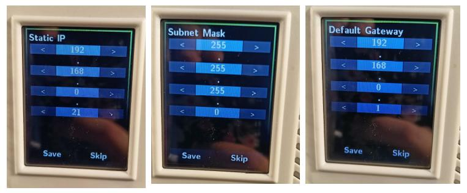
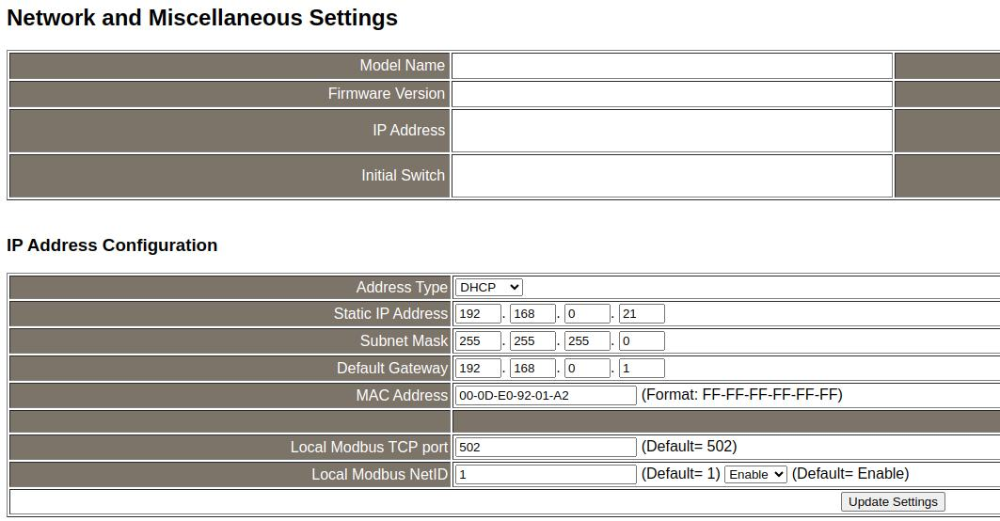
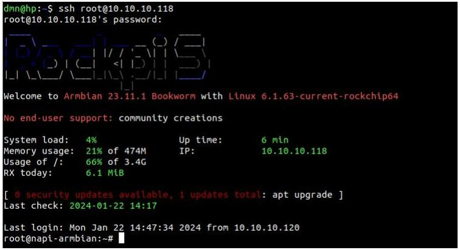
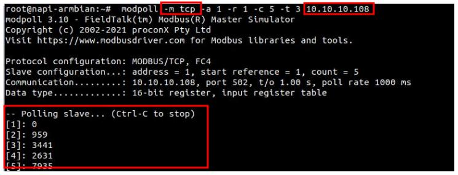
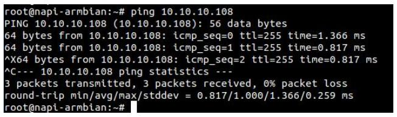
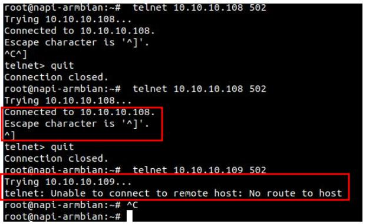

# Опрашиваем датчик по Modbus TCP

> Эта инструкция подходит для любого Сборщика

:::tip 

Как это ни странно, опрос датчиков по ModBus TCP проще, чем под ModBus RTU. В случае Modbus TCP, нас не интересуют параметры RS485 и адрес устройства -  у нас адресом датчика служит его IP адрес. Другое дело, датчик должен иметь модуль Ethernet c поддержкой TCP\IP

:::

>Мы будем ориентироваться на датчик внешней среды IPCDAS DL-303. Мы подробно описали подключение датчика по RS485 и опрос по Modbus RTU в [данной статье](../modbus-rtu/). 

## Подключаем датчик по IP

Необходимо настроить параметры IP датчика. IP адрес может назначаться или статически (тогда нам надо явно указать IP адрес, маску, шлюз) или получать адрес по DHCP. 

:::tip

В случае выдачи параметров IP по DHCP есть опасность, что DHCP сервер может в какой-то момент сменить выдаваемый IP. Для "борьбы" с этим нужно попросить администратора сети привязать выдаваемый IP по MAC адресу.

:::

>:warning: В любом случаем нам нужен IP адрес датчика.

Также в датчике можно переопределить tcp порт (по умолчанию 502), хотя зачем может понадобиться переопределять порт на нестандартный, кроме обхода фаервола представить трудно.

Как пример, вот настройки IP датчика DL-303



И настройки статического IP



Также параметры можно сменить через Веб-интерфейс



>:warning: **Необходимо изучить инструкцию по датчику, для того, чтобы понять как задаются параметры IP**

## Опрос датчика 

Все, что нужно для опроса датчика, это чтобы со сборщика был доступ к IP датчика по протоколу TCP по 502 порту.

>:warning: Адрес нашего датчика выдан по DHCP, мы знаем что он 10.10.10.108

### Опрос датчика утилитой mbpoll

Зайдем на сборщик по ssh.




Запустим команду `mbpoll` с параметрами Modbus TCP. 

> Запрос выглядит проще чем в случае ModBus RTU по RS485 !

```bash
modpoll -m tcp -a 1 -r 1 -c 5 -t 3 10.10.10.108
```



> Поздравляем, вы получили данные по Modbus TCP !

### Проверка доступности датчика 

Однако, не всегда датчик в той же сети, что и Сборщик. В IP-сетях встречаются файрволллы, NAT-ы, маппинг адресов и портов. Поэтому отдельно вынесем часть, как можно проверить доступность датчика по IP.

Проверим доступность адреса командой `ping`



Если "пингуется", то скорее всего вы получите данные, если адрес "не пингуется", можно проверить прямо порт 502 командой `telnet`

На скриншоте видно как откликается система на правильные парамтеры и на неправильные (иpменен IP)




