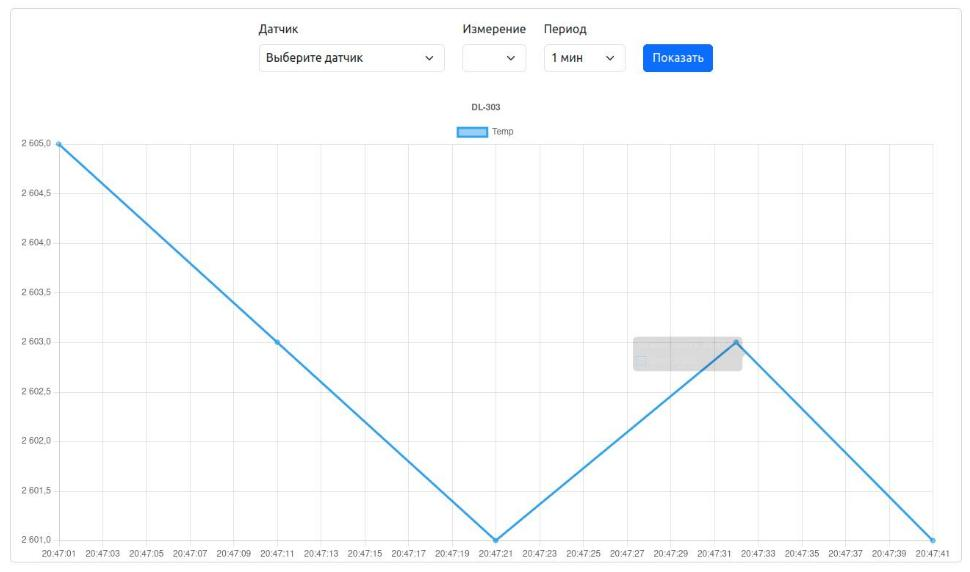

# Сбор данных c Modbus-датчиков через Telegraf

## Общая схема подключения датчика


## Введение

В этой статье мы научимся писать конфигурации опроса через Telegraf для Modbus датчиков c сохранением данных с датчиков базу данных influxdb2.

1. Научимся работать с шаблонами датчиков
2. Разберем шаблоны датчиков для ModbusTCP и ModbusRTU
3. Научимся "ловить" данные с датчиков
4. Научимся редактировать шаблоны и тестировать конфигурации
5. Разберем шаблон для реального устройства (датчика)
6. Проверим данные с этого устройства.

> :point_up: Эта инструкция подходит для любого Сборщика

Мы будем основываться на том, что мы совершаем все действия на устройстве с RS485м портом, Ethernet и установленной [NapiLinux](http://napilinux.ru), в котором уже предустановлен telegraf, influxdb2 и имеется Веб-интерфейс управления NapiConfig.

Для любого датчика, мы должны знать

- Modbus адрес устройства
- Список и тип регистров, которые можно прочесть из датчика
- Для ModBus RTU - параметры последовательного порта

>Сначала мы опросим датчик "без названия", у которого `modbus address = 1` и есть как минимум первый регистр с адресом 0. Далее, мы рассмотрим уже реальный датчик с его регистрами.


## Конфиг Telegraf для Modbus TCP

Опросим наш датчик по Modbus TCP. Мы должны знать IP адрес опрашиваемого устройства.

>:point_up: ** Если на нашем Сборщике работает сервис шлюза ModbusRTU - ModbusTCP, то нужно опрашивать адрес 127.0.0.1 **

Шаблон конфига, принимающего данные для Telegraf для Modbus TCP выглядит следующим образом

```toml
## Any sensor with address=1. hold-register=0 (first) on localhost
[[inputs.modbus]]

  #change name="YOUR_SENSOR" and measurement="YOUR_SENSOR"

  name = "anysensor-modbus-localhost"

  #change to your modbus address if your address is not equal 1
  slave_id = 1

  ## Timeout for each request
  timeout = "1s"

  # TCP - connect via Modbus/TCP
  controller = "tcp://127.0.0.1:502"

  input_registers = [
    { measurement="anysensor-modbus-localhost", name = "First_Hold_Register",   byte_order = "AB",   data_type = "UINT16",   scale=1.0,     address = [0]},
  ]


```

В интерфейсе NapiConfig его можно найти в "Датчики" - "Управление датчиками"


Шаблон датчика - конфиг файл для Telegraf, описывающий механизм сбор данных. Из интерфейса NapiConfig можно править конфигурацию, загружать новые шаблоны, активировать и деактивировать шаблоны.


Рассмотрим шаблон

- (1) name, measurement - имя датчика, например DL-303
- (2) slave_id - modbus адрес устройства
- (3) controller - IP адрес и TCP порт modbus устройства. если на Сборщике работает mbusd (шлюз Modbus RTU - TCP), то адрес будет 127.0.0.1 (так как отвечать на запросы будет сам сборщик)
- (4) measurement имя измерения (должно совпадать с именем датчика и быть уникальным для устройства)

> Если устройств одинаковых несколько, надо дать каждому уникальное измерение

- (5) name произвольное имя, согласно которому регистр попадет в базу данных. Например это может быть temperature или  current (то есть фактически то, что выдает этот регистр из устройства)

- (6) byte_order - порядок байт для целочисленных значений (обычно нужно оставить по умолчанию, если нет, то надо сверится с документацией на устройство)

- (7) data_type - тип данных
- (8) scale - множитель \ делитель
- (9) address - адрес регистра

>Если устройство имеет modbus адрес "1" и имеет регистр "0" типа int, то наш шаблон "по молчанию" (Any sensor) корректно опросит устройство и его 1-й регистр.

## Конфиг Telegraf для Modbus RTU

Для Modbus RTU в шаблоне указывается не IP-адрес, а параметры последовательного порта. Шаблон конфига для Telegraf ModbusRTU датчика "по умолчанию" выглядит так:

```toml
## Any sensor with address=1. hold-register=0 (first) on /dev/ttyS3 (FCC device) with 9600\8n1 (sensor parameter)
[[inputs.modbus]]


  #change name="YOUR_SENSOR" and measurement="YOUR_SENSOR"

  name = "anysensor-modbus-rtu"

  #change to your modbus address if your address is not equal 1
  slave_id = 1

  #change to your port settings, if you need
  baud_rate = 9600
  data_bits = 8
  parity = "N"
  stop_bits = 1

  #change ti your port (ttyS1 \ ttyUSB0 \ etc)
  controller = "file:///dev/ttyS3"
  transmission_mode = "RTU"

 input_registers = [
   { measurement="anysensor-modbus-rtu", name = "First_Hold_Register",   byte_order = "AB",   data_type = "UINT16",   scale=1.0,     address = [0]},


```

В интерфейсе NapiConfig


Разберемся в отличиях с ModbusTCP

(5) - последовательный порт, из которого Telegraf будет читать данные
(6) - ражим работы Modbus

Далее идут стандартные параметры последовательного порта

(1) baud_rate - скорость
(2) data_bits - количество бит
(3) parity - четность
(4) stop_bits - стоп-бит

Эти данные есть в настройках или в паспорте датчика. Как правило это 8N1\8E1 (биты, четность, стоп-бит). Скорость во многих датчика по умолчанию 9600, но может быть и 115200. :fire:** Если указать эти параметры неверно, данные читаться и датчика не будут !**

> :fire: Остальные настройки и параметры точно такие же, как для ModbusTCP :fire:

## Проверка работы шаблонов в NapiConfig

Активируйте шаблон ("Активировать")


Если шаблон корректный появиться зеленая надпись "Шаблон активирован", а также кнопки для редактирования конфигурации шаблона.


Зайдите в "Графики - Сенсоры" и выберете наше устройство


### Успешный итог

Если Вы увидите ЛЮБОЕ значение First_Hold_Register, значит опрос идет !


### Неуспешный итог

Если вы увидите "За заданный период данных нет", значит данные не поступают


## Редактирование шаблона

В NapiConfig есть возможность редактировать шаблон и проверять вручную конфигурацию, запуская Telegraf только для данного шаблона.

- Отключите датчик, если он включен.
- Нажмите "три точки" и  кнопку "Ред. шаблон" напротив датчика.


- Откроется окно с конфигом датчика


- Отредактируйте конфиг и нажмите "Применить"
- Нажмите тест "конфигурации"

Система запустит telegraf в тестовом режиме и выдаст в окно результат с данными или ошибку

- Успешное тестирование, данные идут


- Неуспешное тестирование, ошибка синтаксиса файла


- Неуспешное тестирование, ошибка получения данных их порта (в данном случае были неверные данные скорости порта)


После того, как Вы добились верного тестирования конфигурации, выйдите из редактирования и активируйте шаблон.

## Описание своего устройства

:::tip

Для описания устройства существует достаточно подробная документация на английском языке. Если Вам надо описать сложное устройство или несколько устройств, то рекомендуем ознакомится с первоисточником.

Адрес: https://github.com/influxdata/telegraf/blob/master/plugins/inputs/modbus/README.md

Мы приведем пример простейшего датчика с 5-ю холд регистрами.

:::

Чтобы описать устройство, необходимо сделать смысловое описание регистров modbus (4,5,6,7,8,9) - для каждого регистра сделать строку с полями.

>Смысловое значение регистров, тип, адрес необходимо взять из документации на устройство или опросить вручную через утилиту modpoll и разобрать вывод.


### Пример шаблона для датчика DL-303

>Датчик [DL-303](https://nnz-ipc.ru/catalogue/automation/remote_data_logger/cl_dl/dl-303_cr/) - промышленный измеритель среды (температура, влажность, CO, CO2). Удобен для обучения тем, что у него есть дисплей, на котором дублируются данные. Также с этого дисплея можно изменять режим порта RS485, адрес ModBus и другие параметры.


Опросим датчик DL-303 командой `modpoll` (заберем сразу 10 регистров)

```bash

root@napi-rk3308b-s:~# modpoll -m tcp -0 -a 1 -r 0 -c 10 127.0.0.1
modpoll 3.11 - FieldTalk(tm) Modbus(R) Master Simulator
Copyright (c) 2002-2024 proconX Pty Ltd
Visit https://www.modbusdriver.com for Modbus libraries and tools.

Protocol configuration: MODBUS/TCP, FC3
Slave configuration...: address = 1, start reference = 0 (PDU), count = 10
Communication.........: 127.0.0.1, port 502, t/o 1.00 s, poll rate 1000 ms
Data type.............: 16-bit register, output (holding) register table

-- Polling slave... (Ctrl-C to stop)
[0]: 0
[1]: 815
[2]: 3881
[3]: 2639
[4]: 7950
[5]: 1124
[6]: 5223
[7]: 0
[8]: 0
[9]: 0

```
Из документации (или по дисплею датчика) мы можем распознать регистры (мы не обзязаны знать все регистры, нам нужны только те, которые мы будем хранить)

- [0] показания CO
- [1] показания CO2
- [2] показания влажности
- [3] показания температуры в градусах
- [4] -
- [5] точка росы
- [6] -

### Шаблон для DL-303


Напишем простой шаблон для датчика DL-303

```toml
## Тут пишем комментарий
## DL-303 (CO,CO2,temp,humidity) ModbusTCP
[[inputs.modbus]]

  name = "DL-303"

  ## Slave ID - addresses a MODBUS device on the bus
  ## Range: 0 - 255 [0 = broadcast; 248 - 255 = reserved]
  slave_id = 1

  ## Timeout for each request
  timeout = "1s"

  # TCP - connect via Modbus/TCP
  controller = "tcp://127.0.0.1:502"

  input_registers = [
    { measurement="DL-303", name = "CO",   byte_order = "AB",   data_type = "UINT16",   scale=1.0,     address = [0]},
    { measurement="DL-303", name = "CO2",   byte_order = "AB",   data_type = "UINT16",   scale=1.0,     address = [1]},
    { measurement="DL-303", name = "Humidity",   byte_order = "AB",   data_type = "UINT16",   scale=1.0,     address = [2]},
    { measurement="DL-303", name = "Temp",   byte_order = "AB",   data_type = "UINT16",   scale=1.0,     address = [3]},
    { measurement="DL-303", name = "DewPoint",   byte_order = "AB",   data_type = "UINT16",   scale=1.0,     address = [5]},
  ]

```

Сохраните этот шаблон в файле и нажмите "Загрузить шаблон" или нажмите "Написать шаблон" и вставьте текст шаблона.


> Подготовленные нами шаблоны и дашборды можно посмотреть в открытом [репозитории](https://github.com/lab240/telegraf-grafana-configs).


Активируйте шаблон - нажмите "Активировать", должна появиться надпись "Шаблон ХХХ активирован" и Вместо "Активировать" появятся поля "Отключить" и "Редактировать"


### Проверка работы нового шаблона

В данном шаблоне мы получаем уже не абстрактные данные а конкретные поля (температура, влажность, CO2 и так далее).

В разделе "Графики - Сенсоры" найдите новые датчик DL-303 (или как Вы его назвали в шаблоне), в "Измерение" выберите что Вы хотите посмотреть (например, температуру).


Нажимаем "Показать" и получаем данные по температуре за период



:::tip

Важно, что это данные не напрямую с датчика, а из базы данных Сборщика. То есть эти данные можно будет анализировать и просматривать вне зависимости от работы датчика и за произвольный период времени.

:::

Проверьте также данные по другим регистрам (Humidity, CO, CO2, DewPoint), убедитесь что все нужные регистры присутствуют в базе данных.
