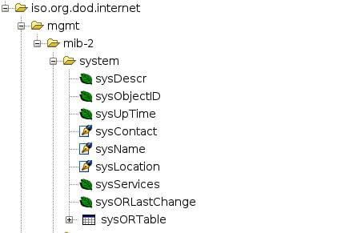
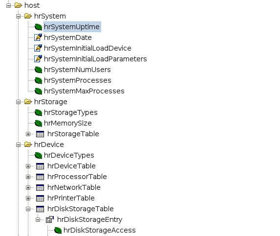
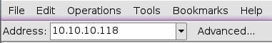
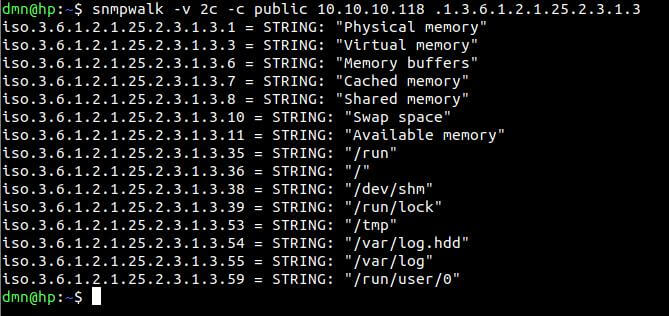
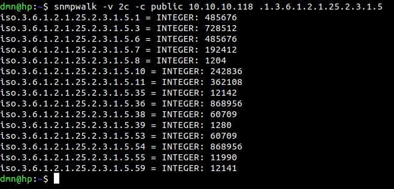

# Опрашиваем NAPI (Cборщик) по SNMP

> Эта инструкция подходит для любого Сборщика

## Запуск и настройка snmpd

Как настроить snmpd на NAPI описано в (этом)[armbian-tune#настроим-snmpd] разделе (руководства)[armbian-tune] по тюнингу ARMbian

Какие данные NAPI будет "отдавать" по SNMP запросам 
регулируется в snmpd.conf. 

Вот часть файла в котором можно "открыть" ветки OID-ов, которые можно будет запрашивать. 

```text

# Views 
#   arguments viewname included [oid]

#  system + hrSystem groups only
view   systemonly  included   .1.3.6.1.2.1.1
view   systemonly  included   .1.3.6.1.2.1.25.1
view   systemonly  included   .1.3.6.1.2.1.25.2

```

:::tip

После редактирования файла snmpd.conf не забываем перепустить сервис командой 

`systemctl restart snmpd`

:::

>:warning: Для визуального понимания OID-структуры мы рекомендуем поставить на любую хост-машину ПО iReasoning Mib Browser: https://www.ireasoning.com/mibbrowser.shtml. Он ставится как под Linux, так и под Windows. 

:::tip

Для корректного отображения веток, в Mib Browser должно быть подключено 2 MIB файла (подключены по умолчанию) 

![snmp napi]](img-snmp-req/mibbr1.jpg)

Подключить\отключить можно через меню `File - Load Mibs  \ File - Unload Mibs`. 

Файлы с MIB-ами идут в составе Mib Browser.

:::

## Стандартные OID-ы из "ветки" ISO. 


Рассмотрим стандартные OID-ы из "ветки" ISO. Все скриншоты приведены из Mib Browser.

Ветка `.1.3.6.1.2.1.1` соответствует следующей "секции" в дереве OID



Ветка `.1.3.6.1.2.1.4` соответствует информации об IP


Ветка `.1.3.6.1.2.1.25` соответствует информации о системных параметрах хоста



Таким образом, Вы можете подключать ветки и опрашивать соответсвующие OID

Для соответствия веток и конкретных OID-ов, MIB Browser показывает числовые значения OID а также файл в котором описан MIB (в данном случае RFC1213-MIB).


## Примеры опроса NAPI

>:warning: В нашем примере NAPI имеет IP 10.10.10.118

### Указываем корректный адрес для опроса



###  Выбираем OID и получаем значения

Начнем с самого простого - получения имени устройства и времени работы


Выясним какие у нас есть интерфейсы 


Какие на них IP


### Читаем системные параметры 

Память и диски в системе


## Читаем через командную строку

:::tip
В linux необходимо поставить пакеты

```
apt install snmp 

```

snmp-tools есть и для Windows: https://sourceforge.net/projects/net-snmp/files/net-snmp%20binaries/5.7-binaries/

:::


Mib Browser позволяет наглядно посмотреть ветки и значения параметров. Однако часто запросы по SNMP делаются через скрипты или стороннее программное обеспечение (Zabbix).

Значения можно опрашивать через команды snmpwalk 

```bash

dmn@hp:~$ snmpwalk -v 2c -c public 10.10.10.118 .1.3.6.1.2.1.25.2.3.1.3

```



```bash

dmn@hp:~$ snmpwalk -v 2c -c public 10.10.10.118 .1.3.6.1.2.1.25.2.3.1.5

```



:::tip

snmp-tools есть и для Windows: https://sourceforge.net/projects/net-snmp/files/net-snmp%20binaries/5.7-binaries/

:::

Надеемся эта информация была полезна и Вам стало легче ориентироваться в мире SNMP.