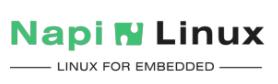

# Программное обеспечение для NAPI

:::tip ВАЖНО !

- Во всех подготовленных нами версиях Linux логин пароль по умолчанию root\napilinux

- Если вставлена SD, то устройства грузятся с SD-карты, если загрузчика на SD нет, то устройство грузится с NAND

- Установка ПО по умолчанию: предустановленная во внутреннюю память (NAND) ARMbian (Debian подобная Linux), на SD в комплекте поставляется NapiLinux, которая может быть прошита в NAND.

:::

## Самое главное: Armabian vs NapiLinux

Все устройства NAPI работают под ОС Linux.

Мы поставляем устройства c дистрибутивом общего назначения ArmBian и с собственным дистрибутивом NapiLinux (скомпилирован нами из исходников).

- В Armbian Вам будут доступны пакеты из репозитория Debian и он больше подходит для разработки.
- NapiLinux не имеет пакетного менеджера, но имеет систему резервирования, апдейта на лету и отката на предыдущую версию, что делает его более оптимальным ПО для тиражируемых однотипных решений.

Мы предоставляем все инструменты и исходные коды для сборки Вашего варианта NapiLinux.

## Armbian

[Armbian](http://armbian.com) - классический Debian-совместимый Linux-дистрибутив с пакетным менеджером и возможностью устанавливать пакеты без сборки всей системы.

### Установка из подготовленного имиджа Armbian

Мы подготовили имидж Armbian со всеми необходимыми дополнениями для Napi P\C и Сборщиков.

Скачать готовый образ можно по ссылке: https://download.napilinux.ru/linuximg/armbian/

В нашем образе Armbian предустановлены пакеты и модули для работы с устройствами по протоколу ModBus:

- Программа опроса modpoll
- Шлюз Modbus TCP - Modbus RTU (mbusd)
- Менеджер пакетов pip3 и модули Python для работы с modbus
- Универсальный шлюз данных telergraf
- Средства разработки gcc\gcc++, cmake, pkg-config

### Доступ к системе

- параметры доступа из консоли: Armbian: **8N1, 1500000** (minicom -D /dev/ttyUSB0 -b 1500000)
- логин\пароль по умолчанию: **root\1234**

>Как подготовить стандартный Armbian читайте в статье **[Установка и тюнинг чистого Armbian](/software/notes/armbian-tuning/)**

>:warning: После того, как система протестирована и отлажена под Armbian, мы рекомендуем собрать NapiLinux с вашим набором пакетов через систему Yocto.

## NapiLinux

[NapiLinux](http://napilinux.ru) - прошивка для Сборщика с Веб-конфигуратором, предустановленным ПО, функциями обновления и резервирования. Мы собираем NapiLinux из исходных кодов на наших серверах с ограниченным набором программного обеспечения, благодаря чему NapiLinux более компактная и быстрая, хотя и менее универсальная. В NapiLinux нет пакетного менеджера, программы и пакеты могут быть добавлены на этапе сборки из исходных кодов.

> NapiLinux также может быть прошита в NAND как основная ОС.

В составе NapiLinux для Сборщик компакт имеются дополнительно ПО для сбора информации с датчиков, хранения и отображения.

- Универсальный шлюз данных Telegraf
- База временных рядов InfluxDB2
- Сервер отображения Grafana-server
- Программа опроса Modbus RTU\TCP modpoll
- Шлюз Modbus TCP - Modbus RTU (mbusd)

Мы также разрабатываем пакет [NapiConfig](https://napilinux.ru/napiConfig) - Веб-интерфейс для работы с сетью, сервисами, датчиками и периферийными устройствами. NapiConfig имеет базовый модуль и различные модули под конкретные реализации устройств.

### Доступ к NapiLinux по консольному кабелю

- параметры доступа из консоли: **8N1, 115200** (minicom -D /dev/ttyUSB0 -b 115200)
- логин\пароль по умолчанию: **root\napilinux** (крайне рекомендуем сменить)

### Доступ к NapiLinux по Ethernet

- вход в NapiConfig: **https://ip-address** (принять угрозу безопасности броузера и продолжить)
- доступ к интерфейсу обновления: **http://ip-address:3001**

:::tip Алгоритм работы сети в NapiLinux

При старте системы, сетевая подсистема пытается получить IP-адрес по протоколу DHCP. Если система "видит" DHCP сервер, то она получает IP адрес (маску, шлюз, DNS) и по выданному адресу можно получить доступ к системе через ssh.

Если адрес не получен, система назначает адрес по умолчанию со следующими параметрами

inet 169.254.100.100  netmask 255.255.0.0  broadcast 169.254.255.255

Для доступа к NapiLinux нужно установить на хост адрес из сети 169.254.100.0/24. Соедините хост с NapiLinux и назначьте адрес 169.254.100.99 mask 255.255.255.0. Зайдите по этому адресу через ssh или через браузер по адресу https://169.254.100.100 и далее укажите параметры сети в ручную.

:::

[Подробнее про доступ к устройству в NapiLinux ->](https://napilinux.ru/docs/access)

:::tip собери свой NapiLinux

Освоив инструментарий Yocto, Вы можете добавить свои пакеты в прошивку NapiLinux. Смотрите инструкции, как собрать NapiLinux самостоятельно.

https://napilinux.ru/docs/biuld-base

А также как собрать две разные сборки NapiLinux:

- Сборка ["Сборщик"](https://napilinux.ru/docs/%D0%92%D0%B0%D1%80%D0%B8%D0%B0%D0%BD%D1%82%D1%8B%20%D1%81%D0%B1%D0%BE%D1%80%D0%BE%D0%BA/frontcontrol/)
- Сборка ["Nemo'](https://napilinux.ru/docs/%D0%92%D0%B0%D1%80%D0%B8%D0%B0%D0%BD%D1%82%D1%8B%20%D1%81%D0%B1%D0%BE%D1%80%D0%BE%D0%BA/nemo/)

:::

>:warning: Отдельный сайт про NapiLinux: http://www.napilinux.ru.
