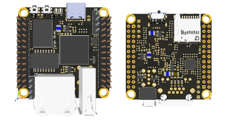
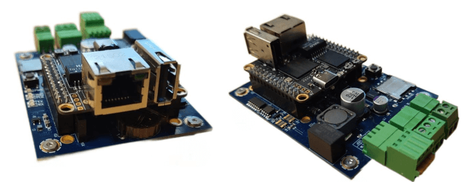

# NapiWorld - платы и решения на основе модуля NAPI

## Одноплатник NAPI и устройствах на SOM NAPI

:boom: **[Документация на процессорный модуль NAPI](/docs/napi-intro)**:boom:

Процессорный модуль на основе мощного ARM процессора Rockchip RK3308. Имеет 512Мб ОЗУ и 4Гб NAND Flash, 1хEthernet, 2xUSB, слот для SD-карты. 

## Платы и решения на основе NAPI: платформа сброрщик-компакт

:boom: **[Документация на платформу FrontControl Compact](/docs/frontcompact)**:boom:

Мы подготовили компактную универсальную и функциональную плату  сборщик-компакт (FrontControl Compact) для процессора NAPI, на основе которой можно в самые сжатые сроки сделать целое семейство устройств.

## Преимущества подхода NAPI

:::tip Мы делаем не рендеринги, а живые устройства ! 

 Для начала работы с SOM NAPI не нужны дополнительные платы - можно работать с NAPI как с обычным одноплатником.

 

:::

:::tip Программная поддержка.

Мы рекомендуем и поддерживаем ОС [NapiLinux](http://www.napilinux.ru) как основную ОС для всех изделий на основе модуля NAPI. Если вам нужен классический Debian-подобный дистрибутив с пакетным менеджером - мы рекомендуем дистрибутив Armbian: https://www.armbian.com/rockpi-s/

:::

:::tip Делайте свои решения на NAPI

SOM NAPI работает как самостоятельное устройство, но в практическом плане это устройство, которое вставляется в так называемые "несущие платы", которые осуществляют питание, дополнительные устройства, датчики, модемы и любые другие устройства по требованию вашего проекта. Вы найдете всю информацию для создания своих устройств на основе NAPI. 

:::

## Готовый продукт №1. Токо-сборщик (FrontControl NAPI Current Collector)

«Токо-сборщик» - дешевая и практичная система сбора данных параметров однофазной сети (все в одном устройстве). 

## Готовый продукт №2. FRONT Control PLC ПЛК НЕМО

ПЛК НЕМО предназначен для создания систем автоматизированного управления технологическим оборудованием в энергетике, на ж/д транспорте, в различных областях промышленности, жилищно-коммунального и сельского хозяйства. Логика работы ПЛК определяется потребителем в процессе программирования контроллера. 

## Ваш готовый продукт

:::tipСделайте свой продукт на NAPI

Вы можете взять у нас проект несущей платформы FrontControl Compact и в сжатые сроки сделать свой продукт на основе NAPI.

:::

:::tip Сделаем Ваш продукт на NAPI

Мы можем сделать Ваш продукт на основе NAPI по техническому заданию. Сделаем несущую плату под Ваш проект (датчики, сенсоры, модули сбора, АЦП, модули передачи данных).

:::