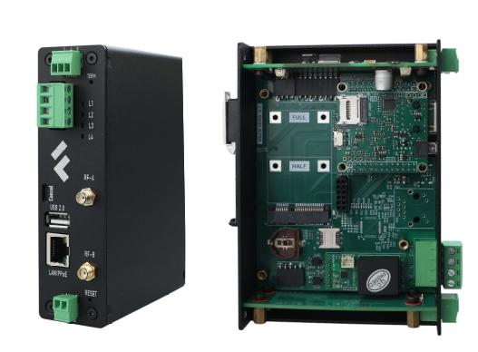
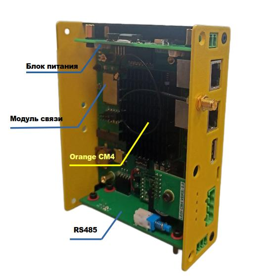
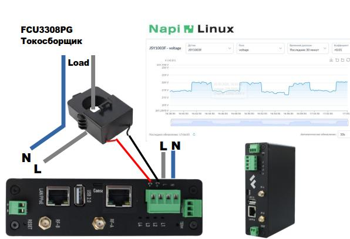

<!-- # Все о модулях NAPI и устройствах на NAPI -->
<!--

# Модули NAPI и устройства на их основе
-->
<!-- ***Вся мощь Linux в Embedded устройствах***-->

## Самое актуальное!
>:warning: **Подпишитесь на наш Telegram [канал](https://t.me/napiworld) @napiworld** \
> :fire: Взять на бесплатное тестирование [Napi-С](/docs/demokits/demokit2/) или [Сборщик-Компакт](/docs/demokits/demokit1/) \
> :fire: **[NAPI-C в реестре Минпромторга](/blog/napi-c-v-reestre-minpromtorg/)** \
> :fire: **Совершенно новый (почти) NapiLinux 0.2.xx: http://napilinux.ru** \
> :point_right: Учимся вместе: плата **[Napi Sci 2.0](/docs/sci/napisci/)**. \
> **[Все новости](/blog/archive)**

<!-- -->

<!--  -->

<!--  -->
<!--
**[Взять на бесплатное тестирование](/docs/demokits/getontest-demokit2)** | **[Купить](https://nnz-ipc.ru/catalogue/front_man/front_control/modul_napi_c/)**

**[Взять на бесплатное тестирование](/docs/demokits/getontest-demokit1)** | **[Купить](https://nnz-ipc.ru/catalogue/front_man/front_compact/front_compact_159_101/)**
-->
<!--

-->

:::tip Только Российские продукты !

***Все что вы видите на этом сайте придумано и разработано в России. Выбирая наши продукты, вы развиваете национальную электронику. Если вы проектируете банкоматы, контроллеры, системы сбора данных, зарядные станции — применение одноплатников NAPI сильно поможет попаданию вашего изделия в реестр Минпромторга!***

:::

## Вычислительные модули

### Вычислительные модули NAPI (NAPI C/P)

Процессорные модули на основе процессора Rockchip RK3308 под управлением ОС Linux (Armbian/NapiLinux).

- :boom: **[Взять на бесплатное тестирование](/docs/demokits/getontest-demokit2)**:boom:

<!--  -->
<!--  -->
 >Самое важное: 512 Мб ОЗУ и 4 Гб NAND Flash, 1 × Ethernet, 2 × USB, слот для SD-карты, SPI, I2C, 3 × UART.

 <!-- **[Подробнее...](/docs/napi-intro)** -->

 ### Компактный процессорный модуль (SOM) NAPI Slot

>Самое важное: 512 Мб ОЗУ и 32 Гб EMMC Flash, 1 × Ethernet, 2 × USB, SPI, I2C, 3 × UART.

<!--  -->

<!--
:::tip Очень маленький вычислитель !

Имеет 512Мб ОЗУ и 32Гб EMMC. Поставляется с платой с интерфейсами для тестирования и прошивки.

:::
-->

## Компактные компьютеры

### FCC3308. Cуперкомпактный одноплатный компьютер «Сборщик-компакт» (FrontControl Compact)

>Самое важное: NAPI-C (RK3308, 512 Мб, 4 Гб NAND), 1 × Ethernet, 1 × USB, RS485, питание 9–36 В, RTC, Passive PoE, DIN-крепление. Очень компактный (118 × 55 мм) и холодный!

<!-- - :boom: **[Документация](/docs/computers/frontcontrol-compact/)** :boom: -->
- :boom: **[Взять на бесплатное тестирование](/docs/demokits/getontest-demokit1)**:boom:
<!-- - :boom: **[Купить](https://nnz-ipc.ru/catalogue/front_man/front_compact/front_compact_159_101/)**:boom: -->

<!--  -->

<!-- **[Подробнее...](/docs/computers/frontcontrol-compact/)** -->

<!-- # Программные комплексы на основе  "Сборщик-компакт" -->

### FCU3308P. Универсальный одноплатный компьютер «Сборщик-универсал» c модулем связи

>Самое важное:

- NAPI-C (RK3308, 512 Мб, 4 Гб NAND), 2 × Ethernet, 1 × USB, RS485, питание 12–36 В, RTC, Passive PoE, DIN-крепление;
- Консоль отладки;
- Слот для модуля связи (LTE/LoRa/ZigBee);
- встроенный датчик тока и напряжения.

### FCUCM4. Универсальный мощный одноплатный компьютер «Сборщик-универсал» c модулем связи на основе Orange PI CM4

>Самое важное:

- Orange PI CM4 (RK3566, 1Гб- 8Гб, 32Гб EMMC), 2 × Ethernet, 1 × USB, RS485, питание 12–36 В, RTC, DIN-крепление;
- Консоль отладки;
- Слот для модуля связи (LTE/LoRa/ZigBee);
- встроенный датчик тока и напряжения.

## Программно-аппаратные комплексы и решения

### FGM0801. Шлюз Modbus RTU → Modbus TCP с памятью

**[FrontGate-M](/docs/special/frontgate-m/)** — шлюз Modbus RTU → Modbus TCP с памятью. На основе Сборщика-компакт.

### FGS0801. Шлюз SNMP V2 → SNMP V3

**[FrontGate-S](/docs/special/frontgate-s/)** — шлюз SNMP V2 → SNMP V3. На основе Сборщика-компакт.

### FCU3308PG. Система сбора и контроля энергии — Токосборщик 2.0

На основе Сборщика-Универсал FCU3308P

>Отлично подходит для контроля работы любых приборов, станков, установок.

## Ваш продукт на основе NAPI

:::tip Сделаем Ваш продукт на NAPI

Сделаем несущую плату на основе NAPI под Ваш проект (датчики, сенсоры, модули сбора, АЦП, модули передачи данных).

:::
