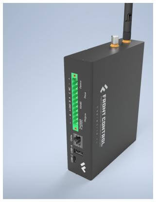

<!-- # Все о модулях NAPI и устройствах на NAPI -->

# Мир модулей NAPI и устройствах на их основе

## Вычислительные модули NAPI

- :boom: **[Документация](/docs/napi-intro)**:boom:
- :boom: **[Взять на тестирование](/docs/demokits/getontest-demokit2)**:boom:

Процессорный модуль на основе мощного ARM процессора Rockchip RK3308 под управлением ОС Linux (Armbain\NapiLinux). Имеет 512Мб ОЗУ и 4Гб NAND Flash, 1хEthernet, 2xUSB, слот для SD-карты, SPI, i2C, 3хUART.

**[Подробнее...](/docs/napi-intro)**

## Готовые продукты на основе NAPI

Мы создаем линейку законченных изделий для сектора промышленной автоматизации на основе модуля [NAPI](/docs/napi-intro).

### Одноплатный компьютер "Сборщик-компакт" (FrontControl Compact)

Супер-компактный одноплатный компьютер на основе модуля [NAPI C](/docs/napi-intro) под управлением ОС Linux с изолированными портами RS485, RTC, питанием 9-36DC или Passive POE. Корпус оптимизирован для крепления на DIN-рейку.

- :boom: **[Документация](/docs/computers/frontcontrol-compact/)** :boom:
- :boom: **[Взять на тестирование](/docs/demokits/getontest-demokit1)**:boom:

**[Подробнее...](/docs/computers/frontcontrol-compact/)**

### Одноплатный компьютер "Сборщик-универсал" (FrontControl Uni)

Сборщик-универсал (FrontControl Uni ) — Одноплатный мини-компьютер на основе модуля [NAPI P](/docs/napi-intro) с сменяемыми встроенными модулями связи, 2-мя портами RS485, встроенной консолью для отладки, реле сухого контакта, шлейфом сигнализации и интеллектуальным POE. Корпус компьютера оптимизирован для крепления на DIN-рейку и обладает минимально возможной толщиной. Доступны модули связи стандарта LTE и LoraWan.

> :boom: **[Документация](/docs/computers/frontcontrol-uni/)** :boom:

**[Подробнее...](/docs/computers/frontcontrol-uni/)**

### Токо-сборщик (FrontControl Current Collector)

«Токо-сборщик» - дешевая и практичная система сбора данных параметров однофазной сети с автономным хранением данных.

:boom: **[Документация](/docs/special/frontcurrent/)**:boom:

**[Подробнее...](/docs/special/frontcurrent/)**

### Мини-компьютер FRONT Control 150.901

Миниатюрный компьютер для сбора и обработки данных FRONT Control 150.901

:::tip Посмотреть в каталоге Ниеншанц-Автоматика

Ссылка на продуктовый каталог: https://nnz-ipc.ru/catalogue/front_man/front_control/front_control_pc/

:::

## Ваш продукт на основе NAPI

:::tip Сделайте свой продукт на NAPI

Вы можете взять у нас проект несущей платы ["Сборщик-демокит](/docs/hidden/frontcontrol-demo) и в сжатые сроки сделать свой продукт на основе NAPI.

:::

:::tip Сделаем Ваш продукт на NAPI

Сделаем несущую плату на основе NAPI под Ваш проект (датчики, сенсоры, модули сбора, АЦП, модули передачи данных).

:::