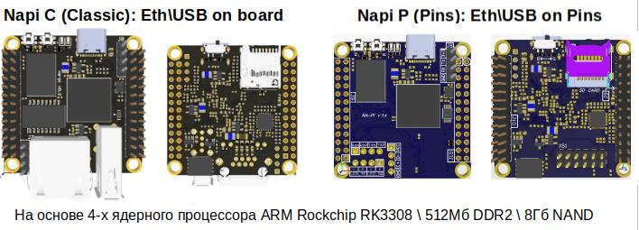
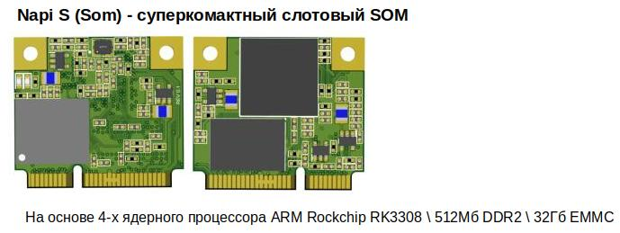
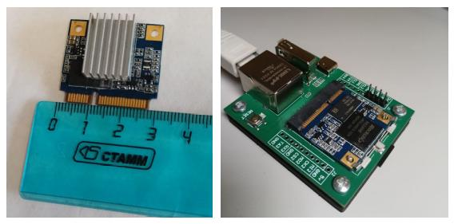
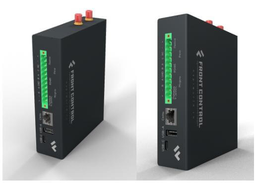

<!-- # Все о модулях NAPI и устройствах на NAPI -->

# Модули NAPI и устройства на их основе

<!-- ***Вся мощь Linux в Embedded устройствах***-->

>:warning:Все оперативные новости мы публикуем в Телеграм, подпишитесь на наш **[канал](https://t.me/napiworld)** @napiworld \
> :fire: Читайте новый лонгрид: "[Сбор данных и логирование Modbus-датчиков](/software/sensors/telegraf-modbus/)" \
> :fire: Добавлен новый продукт "[Шлюз Modbus с хранением данных](/docs/special/frontfage-m/)" \
> :fire: Взять на бесплатное тестирование демо-киты с [Napi-С](/docs/demokits/demokit2/) или [Сборщик-Компакт](/docs/demokits/demokit1/) \
> :point_right: Плата Napi SCI: [Описание и репозиторий](https://github.com/lab240/napisci/tree/main) \
>  :point_right: Сборщик-Универсал 2.0: [Описание](/docs/computers/FCU/) \
> :point_right: Сервер с прошивками: https://download.napilinux.ru/linuximg/ \
> **[Все новости](/blog/archive)**

<!-- -->

<!--  -->

<!--  -->
<!--
**[Взять на бесплатное тестирование](/docs/demokits/getontest-demokit2)** | **[Купить](https://nnz-ipc.ru/catalogue/front_man/front_control/modul_napi_c/)**

**[Взять на бесплатное тестирование](/docs/demokits/getontest-demokit1)** | **[Купить](https://nnz-ipc.ru/catalogue/front_man/front_compact/front_compact_159_101/)**
-->
<!--

-->

## Вычислительные модули NAPI (NAPI C\P\S)

Процессорные модули на основе процессора Rockchip RK3308 под управлением ОС Linux (Armbian\NapiLinux).

- :boom: **[Документация](/docs/napi-intro)**:boom:
- :boom: **[Взять на бесплатное тестирование](/docs/demokits/getontest-demokit2)**:boom:
- :boom: **[Купить](https://nnz-ipc.ru/catalogue/front_man/front_control/modul_napi_c/)**:boom:

<!--  -->

 Имеет 512Мб ОЗУ и 4Гб NAND Flash, 1хEthernet, 2xUSB, слот для SD-карты, SPI, i2C, 3хUART.

**[Подробнее...](/docs/napi-intro)**

<!--  -->

:::tip Очень маленький вычислитель !

Имеет 512Мб ОЗУ и 32Гб EMMC. Поставляется с платой с интерфейсами для тестирования и прошивки.

:::

**[Подробнее...](/docs/napi-som-intro)**

## Мини-компьютеры основе NAPI

### Одноплатный компьютер "Сборщик-компакт" (FrontControl Compact)

Супер-компактный одноплатный компьютер на основе модуля [NAPI C](/docs/napi-intro) под управлением ОС Linux с изолированными портами RS485, RTC, питанием 9-36DC или Passive POE. Корпус оптимизирован для крепления на DIN-рейку.

- :boom: **[Документация](/docs/computers/frontcontrol-compact/)** :boom:
- :boom: **[Взять на бесплатное тестирование](/docs/demokits/getontest-demokit1)**:boom:
- :boom: **[Купить](https://nnz-ipc.ru/catalogue/front_man/front_compact/front_compact_159_101/)**:boom:
-

**[Подробнее...](/docs/computers/frontcontrol-compact/)**

### Одноплатный компьютер "Сборщик-универсал" (FrontControl Uni)

Сборщик-универсал (FrontControl Uni ) — Одноплатный мини-компьютер на основе модуля [NAPI P](/docs/napi-intro) с сменяемыми встроенными модулями связи, 2-мя портами RS485, встроенной консолью для отладки, реле сухого контакта, шлейфом сигнализации и интеллектуальным POE. Корпус компьютера оптимизирован для крепления на DIN-рейку и обладает минимально возможной толщиной. Доступны модули связи стандарта LTE и LoraWan.

> :boom: **[Документация](/docs/computers/frontcontrol-uni/)** :boom:

**[Подробнее...](/docs/computers/frontcontrol-uni/)**

### Токо-сборщик (FrontControl Current Collector)

«Токо-сборщик» - дешевая и практичная система сбора данных параметров однофазной сети с автономным хранением данных.

:boom: **[Документация](/docs/special/frontcurrent/)**:boom:

**[Подробнее...](/docs/special/frontcurrent/)**

### Мини-компьютер FRONT Control 150.901

Миниатюрный компьютер для сбора и обработки данных FRONT Control 150.901

- :boom: **[Купить](https://nnz-ipc.ru/catalogue/front_man/front_control/front_control_pc/
)**:boom:

## Ваш продукт на основе NAPI

:::tip Сделайте свой продукт на NAPI

Вы можете взять у нас проект несущей платы ["Сборщик-демокит](/docs/hidden/frontcontrol-demo) и в сжатые сроки сделать свой продукт на основе NAPI.

:::

:::tip Сделаем Ваш продукт на NAPI

Сделаем несущую плату на основе NAPI под Ваш проект (датчики, сенсоры, модули сбора, АЦП, модули передачи данных).

:::
