<!-- # Все о модулях NAPI и устройствах на NAPI -->
<!--

# Модули NAPI и устройства на их основе
-->
<!-- ***Вся мощь Linux в Embedded устройствах***-->

## Самое Актуальное !
>:warning: **Подпишитесь на наш Telegram [канал](https://t.me/napiworld) @napiworld** \
> :fire: Взять на бесплатное тестирование [Napi-С](/docs/demokits/demokit2/) или [Сборщик-Компакт](/docs/demokits/demokit1/) \
> :fire: **[NAPI-C в реестре Минпромторга](/blog/napi-c-v-reestre-minpromtorg/)** \
> :fire: **Совершенно новый (почти) NapiLinux 0.2.2: http://napilinux.ru** \
> :point_right: Учимся вместе: плата **[Napi Sci 2.0](/docs/sci/napisci/)**. \
> **[Все новости](/blog/archive)**

<!--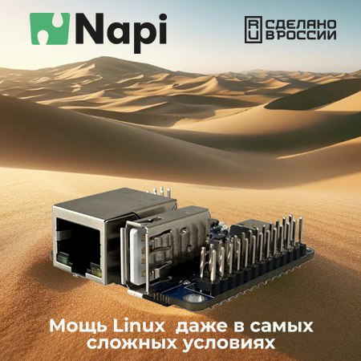 -->

<!-- [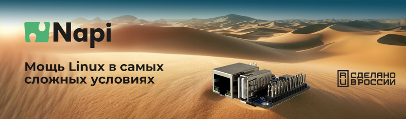](/docs/napi-intro) -->

<!-- [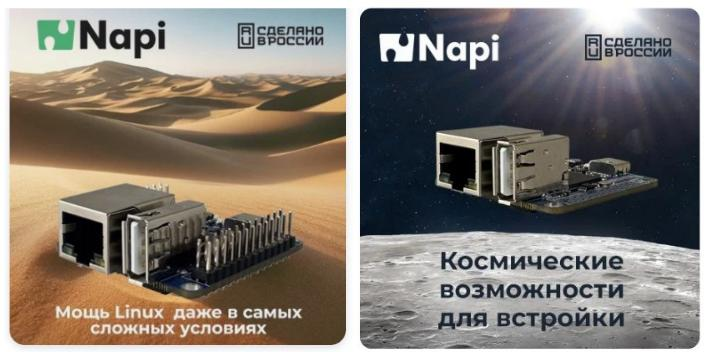](/docs/napi-intro) -->
<!--
**[Взять на бесплатное тестирование](/docs/demokits/getontest-demokit2)** | **[Купить](https://nnz-ipc.ru/catalogue/front_man/front_control/modul_napi_c/)**

[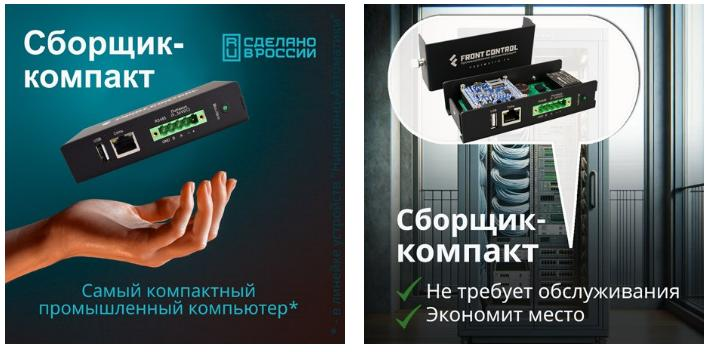](/docs/computers/frontcontrol-compact)

**[Взять на бесплатное тестирование](/docs/demokits/getontest-demokit1)** | **[Купить](https://nnz-ipc.ru/catalogue/front_man/front_compact/front_compact_159_101/)**
-->
<!--
[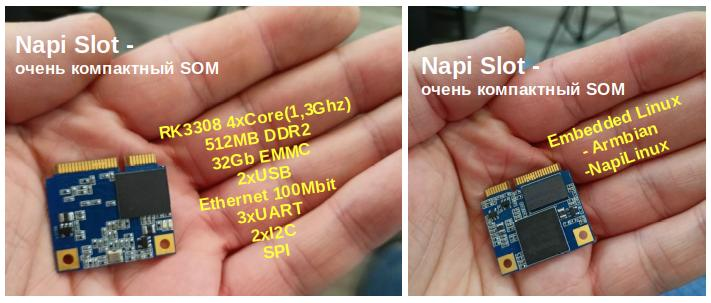](/docs/napi-som-intro)
-->

:::tip Только Российские продукты !

***Все что вы видите на этом сайте придумано и разработано в России. выбирая наши продукты вы развиваете национальную элеткронику. Если Вы проектируете банкоматы, контроллеры, системы сбора данных, зарядные станции - применение одноплатников NAPI сильно поможет попаданию Вашего изделия в реестр Минпромторга !***

:::

## Вычислительные модули NAPI (NAPI C\P\S)

Процессорные модули на основе процессора Rockchip RK3308 под управлением ОС Linux (Armbian\NapiLinux).

- :boom: **[Взять на бесплатное тестирование](/docs/demokits/getontest-demokit2)**:boom:

<!-- 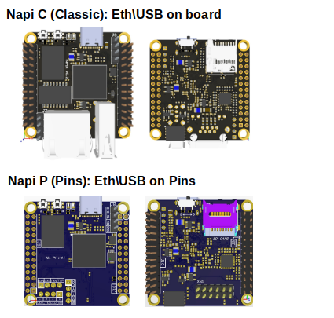 -->
<!--  -->
 >Самое важное: 512Мб ОЗУ и 4Гб NAND Flash, 1хEthernet, 2xUSB, слот для SD-карты, SPI, i2C, 3хUART.

[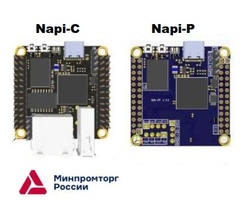](/docs/napi-intro)

 <!-- **[Подробнее...](/docs/napi-intro)** -->

 ## Компактный процессорный модуль (SOM) NAPI-Slot

>Самое важное: 512Мб ОЗУ и 32Гб EMMC Flash, 1хEthernet, 2xUSB, SPI, i2C, 3хUART.

<!-- 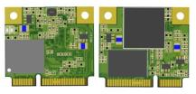 -->

[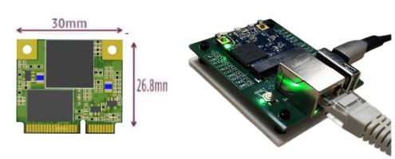](docs/napi-som-intro)
<!--
:::tip Очень маленький вычислитель !

Имеет 512Мб ОЗУ и 32Гб EMMC. Поставляется с платой с интерфейсами для тестирования и прошивки.

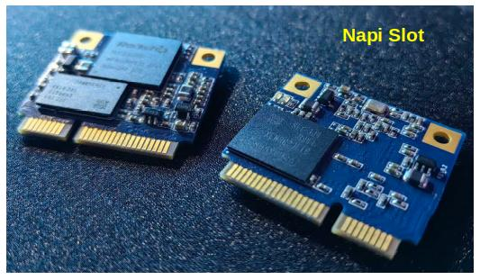

:::
-->

## Супер компактный одноплатный компьютер "Сборщик-компакт" (FrontControl Compact)

>Самое важное: NAPI-C (RK3308, 512Мб, 4Гб NAND), 1хEthernet, 1xUSB, RS485, питание 9-36, RTC, Passive POE, Din-крепление. Очень компактный (118х55) и холодный !

<!-- - :boom: **[Документация](/docs/computers/frontcontrol-compact/)** :boom: -->
- :boom: **[Взять на бесплатное тестирование](/docs/demokits/getontest-demokit1)**:boom:
<!-- - :boom: **[Купить](https://nnz-ipc.ru/catalogue/front_man/front_compact/front_compact_159_101/)**:boom: -->

<!-- 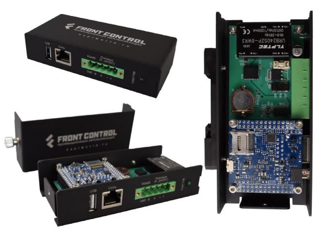 -->

[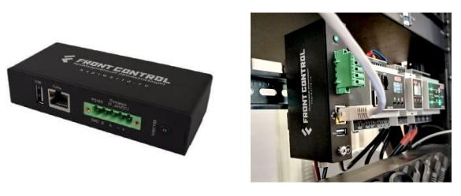](/docs/computers/frontcontrol-compact/)

<!-- **[Подробнее...](/docs/computers/frontcontrol-compact/)** -->

<!-- # Программные комплексы на основе  "Сборщик-компакт" -->

## Универсальный одноплатный компьютер "Сборщик-универсал" (FrontControl Uni)

>Самое важное:

- NAPI-C (RK3308, 512Мб, 4Гб NAND), 2хEthernet, 1xUSB, RS485, питание 9-36, RTC, Passive POE, Din-крепление;
- Консоль отладки;
- Слот для модуля связи (LTE\LORA\Zegbee);
- Встроенный датчик тока \ напряжения (!);

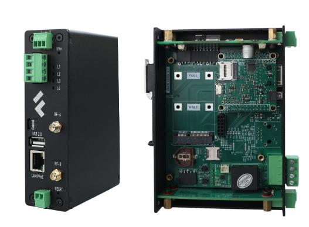

>**Подробности скоро !**

## Шлюз ModBus RTU - Modbus TCP с памятью.

**[FrontGate-M](/docs/special/frontfage-m/)**. Шлюз ModBus RTU - Modbus TCP с памятью. На основе Сборщик-компакт.

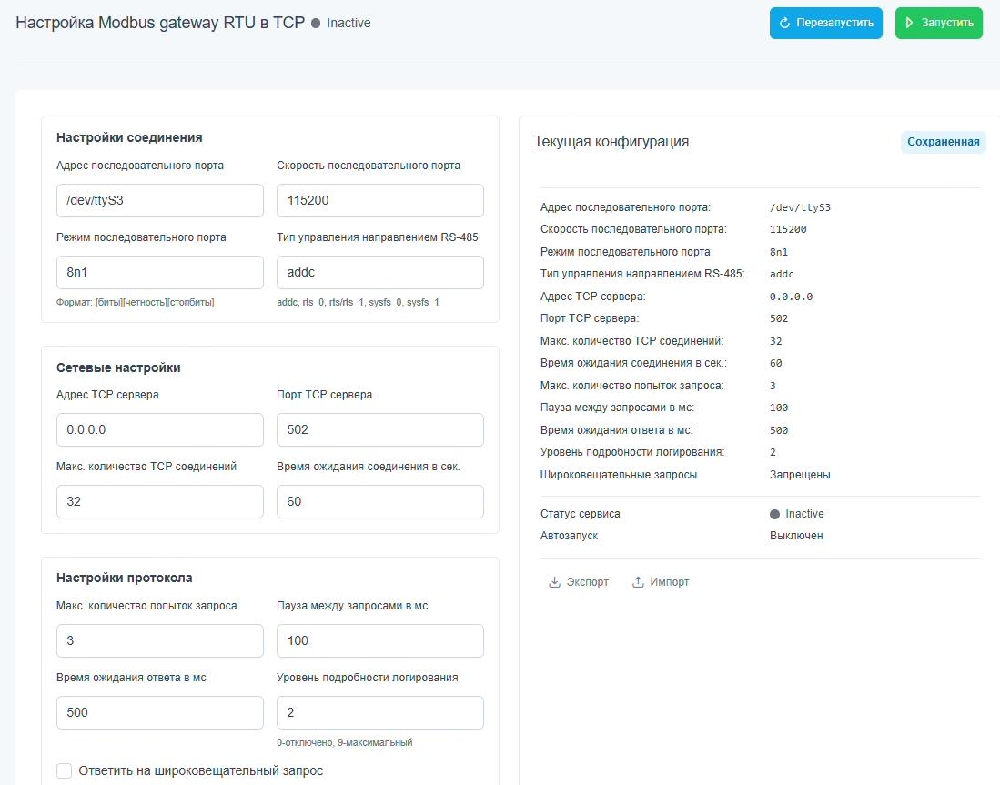

## Шлюз SNMP V2 - SNMP V3.

**[FrontGate-S](/docs/special/frontgate-s/)**. Шлюз SNMP V2 - SNMP V3. На основе Сборщик-компакт.

## Система сбора и контроля энергии - Токосборщик 2.0

На основе Сборщик-Универсал

- Переменный ток через трансформатор
- Напряжение
- Частоту
- Активную\Реактивную мощность
- Передача данных по Ethernet, Zigbee, Lte.

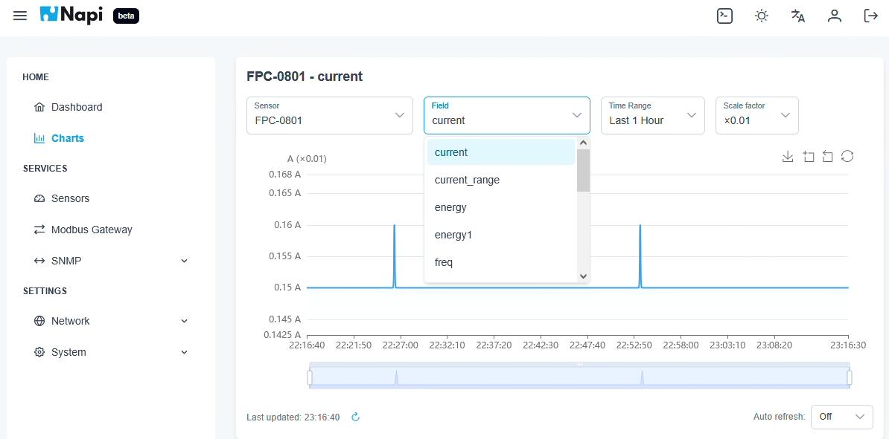

Выдает информацию в виде графиков с историей измерений, также передает данные в любом формате в внешние источники.

>Отлично подходит для контроля работы любых приборов, станков, установок.

## Ваш продукт на основе NAPI

:::tip Сделайте свой продукт на NAPI

Вы можете взять у нас проект несущей платы ["Сборщик-демокит](/docs/hidden/frontcontrol-demo) и в сжатые сроки сделать свой продукт на основе NAPI.

:::

:::tip Сделаем Ваш продукт на NAPI

Сделаем несущую плату на основе NAPI под Ваш проект (датчики, сенсоры, модули сбора, АЦП, модули передачи данных).

:::
